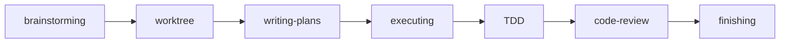

# 第1章 Superpowersの概要

Superpowersの定義、ワークフロー全体像、スキルの分類を示します。

## 1.1 Superpowersとは

Superpowersは、Claude Codeの振る舞いを規律ある開発ワークフローに変えるスキルフレームワークです。

Claude Codeは汎用のAIコーディングエージェントですが、デフォルトでは場当たり的に動きます。指示されたことをそのまま実行し、設計もテストも省略しがちです。Superpowersは、Skill toolを通じてClaude Codeに開発プロセスの規律を注入します。

仕組みはシンプルです。ユーザーがタスクを依頼すると、Claude Codeは状況に応じたスキルをSkill toolで呼び出します。スキルの内容（プロンプト）がコンテキストに展開され、以降のClaude Codeの振る舞いがそのスキルの指示に従います。

## 1.2 7段階ワークフローの全体像

Superpowersのコアワークフローは7段階で構成されます。

1. **brainstorming** — 要件を整理し、設計ドキュメントを作成する
2. **using-git-worktrees** — 隔離されたGitワークツリーを作成する
3. **writing-plans** — タスクをステップに分解した実装プランを書く
4. **executing-plans / subagent-driven-development** — プランをタスクごとに実行する
5. **test-driven-development** — RED-GREEN-REFACTORサイクルを強制する
6. **requesting / receiving-code-review** — コードレビューを実施する
7. **finishing-a-development-branch** — ブランチをマージ、PR作成、または破棄する

各段階は前の段階の出力を入力として受け取ります。brainstormingが設計ドキュメントを出力し、writing-plansがそれを入力として実装プランを作り、executing-plansがプランに沿って実装を進めます。

## 1.3 スキルの分類

スキルはコアとサポートの2種類に分かれます。

### コアスキル（ワークフローの各段階を担当）

| スキル名 | 役割 |
|---------|------|
| brainstorming | 要件整理と設計ドキュメント作成 |
| using-git-worktrees | 隔離ワークツリーの作成 |
| writing-plans | 実装プランの作成 |
| executing-plans | プランの逐次実行（別セッション） |
| subagent-driven-development | プランの逐次実行（同セッション、サブエージェント） |
| test-driven-development | RED-GREEN-REFACTORの強制 |
| requesting-code-review | コードレビューの依頼 |
| receiving-code-review | レビューフィードバックへの対応 |
| finishing-a-development-branch | ブランチの完了処理 |

### サポートスキル（必要時に発動）

| スキル名 | 役割 |
|---------|------|
| systematic-debugging | バグの4フェーズ体系的調査 |
| verification-before-completion | 完了宣言前の検証強制 |
| dispatching-parallel-agents | 独立タスクの並列実行 |
| writing-skills | カスタムスキルの作成 |
| using-superpowers | スキルシステムの導入（会話開始時に自動発動） |

コアスキルはワークフローの段階に対応し、原則として順番に使います。サポートスキルは状況に応じて任意のタイミングで発動します。

---

**要約**: Superpowersはスキルフレームワークで、7段階のコアワークフロー（設計→計画→実行→テスト→レビュー→完了）を通じてClaude Codeに開発規律を与えます。スキルはコア（9個）とサポート（5個）の計14個で構成されています。
