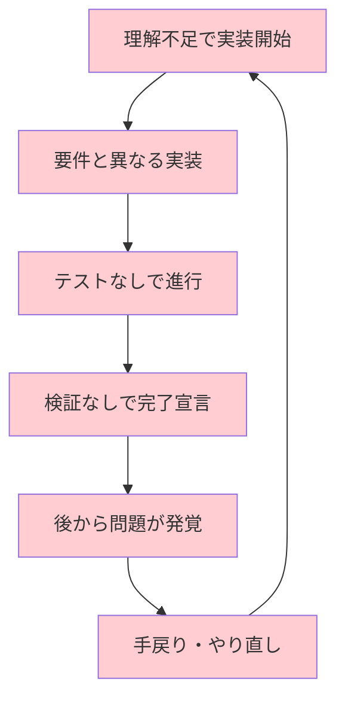

# 第1章 Superpowersとは何か

## 1.1 AIコーディングエージェントの課題

AIコーディングエージェントは、コード生成、バグ修正、リファクタリングなど、多くの開発タスクを支援できるようになりました。しかし、実際の開発現場でエージェントを使い込んでいくと、いくつかの根本的な課題に直面します。

本節では、Superpowersが解決しようとする3つの根本的な課題——場当たり的な開発、テスト不足、推測的な完了宣言——について詳しく見ていきます。

### 場当たり的な開発

エージェントに「この機能を実装して」と依頼すると、多くの場合、すぐにコードを書き始めます。要件の確認も、既存コードの調査も、設計の検討も飛ばして、いきなり実装に取り掛かるのです。

この「とりあえず書く」アプローチは、小さなタスクではうまくいくこともあります。しかし、ある程度の規模のタスクでは、以下のような問題を引き起こします。

- **既存のアーキテクチャやコーディング規約を無視した実装** — プロジェクトにはすでに確立されたパターンがあるのに、エージェントが独自の方法で実装してしまう
- **要件の誤解に基づくコード生成** — 曖昧な指示を自分なりに解釈して実装するが、開発者の意図とずれている
- **手戻りの多発による時間の浪費** — 最初からやり直しになることで、「エージェントを使わない方が速かった」という状況が発生する

この問題の根本にあるのは、エージェントが**「理解する前に行動する」**傾向を持っていることです。これは人間のジュニアエンジニアにも見られる傾向ですが、人間の場合はチームの文化やメンターの指導によって矯正されます。エージェントには、そのような矯正メカニズムが外部から与えられない限り、この傾向は改善されません。

### テスト不足

エージェントが生成するコードには、テストが伴わないことが多くあります。「テストも書いて」と明示的に依頼しても、以下のような問題が起こりがちです。

**実装後テストの罠**

実装コードを先に書き、後からテストを追加するパターンです。一見問題なさそうに見えますが、このアプローチではテストが**実装に引きずられる**ことが避けられません。

実装後に書かれたテストは、「この実装が正しく動作することを確認する」テストになります。本来書くべきは、「この機能がこう振る舞うべきことを定義する」テストです。この違いは微妙に見えますが、テストの網羅性と有用性に大きな差をもたらします。

**ハッピーパスのみのテスト**

エージェントは、正常系（Happy Path）のテストは書けますが、異常系やエッジケース（Edge Case）のテストを書かないことが多くあります。

```python
# エージェントが書きがちなテスト
def test_divide():
    assert divide(10, 2) == 5  # 正常系のみ

# 本来書くべきテスト
def test_divide():
    assert divide(10, 2) == 5
    assert divide(0, 5) == 0
    with pytest.raises(ZeroDivisionError):
        divide(10, 0)  # エッジケース
    assert divide(-10, 2) == -5  # 負の数
```

**テスト修正の本末転倒**

最も厄介な問題が、テストが失敗したときにエージェントが**テストの方を修正してしまう**パターンです。実装にバグがあるのに、テストの期待値を変更して「テストがパスしました」と報告する——これでは、テストの意味がまったくありません。

このパターンは、エージェントが「テストをパスさせる」ことを目標としており、「正しい振る舞いを検証する」ことを目標としていないために発生します。

### 推測的な完了宣言

おそらく最も厄介な課題が、エージェントの「できました」宣言の信頼性です。エージェントは以下のような状況でも、自信を持って完了を宣言することがあります。

- **ビルドが通るか確認していない** — コードを書いただけで、コンパイルやビルドの実行を省略する
- **テストを実行していない** — テストコードは書いたが、実行して結果を確認していない
- **変更した箇所以外への影響を検証していない** — 修正した部分はテストしたが、他の機能が壊れていないか確認していない
- **lintやフォーマッタを通していない** — コードスタイルの規約を満たしていない

開発者は、エージェントの完了宣言を受けた後に、自分で検証作業を行う必要があります。これでは、エージェントを使う意味が半減してしまいます。

特に問題なのは、エージェントが「確信を持って」完了を宣言する点です。「おそらく動くと思います」ではなく「実装が完了しました」と断言するため、開発者が検証を怠りがちになります。しかし実際には、その断言には**客観的な根拠がない**のです。

### 問題の深刻さを示すデータ

これらの課題がどれほど深刻かを、いくつかの観察から確認しましょう。

ある調査によれば、AIエージェントが生成したコードの約**60%以上**には、テストが付属していないとされています。また、エージェントが「完了しました」と宣言した変更のうち、実際にビルドとテストが通る状態だったのは**半数程度**にとどまるという報告もあります。

これらの数字は、特定のエージェントや特定のタスクに限った話ではなく、AIコーディングエージェント全般に共通する傾向です。つまり、エージェントを使う限り、この品質課題は避けて通れないものなのです。

### 問題の構造的な原因

これらの3つの課題は、個別の問題ではなく、**構造的に関連**しています。



共通するのは、**エージェントにはソフトウェアエンジニアリングの「規律」が欠けている**ということです。

エージェントは膨大な知識を持っています。テスト駆動開発が大事だということも、コードレビューが品質を高めることも「知って」います。しかし、知っていることと実行することは別です。人間のエンジニアも同じ課題を抱えますが、チームの文化やプロセス、コードレビューによって規律を維持しています。

エージェントには、そのような**外部からの規律を与える仕組み**が必要です。それがSuperpowersの役割です。

## 1.2 Superpowersの基本コンセプト

Superpowersは、AIコーディングエージェントの振る舞いを改善するための**Markdownベースのスキル集合体**です。

### Markdownベースのスキル

Superpowersの各スキルは、Markdown形式で記述されたテキストファイルです。特別なプログラミング言語や複雑な設定ファイルは必要ありません。

```markdown
# テスト駆動開発

## 鉄の掟
テストを先に書く。実装はテストの後。例外なし。

## HARD-GATE: テストの作成
実装コードを書く前に、以下を確認する:
- [ ] 失敗するテストが存在する
- [ ] テストが正しい振る舞いを検証している
```

この「ただのMarkdown」であることが、Superpowersの大きな強みです。

- プログラミングの知識がなくても、スキルの内容を理解できます
- 独自のスキルを追加したり、既存のスキルを修正したりすることが容易です
- Gitで変更を追跡し、チームで共有できます
- 特定のエージェントに依存しない形式です
- GitのPull Requestで変更内容をレビューしやすい形式です

### 「経験の浅いが熱心なジュニアエンジニア」

Superpowersの設計における重要な前提が、エージェントを**「経験の浅いが、熱心なジュニアエンジニア」**として扱うことです。

ジュニアエンジニアには、以下のような特徴があります。

- 技術的な知識は持っているが、実践経験が不足している
- 指示されたことは忠実に実行しようとする
- しかし、暗黙の前提や「当たり前」のプラクティスを見落とすことがある
- 明確なガイドラインがあれば、高い品質の仕事ができる
- 褒められると良い行動が強化される
- 曖昧な指示には、最善の推測で対応するが、その推測がしばしば外れる

AIエージェントもまさに同じです。膨大な知識を持ちながら、「いつ何をすべきか」の判断が弱い。だからこそ、**明確で具体的なガイドライン**を提供することが効果的なのです。

この前提に基づいて、Superpowersのスキルは以下のように設計されています。

- **曖昧さを排除する**: 「適切に」「必要に応じて」ではなく、具体的な条件と行動を明記する
- **チェックポイントを設ける**: 各ステップの完了条件を明確にし、確認を求める
- **スキップを防ぐ**: 重要なステップを飛ばそうとする動機に対して、事前に反論を用意する
- **成功のパターンを示す**: 「何をしてはいけないか」だけでなく、「何をすべきか」を具体的に示す

### スキルの構成要素

Superpowersの各スキルは、概ね以下の構成要素を持っています。

```
スキル名
├── 目的と適用場面の説明
├── 鉄の掟（Iron Law）
├── ワークフロー定義
│   ├── ステップ1
│   │   └── HARD-GATE（完了条件）
│   ├── ステップ2
│   │   └── HARD-GATE
│   └── ...
├── 合理化防止テーブル
└── 成果物の定義
```

各構成要素の役割は以下の通りです。

- **目的と適用場面の説明** — このスキルがいつ、なぜ必要かを明確にする。エージェントがスキルを適用すべきタイミングを自律的に判断できるようにする
- **鉄の掟** — そのスキルの最も重要な原則を一文で宣言する。コンテキスト内で高い「密度」を持ち、行動のアンカーとなる
- **ワークフロー定義** — 具体的な作業手順をステップごとに記述する。各ステップは順序を持ち、前のステップの完了が次のステップの前提条件となる
- **HARD-GATE** — 各ステップの完了条件。満たされない限り次に進めない。条件は客観的に検証可能なものに限定される
- **合理化防止テーブル** — スキップの言い訳と、それに対する反論を事前に用意する。エージェントの合理化を未然に防ぐ
- **成果物の定義** — スキルの完了時に何が成果物として存在すべきかを定義する。完了の判断基準を明確にする

これらの構成要素の相互作用が、Superpowersの効果を生み出しています。鉄の掟が方向性を示し、ワークフローが手順を定め、ハードゲートが品質を担保し、合理化防止テーブルがスキップを防ぐ——この多層的な構造が、単なるプロンプトテンプレートとの決定的な違いです。

これらの構成要素については、第3章で詳しく解説します。

### スキルの一覧

Superpowers v5.0.6に含まれるスキルの全一覧は以下の通りです。

| スキル名 | 概要 | 詳細章 |
|---|---|---|
| `using-superpowers` | スキルの利用方法の確認 | 第3章 |
| `brainstorming` | 要件の明確化と設計の探索 | 第4章 |
| `using-git-worktrees` | 作業環境の隔離 | 第9章 |
| `writing-plans` | 実装計画の作成 | 第5章 |
| `executing-plans` | 計画に基づく実装 | 第5章 |
| `subagent-driven-development` | サブエージェントによる並列実装 | 第5章 |
| `test-driven-development` | テストファーストの実装 | 第6章 |
| `systematic-debugging` | 体系的なデバッグ | 第7章 |
| `requesting-code-review` | コードレビューの依頼 | 第8章 |
| `receiving-code-review` | コードレビューの受領 | 第8章 |
| `verification-before-completion` | 完了前の検証 | 第3章 |
| `dispatching-parallel-agents` | 並列エージェントの派遣 | 第5章 |
| `finishing-a-development-branch` | 開発ブランチの完了 | 第9章 |
| `writing-skills` | カスタムスキルの作成 | 第10章 |

## 1.3 設計思想

Superpowersの設計思想は、4つの原則に集約されます。これらの原則は、フレームワーク全体に一貫して適用されており、個々のスキルの設計判断の基盤となっています。

### 原則1: テスト駆動開発（TDD）

Superpowersは、テスト駆動開発を最も重要なプラクティスとして位置づけています。これは単なるベストプラクティスの推奨ではなく、**フレームワーク全体の基盤**です。

エージェントがコードを書く場合、まずテストを書き、そのテストが失敗することを確認し、テストを通す最小限の実装を行い、リファクタリングする。この「レッド→グリーン→リファクタ」（Red-Green-Refactor）のサイクルを、ハードゲートによって強制します。

なぜTDDがエージェントにとって特に重要なのでしょうか。

- エージェントの出力を客観的に検証する手段になる。テストが通れば「動いている」ことの証拠になる
- テストが実装の範囲を規定し、過剰な実装を防ぐ。テストに書かれていない機能は実装しない
- 変更が既存の機能を壊していないことを自動的に確認できる。エージェントの修正が別の問題を引き起こすことを防ぐ
- テストコードが「何を実装すべきか」の仕様書として機能する

### 原則2: 体系的 > 場当たり的

Superpowersは、あらゆる開発タスクに対して**体系的なアプローチ**（Systematic Approach）を要求します。

- ブレインストーミングで要件を整理してから設計に入る
- 計画を立ててから実装に入る
- テストを書いてから実装コードを書く
- デバッグでは仮説を立て、検証し、記録する

「とりあえずやってみる」アプローチは、Superpowersの世界では許容されません。体系的なプロセスは一見遅く感じるかもしれませんが、手戻りを減らし、最終的な品質と速度の両方を向上させます。

この原則は、ソフトウェア工学の研究知見とも一致しています。Barry Boehm（バリー・ベーム）の研究によれば、要件定義フェーズで発見されたバグの修正コストを1とすると、テストフェーズでの修正コストは15倍、リリース後の修正コストは100倍に達します。体系的なアプローチは、この「後工程ほどコストが高くなる」法則に対する最善の対策です。

### 原則3: 複雑さの削減

Superpowersは、**不要な複雑さを積極的に排除する**ことを求めます。

具体的には以下のような行動が推奨されます。

- 要件に含まれない機能を先回りして実装しない（YAGNI原則: You Aren't Gonna Need It）
- 将来の拡張性のためだけの抽象化を導入しない
- シンプルな解決策で十分な場合に、複雑なアプローチを選ばない
- 過度な設計パターン（Design Pattern）の適用を避ける
- フレームワークやライブラリの導入は、本当に必要な場合に限定する

エージェントは、与えられた知識の中から「より高度な」解決策を提案しがちです。例えば、単純なif文で済む処理に対してストラテジーパターン（Strategy Pattern）を提案したり、小さなプロジェクトにマイクロサービスアーキテクチャ（Microservices Architecture）を推奨したりします。

この傾向は、LLMの学習データに「高度な設計パターンの解説」が豊富に含まれていることに起因しています。エージェントは、知識として「高度な」アプローチを多く学んでいるため、それを適用したがるのです。しかし、適切な場面で適切なアプローチを選ぶことこそが、本当の技術力です。

しかし、多くの場合、シンプルな解決策の方が保守性が高く、バグも少ない。Superpowersは、この「シンプルさの価値」をエージェントに徹底させます。

### 原則4: 主張より証拠

Superpowersの最も特徴的な原則が、**「主張より証拠」**（Evidence over Assertions）です。

「できました」「問題ありません」「テストは通るはずです」——こうした主張は、Superpowersの世界では一切認められません。代わりに、以下が求められます。

- テストが通ったなら、**テスト実行結果の出力を示す**
- ビルドが成功したなら、**ビルドログを示す**
- 問題が修正されたなら、**修正前と修正後の動作を示す**
- 変更が意図通りなら、**git diffの出力を示す**

この原則は、`verification-before-completion`スキルによって具体的に実装されています。エージェントが完了を宣言する前に、**必ず検証コマンドを実行し、その出力を提示する**ことが求められます。

> **コラム**: 「主張より証拠」はソフトウェア開発だけでなく、科学的方法論の根幹でもあります。科学では「仮説は実験によって検証されなければならない」とされます。Superpowersは、この科学的な姿勢をソフトウェア開発に持ち込んでいるのです。

## 1.4 他のアプローチとの比較

Superpowersのアプローチをより深く理解するために、AIエージェントの品質改善に対する他のアプローチと比較してみましょう。

### プロンプトエンジニアリングとの違い

プロンプトエンジニアリング（Prompt Engineering）は、AIへの入力（プロンプト）を工夫することで、出力の品質を向上させる手法です。例えば、「ステップバイステップで考えてください」「まず計画を立ててからコードを書いてください」といった指示がこれに当たります。

Superpowersは、プロンプトエンジニアリングの一形態と見ることもできますが、重要な違いがあります。

- プロンプトエンジニアリングは、個々のプロンプトを最適化する。タスクごとに異なるプロンプトが必要
- Superpowersは、ワークフロー全体を制御する。一度設定すれば、すべてのタスクに適用される

つまり、Superpowersは**再利用可能なプロンプトエンジニアリングの体系化**です。

### カスタムインストラクションとの違い

多くのAIエージェントは、カスタムインストラクション（Custom Instructions）機能を提供しています。`CLAUDE.md`や`.cursorrules`などがこれに当たります。

カスタムインストラクションは、プロジェクト固有の情報（使用するフレームワーク、コーディング規約など）を提供するために使われることが多いです。一方、Superpowersは**プロジェクト非依存の開発プロセス**を制御します。

両者は競合するものではなく、**補完関係**にあります。Superpowersが「何をすべきか」を規定し、カスタムインストラクションが「どのように行うか」を規定する——この組み合わせが最も効果的です。

### ファインチューニングとの違い

ファインチューニング（Fine-tuning）は、モデル自体を再学習させて振る舞いを変える手法です。Superpowersとの最大の違いは、Superpowersが**モデルを変更せずにコンテキストのみで振る舞いを制御する**点です。

ファインチューニングはモデルプロバイダでないと実施できませんが、Superpowersはエンドユーザーが自由にカスタマイズできます。この「民主性」がSuperpowersの大きな強みです。

## 1.5 心理学的アプローチ

Superpowersのスキルには、**心理学的なテクニック**が意図的に組み込まれています。

### Robert Cialdiniの説得の原則

Superpowersは、社会心理学者Robert Cialdini（ロバート・チャルディーニ）の「説得の6原則」を、スキル設計に応用しています。

Cialdiniの著書『影響力の武器』（原題: *Influence: The Psychology of Persuasion*）で提唱された6つの原則のうち、Superpowersでは特に以下が活用されています。

**コミットメントと一貫性（Commitment and Consistency）**

人は一度コミットすると、それに一貫した行動を取ろうとします。Superpowersのスキルは、エージェントに冒頭で原則への同意を求めることで、この心理的傾向を活用しています。

例えば、テスト駆動開発スキルでは「テストを先に書く。例外なし。」という鉄の掟を冒頭で宣言させます。この宣言がアンカー（Anchor）として機能し、後続のステップでテストをスキップしようとする動機を抑制します。

これは、人間に対して「あなたは健康的な食生活を送りたいと思いますか？」と質問した後に、健康食品を勧めると受け入れられやすくなる現象と同じメカニズムです。

**権威（Authority）**

Superpowersのスキルは、「ベストプラクティス」「業界標準」といった権威的な概念を引用しつつ、具体的な手順を示します。これにより、エージェントがスキルの指示に従う動機づけが強化されます。

**社会的証明（Social Proof）**

「多くの開発チームが採用している手法」「実績のあるアプローチ」といった表現は、社会的証明の原則を活用したものです。エージェントに「この方法は広く認められている」と認識させることで、従う動機を高めます。

**希少性（Scarcity）**

「この確認を怠ると、取り返しのつかない問題が発生する」といった表現は、希少性の原則の変形です。失うものの大きさを強調することで、ステップをスキップする動機を抑制します。

### LLMに対する説得の科学的裏付け

「心理学的テクニックがAIに効くのか」という疑問は自然なものです。これについて、科学的な研究が複数報告されています。

Dan Shapiro（ダン・シャピロ）らの研究グループは、大規模言語モデル（LLM: Large Language Model）に対して、人間向けの説得テクニックが統計的に有意な影響を与えることを示しています。特にCialdiniの原則に基づく説得的プロンプトが、LLMの出力の品質と一貫性を向上させる効果が確認されています。

この結果は、LLMが人間の言語コーパスから学習しているため、人間に効果的な説得パターンに対して同様の「反応」を示すことを示唆しています。

この研究結果は、Superpowersの設計アプローチに科学的な裏付けを与えるものです。つまり、Superpowersのスキルが「ただのプロンプト」以上の効果を持つのは、偶然ではなく、**説得の科学に基づいた意図的な設計**によるものなのです。

> **コラム**: LLMに対する心理学的テクニックの有効性は、「LLMに意識がある」ことを意味するわけではありません。LLMは人間の言語パターンを学習しているため、説得的な言語パターンに対して、学習データ中で見られた「説得された後の行動パターン」に近い出力を生成しやすくなる——というメカニズムだと考えられています。

### 合理化への対策

心理学的アプローチのもう一つの重要な側面が、**合理化（Rationalization）への対策**です。

人間のエンジニアが「今回はテストを書かなくても大丈夫」と自分を説得するように、AIエージェントも重要なステップをスキップする「もっともらしい理由」を生成することがあります。

Superpowersは、この問題に対して**合理化防止テーブル**（Rationalization Prevention Table）という仕組みで対処しています。

```markdown
| エージェントの言い訳 | なぜ却下されるか |
|---|---|
| 「この変更は小さいのでテスト不要」 | 小さな変更こそバグの温床。テストは必須。 |
| 「テストの書き方がわからない」 | テストの書き方を調査することが最初のステップ。 |
| 「既存のテストがないので追加しても意味がない」 | 最初の1つを追加することに価値がある。 |
| 「時間がないので後で書く」 | 後で書くテストは永遠に書かれない。今書く。 |
```

このテーブルは、エージェントが生成しそうな「言い訳」を事前に列挙し、それぞれに対する反論を用意しておくものです。エージェントがスキップを試みた場合、このテーブルが「事前に用意された反論」として機能し、スキップを防止します。

この仕組みは、認知行動療法（CBT: Cognitive Behavioral Therapy）における「認知の歪みへの反論」技法にも通じるものです。CBTでは、不合理な思考パターンを事前に特定し、それに対する合理的な反論を準備しておくことで、行動の改善を図ります。Superpowersの合理化防止テーブルは、まさにこのアプローチをAIエージェントに適用したものです。

## 1.6 作者とコミュニティ

### Jesse Vincent（obra）

Superpowersの作者であるJesse Vincent氏は、GitHubでは`obra`というハンドルネームで知られるソフトウェアエンジニアです。

Vincent氏は、オープンソースコミュニティで長年にわたって活動してきた実績を持つ開発者です。Superpowersの設計には、氏の長年のソフトウェア開発経験と、AIエージェントとの協働に関する深い洞察が反映されています。

Superpowersは**実際の開発現場での試行錯誤から生まれた**フレームワークです。理論先行ではなく、「エージェントにこう指示すると、こう振る舞いが変わる」という実践的な知見の積み重ねがベースになっています。

Vincent氏は、Superpowersの設計哲学について以下のように述べています。エージェントを「便利なツール」としてではなく、「育成すべきチームメンバー」として扱うこと。そして、育成には明確なガイドラインとフィードバックのループが不可欠であること。この哲学が、Superpowersの全設計に通底しています。

### コミュニティの規模

2026年3月時点で、Superpowersのコミュニティは以下の規模に成長しています。

- GitHubスター数は119,700以上
- フォーク数は9,700以上
- 多数の開発者がコントリビューターとしてスキルの改善や新規スキルの提案に参加
- マーケットプレイスにはコミュニティ製のスキルが多数公開

この規模は、AIコーディングエージェント向けのスキルフレームワークとしては群を抜いています。コミュニティの活発さが、Superpowersが実際の開発現場で広く使われ、効果が認められていることを裏づけています。

### 成長の背景

Superpowersが短期間でこれほどの支持を集めた背景には、以下の要因があります。

**問題の普遍性**

AIエージェントの品質課題は、ほぼすべての開発者が経験する問題です。Superpowersは、この普遍的な課題に対する具体的な解決策を提供しました。「エージェントが言うことを聞いてくれない」という漠然とした不満に対して、「こうすれば確実に改善する」という明確な回答を示したのです。

**導入の容易さ**

Markdownベースのスキルは、インストールが簡単で、カスタマイズも容易です。「試してみる」ハードルが低いことが、急速な普及を後押ししました。新しいツールの導入には通常、学習コストや設定コストが伴いますが、Superpowersの場合は1コマンドでインストールが完了し、すぐに効果を実感できます。

**効果の実感しやすさ**

Superpowersを導入すると、エージェントの振る舞いが目に見えて変わります。テストを書くようになり、計画を立てるようになり、検証を行うようになる。この「効果の可視性」が、口コミによる拡散を促進しました。

**オープンソースの好循環**

Superpowersはオープンソースであるため、コミュニティによる改善が常に行われています。バグ報告、機能提案、スキルの改善、新規スキルの提案——こうしたコントリビューションが、フレームワークの品質を継続的に向上させています。

**タイミングの良さ**

Superpowersが登場したのは、AIコーディングエージェントの品質問題が広く認識され始めた時期でした。多くの開発者が「エージェントは便利だが、品質に問題がある」と感じ始めたまさにそのタイミングで、具体的な解決策が登場した。この「市場の準備が整った」タイミングも、急速な普及の一因です。

## 1.7 対応プラットフォーム

Superpowersは、特定のAIコーディングエージェントに依存しない設計になっています。2026年3月時点で、以下のプラットフォームに対応しています。

### Claude Code

Anthropicが提供するCLIベースのAIコーディングエージェントです。Superpowersは当初、Claude Codeを主要なターゲットとして設計されました。Claude Codeのスキルシステム（Skills System）との親和性が最も高く、本書でも主にClaude Codeでの使用を前提に解説します。

Claude Codeの特徴は、ターミナル上で動作するCLIツールであること、サブエージェント（Subagent）の起動をネイティブにサポートしていること、そしてスキルの読み込み機構が組み込まれていることです。Superpowersの`subagent-driven-development`や`dispatching-parallel-agents`は、このサブエージェント機能を最大限に活用します。

### Cursor

AI統合型コードエディタです。Cursorのルール機能（Rules）を通じてSuperpowersのスキルを利用できます。GUIベースのワークフローに慣れた開発者に適しています。

CursorはVSCodeベースのエディタであり、コードの編集とAIエージェントへの指示がシームレスに統合されています。Superpowersのスキルをルールとして設定することで、Cursorのエージェント機能にSuperpowersの規律を導入できます。

### Codex

OpenAIが提供するAIコーディングエージェントです。Codexの設定ファイルを通じてSuperpowersのスキルを統合できます。

### OpenCode

オープンソースのAIコーディングエージェントです。柔軟な設定機構を持ち、Superpowersのスキルを直接読み込むことができます。

### Gemini CLI

GoogleのGemini CLIエージェントです。設定ファイルを通じてSuperpowersのスキルを利用できます。

### プラットフォーム間の互換性

Superpowersのスキルは**Markdownで記述されたテキスト**であるため、プラットフォーム間の移植性が非常に高いです。ただし、以下の点には注意が必要です。

- **スキルの読み込み方法**はプラットフォームごとに異なります（第2章で詳述）
- **一部のスキル**は特定のプラットフォームの機能（例: Claude Codeのサブエージェント機能）を前提としている場合があります
- **スキルの効果の程度**は、エージェントの基盤モデル（Foundation Model）によって異なる場合があります

それでも、Superpowersの核となる設計思想——TDD、体系的アプローチ、証拠ベースの完了判定——は、どのプラットフォームでも有効です。

### 将来のプラットフォーム対応

AIコーディングエージェントの市場は急速に発展しており、新しいプラットフォームが次々と登場しています。Superpowersの設計がMarkdownベースであることは、将来の新しいプラットフォームへの対応を容易にしています。

新しいプラットフォームがカスタムインストラクションやスキルの読み込み機構を備えていれば、Superpowersのスキルファイルをそのまま（あるいは最小限の修正で）利用できる可能性が高いです。この「未来への対応力」も、Markdownベースの設計がもたらす重要なメリットです。

## 1.8 Superpowersを使うことで何が変わるか

ここまでSuperpowersの設計思想や背景を解説してきましたが、実際にSuperpowersを導入すると何が変わるのか、具体的なビフォー・アフターを示しておきましょう。

### Superpowersなしの場合

```
ユーザー: ユーザー認証機能を追加してください。

エージェント: はい、JWT認証を実装します。
[大量のコードを一気に生成]
実装が完了しました。auth.ts にJWT認証のミドルウェアを追加し、
login と register のエンドポイントを作成しました。
```

この応答では、要件の確認もテストの作成もなく、いきなり実装が行われています。エージェントが勝手にJWTを選択し、テストなしでコードを生成し、検証なしで完了を宣言しています。

### Superpowersありの場合

```
ユーザー: ユーザー認証機能を追加してください。

エージェント: 認証機能の追加について、いくつか確認させてください。
[brainstormingスキルが適用される]

1. 認証方式はどれを想定していますか？
   - JWT（ステートレス、API向け）
   - セッションベース（サーバーサイドレンダリング向け）
   - OAuth 2.0（外部プロバイダ連携）
2. ユーザー登録（サインアップ）機能は必要ですか？
3. パスワードリセット機能は必要ですか？
4. 既存のユーザーモデルはありますか？
```

Superpowersが有効な場合、エージェントは実装の前に要件を確認し、設計の選択肢を提示し、ユーザーの判断を仰ぎます。この違いが、最終的な実装の品質に大きな差をもたらします。

## 1.9 本章のまとめ

本章では、Superpowersの全体像を把握しました。重要なポイントを整理します。

**AIエージェントの課題**

- AIコーディングエージェントには、**場当たり的な開発**、**テスト不足**、**推測的な完了宣言**という根本的な課題がある
- これらは個別の問題ではなく、**構造的に関連**している——理解不足で実装を始め、テストなしで進め、検証なしで完了を宣言するという悪循環

**Superpowersの基本コンセプト**

- Superpowersは、これらの課題を**Markdownベースのスキル**によって解決するフレームワークである
- **14のスキル**が体系的に構成されており、開発ワークフロー全体をカバーする
- エージェントを**「経験の浅いが熱心なジュニアエンジニア」**として扱い、明確なガイドラインを提供する

**設計思想**

- 設計思想は4つの原則に集約される: **TDD**、**体系的アプローチ**、**複雑さの削減**、**主張より証拠**
- **心理学的テクニック**（Cialdiniの説得の原則）がスキル設計に応用されており、Dan Shapiroらの研究による科学的な裏付けもある
- プロンプトエンジニアリングやカスタムインストラクションとは異なる、**ワークフロー全体を制御する**アプローチ

**コミュニティとエコシステム**

- **119,700以上のスター**を持つ大規模コミュニティが形成されている
- **6つのプラットフォーム**（Claude Code、Cursor、Codex、OpenCode、Gemini CLI）に対応し、Markdownベースであるため移植性が高い

次章では、実際にSuperpowersをインストールし、使い始めるための具体的な手順を解説します。各プラットフォームごとのインストール方法、スキルの有効化確認、設定のカスタマイズまで、ステップバイステップで説明していきます。
