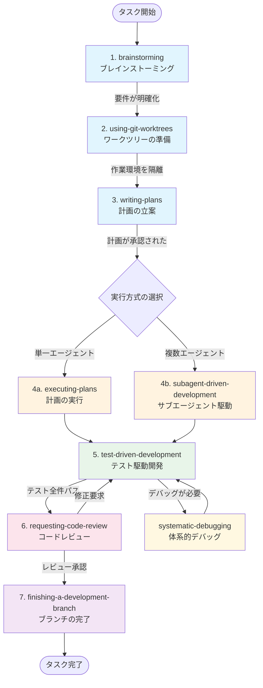
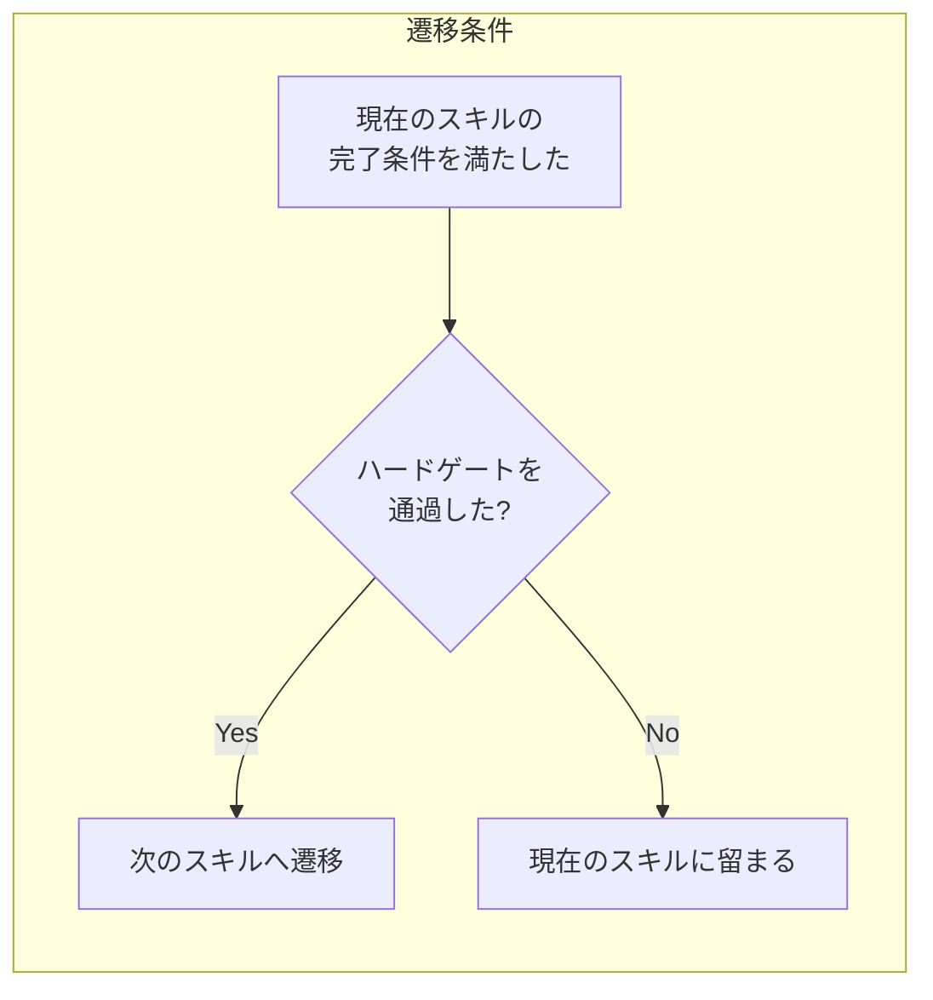
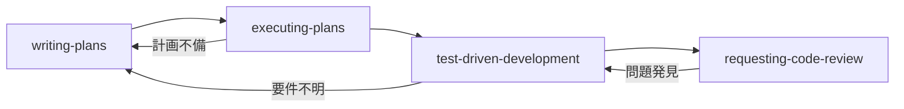
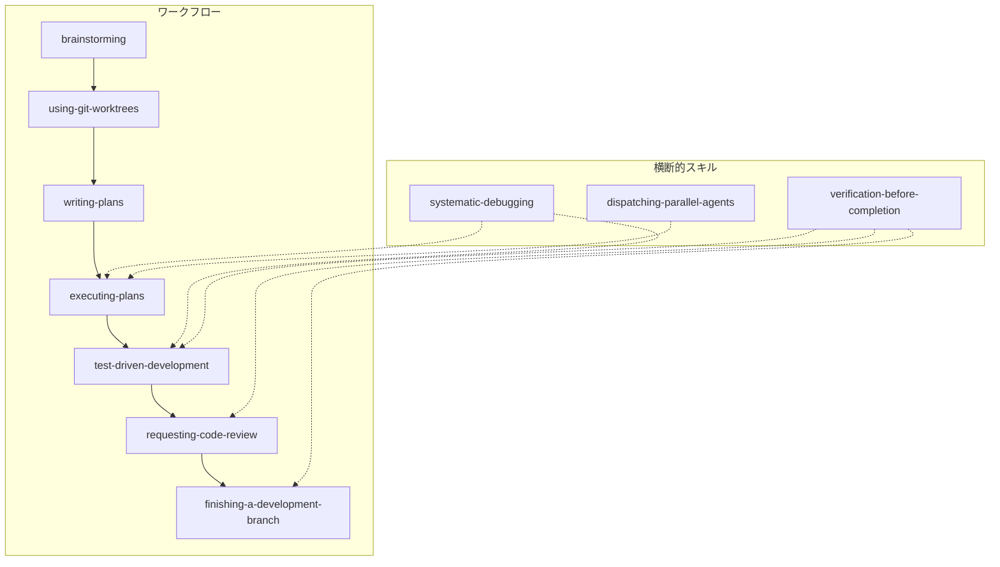

# 第3章 コアワークフロー

## 3.1 7段階のワークフロー全体像

Superpowersの最も重要な特徴は、開発タスクを**7つの段階**に分解し、各段階に専用のスキルを割り当てている点です。この構造化されたワークフローが、エージェントの行動に一貫性と規律を与えます。

7つの段階は以下の通りです。

1. **ブレインストーミング**（brainstorming）— 要件の明確化と設計の探索
2. **ワークツリーの準備**（using-git-worktrees）— 作業環境の隔離
3. **計画の立案**（writing-plans）— 実装計画の作成
4. **計画の実行**（executing-plans / subagent-driven-development）— 計画に基づく実装
5. **テスト駆動開発**（test-driven-development）— テストファーストの実装
6. **コードレビュー**（requesting-code-review）— 実装の品質検証
7. **ブランチの完了**（finishing-a-development-branch）— 統合と後片付け

この7段階は、実際のソフトウェア開発チームにおける標準的なワークフローを反映しています。人間のチームでは暗黙的に行われるこれらのステップを、Superpowersは**明示的かつ強制的に**エージェントに実行させます。

なぜ7段階なのでしょうか。これは、ソフトウェア開発の本質的なフェーズを網羅するために必要最小限の段階数です。段階が少なすぎると重要なステップが省略され、多すぎるとワークフローが冗長になります。Superpowersは、この「ちょうどよい粒度」を長期間の試行錯誤を経て確立しました。

### ワークフロー全体図

以下の図は、7段階のワークフローの全体像とスキル間の遷移を示しています。



この図では、色分けによって各段階の役割を視覚的に区別しています。青は基礎フェーズ（理解と計画）、オレンジは実行フェーズ、緑はテストフェーズ、ピンクはレビューフェーズ、紫は完了フェーズです。黄色のデバッグは、どのフェーズからでも呼び出される横断的なスキルを表しています。

### 段階ごとの役割

**第1段階: ブレインストーミング**

タスクの要件を明確にし、設計上の選択肢を探索します。ここでは**コードを一切書きません**。ユーザーとの対話を通じて、何を作るのか、なぜ作るのか、どのような制約があるのかを明らかにします。

この段階の重要性は、しばしば過小評価されます。しかし、要件の曖昧さが残ったまま実装に入ると、手戻りのコストは指数関数的に増大します。ブレインストーミングに投じる時間は、後工程のコスト削減として何倍にもなって返ってきます。

ブレインストーミングスキルが特に効果を発揮するのは、以下のような場面です。

- ユーザーの指示が曖昧な場合（「認証機能を追加して」など）
- 複数の実現方法が考えられる場合
- 既存のコードベースとの整合性を確認する必要がある場合
- 非機能要件（パフォーマンス、セキュリティ等）の確認が必要な場合

**第2段階: ワークツリーの準備**

Gitワークツリー（Git Worktrees）を使って、作業環境を隔離します。これにより、実験的な変更がメインの作業ディレクトリに影響を与えることを防ぎます。

ワークツリーとは、1つのGitリポジトリに対して複数の作業ディレクトリを持つ機能です。通常のブランチ切り替え（`git checkout`）と異なり、ワークツリーでは**複数のブランチを同時に異なるディレクトリで開くことができます**。

```bash
# ワークツリーの作成例
git worktree add ../feature-auth -b feature/auth
```

この段階は省略可能ですが、中〜大規模のタスクでは強く推奨されます。

**第3段階: 計画の立案**

ブレインストーミングの結果をもとに、具体的な実装計画を作成します。計画には以下が含まれます。

- 実装ステップの一覧（順序と依存関係）
- 各ステップでのテスト方針
- リスクの特定と対策
- 成果物の定義

計画はMarkdownファイルとして明示的に記述されます。「頭の中にある」計画は計画ではない——これが`writing-plans`スキルの基本姿勢です。

**第4段階: 計画の実行**

計画に基づいて実装を進めます。2つのアプローチがあります。

- `executing-plans`は、単一のエージェントが計画のステップを順次実行する方法。シンプルで確実です。
- `subagent-driven-development`は、複数のサブエージェントが独立したタスクを並列に実行する方法。独立性の高いタスクが多い場合に効率的です。

どちらのアプローチを選択するかは、タスクの性質（ステップ間の依存関係の有無）とプラットフォームのサブエージェント対応状況によって判断します。

**第5段階: テスト駆動開発**

実装のすべてのステップで、テストファーストのアプローチを適用します。テストを書き、失敗を確認し、実装し、パスを確認する——このサイクルを繰り返します。

第4段階と第5段階は、実際には密接に連携しています。計画の各ステップを実行する際に、TDDのサイクルが適用されます。つまり、「計画のステップ1を実行する」とは、「ステップ1のテストを書き、テストを通す実装を行う」ことを意味します。

**第6段階: コードレビュー**

実装が完了したら、コードレビューを実施します。エージェント自身がレビュアーの視点で品質を検証します。

レビューでは、以下の観点からコードを評価します。

- コードの正確性（要件を満たしているか）
- テストの充分性（テストカバレッジは十分か）
- コードの可読性（他の開発者が理解しやすいか）
- アーキテクチャとの整合性（既存のパターンに従っているか）
- パフォーマンスとセキュリティ（明らかな問題がないか）

**第7段階: ブランチの完了**

コードレビューを通過したら、ブランチの統合方法を決定し、後片付けを行います。具体的には以下の選択肢が提示されます。

- メインブランチへのマージ
- プルリクエストの作成
- さらなる作業の継続
- ワークツリーのクリーンアップ

## 3.2 スキル間の連携と遷移

### 自動遷移の仕組み

Superpowersのスキルは、各スキルの完了条件が満たされると、**次のスキルへの遷移を促す**仕組みを持っています。

例えば、`brainstorming`スキルは、要件が十分に明確化されたと判断した時点で、以下のようなメッセージを出力します。

```markdown
## 次のステップ
要件が明確になりました。次は計画の立案に進みます。
writing-plansスキルを適用します。
```

この遷移は完全に自動的ではなく、ユーザーの確認を挟むことが推奨されています。エージェントが「次に進みます」と宣言した際に、ユーザーが「まだ確認したいことがある」と返せば、現在のスキルにとどまります。

この「半自動」の遷移設計は意図的なものです。完全自動にすると、ユーザーが介入する機会が失われ、エージェントが独走するリスクがあります。完全手動にすると、ユーザーの負担が増え、スキルの恩恵が減少します。半自動の遷移は、このトレードオフの最適解です。

### 遷移の判断基準

各スキル間の遷移は、以下の判断基準に基づいて行われます。



**ハードゲートを通過しない限り次に進めない**——この制約が、不完全な状態で次のステップに進んでしまうことを防ぎます。

遷移条件は各スキルに明示的に定義されており、曖昧さがありません。「十分に検討した」「おおよそ完了した」といった主観的条件ではなく、「テストを実行し、失敗することを確認した」「計画をMarkdownファイルに記述し、ユーザーの承認を得た」のような客観的条件が設定されています。

### スキルの逆遷移

ワークフローは常に前方にだけ進むわけではありません。以下のような場合に、前のスキルに戻ることがあります。

- **コードレビューで問題が発見された場合** → テスト駆動開発に戻る
- **実装中に要件の不明点が見つかった場合** → ブレインストーミングに戻る
- **計画に不備があった場合** → 計画の立案に戻る
- **テスト中にアーキテクチャ上の問題が判明した場合** → 計画の立案に戻る



このような**フィードバックループ**（Feedback Loop）が組み込まれていることで、問題を早期に発見し、手戻りのコストを最小化できます。

逆遷移は「失敗」ではなく、「品質保証プロセスの正常な動作」として捉えるべきです。コードレビューで問題が発見されることは、レビュープロセスが正しく機能していることの証です。

### 横断的スキル

7段階のワークフローに加えて、ワークフローのどの段階でも呼び出される**横断的スキル**（Cross-cutting Skills）があります。

- **systematic-debugging** — デバッグが必要になった時点で、どの段階からでも呼び出される。テスト失敗時、ビルドエラー時、予期しない動作の発生時など
- **verification-before-completion** — 各段階の完了宣言時に呼び出される。「できました」の前に、必ず検証を行うことを強制する
- **dispatching-parallel-agents** — 独立したタスクの並列実行が可能な場面で呼び出される。効率的なタスク分割と並列処理を実現する
- **using-superpowers** — 会話の開始時にスキルの利用方法を確認する。エージェントがどのスキルをどのタイミングで使うべきかを判断する基盤



横断的スキルは、ワークフローの「インフラストラクチャ」として機能します。特に`verification-before-completion`は、Superpowers全体の品質保証の要であり、すべてのスキルの完了判定に関与します。

## 3.3 HARD-GATE: ゲート機構

### ハードゲートとは

ハードゲート（HARD-GATE）は、Superpowersの最も重要な設計パターンの一つです。**条件が満たされるまで、絶対に次のステップに進めない**関門を設けるものです。

通常のチェックリストは「確認したら次に進む」という**ソフトな制約**ですが、ハードゲートは「条件を満たさない限り進めない」という**ハードな制約**です。

この区別は重要です。ソフトな制約は「確認した（つもり）」で通過できてしまいますが、ハードな制約は客観的な条件の充足を要求します。

### ソフトな制約とハードな制約の違い

両者の違いを具体例で比較しましょう。

**ソフトな制約の例**

```markdown
## チェックリスト
- [ ] テストを書いた
- [ ] テストが通った
- [ ] コードレビューした
```

このチェックリストは、エージェントが自己申告でチェックを入れるだけで通過できます。実際にテストを実行したか、テスト結果を確認したかは検証されません。

**ハードな制約の例**

```markdown
## HARD-GATE: テストの実行と確認

以下の条件をすべて満たすまで、次のステップに進んではならない:

1. テストを実行するコマンドを実行した
2. テストの実行結果の出力をユーザーに提示した
3. すべてのテストがパスしていることを実行結果で確認した
4. テスト実行結果に「0 failures」が含まれていることを確認した

**このゲートを通過する前に、テスト実行結果の出力を必ず表示すること。**
```

ハードな制約では、**実行結果の出力を提示する**ことが求められます。これにより、エージェントが実際にコマンドを実行したかどうかを検証できます。

### ハードゲートの記述形式

スキル内でのハードゲートは、以下のような形式で記述されます。

```markdown
## HARD-GATE: テスト作成の完了

以下の条件をすべて満たすまで、実装コードの記述に進んではならない:

1. 新しい機能に対する失敗するテストが存在する
2. テストが正しい振る舞いを検証していることを確認した
3. テストを実行し、期待通りに失敗することを確認した

**このゲートを通過するまで、実装コードを1行も書いてはならない。**
```

ハードゲートの条件は**客観的に検証可能**です。「十分に検討した」のような主観的条件ではなく、「テストを実行し、失敗することを確認した」のような具体的条件が設定されています。

### 主要なハードゲート一覧

Superpowersの各スキルに組み込まれている主要なハードゲートを整理します。

**brainstormingスキルのハードゲート**

| ゲート名 | 条件 | 検証方法 |
|---|---|---|
| 要件の明確化 | ユーザーとの対話で要件が合意された | ユーザーの明示的な承認 |
| 既存コードの調査 | 関連する既存コードを調査し、影響範囲を把握した | 調査結果の提示 |
| 設計の合意 | 設計方針についてユーザーの承認を得た | ユーザーの明示的な承認 |

**writing-plansスキルのハードゲート**

| ゲート名 | 条件 | 検証方法 |
|---|---|---|
| 計画の完成 | すべての実装ステップが具体的に記述された | 計画文書の提示 |
| テスト方針の明記 | 各ステップでのテスト方針が定義された | 計画文書内の確認 |
| 計画の承認 | ユーザーが計画を承認した | ユーザーの明示的な承認 |

**test-driven-developmentスキルのハードゲート**

| ゲート名 | 条件 | 検証方法 |
|---|---|---|
| テストの作成 | 失敗するテストが存在し、実行結果を確認した | テスト実行結果の出力 |
| テストのパス | 実装後、すべてのテストがパスすることを確認した | テスト実行結果の出力 |
| 回帰テスト | 既存のテストが引き続きパスすることを確認した | テスト実行結果の出力 |

**verification-before-completionスキルのハードゲート**

| ゲート名 | 条件 | 検証方法 |
|---|---|---|
| 検証コマンドの実行 | ビルド、テスト、リンターを実行した | コマンド実行結果の出力 |
| 成功の証拠提示 | 実行結果の出力を提示した | 出力の確認 |
| 差分の確認 | git diffで変更内容が意図通りであることを確認した | diff出力の提示 |

### ハードゲートの効果

ハードゲートが効果的な理由は、エージェントの**「先に進みたい」バイアス**を抑制するためです。

エージェントは、ユーザーのタスクを早く完了させようとする傾向があります。この傾向自体は好ましいのですが、品質を犠牲にして速度を優先してしまうことがあります。ハードゲートは、この速度優先のバイアスに対するカウンターウェイト（Counter-weight）として機能します。

また、ハードゲートには**教育的効果**もあります。エージェントがハードゲートに繰り返し遭遇することで、「テストを実行してから完了宣言する」「計画を立ててから実装する」というパターンが強化されます。長期的には、ハードゲートに明示的に記述されていない場面でも、同様の慎重なアプローチを取るようになります。

> **注意**: ハードゲートは万能ではありません。エージェントが「テストを実行した」と偽って報告する可能性はゼロではありません。しかし、`verification-before-completion`スキルと組み合わせることで、実行結果の出力を提示させるため、虚偽報告のリスクは大幅に低減されます。

## 3.4 鉄の掟（Iron Law）パターン

### 鉄の掟とは

鉄の掟（Iron Law）は、各スキルの**最も重要なルールを一文で宣言する**パターンです。

鉄の掟は、スキルの冒頭に配置され、そのスキルの核心を簡潔に伝えます。これは、Cialdiniの「コミットメントと一貫性」の原則を活用したものです——最初に明確な原則を宣言することで、以降の行動がその原則に一貫するようになります。

### なぜ一文なのか

鉄の掟が効果的である理由の一つは、その**簡潔さ**にあります。

LLMのコンテキストウィンドウ（Context Window）は有限です。長い説明文は、コンテキストの中で「薄まって」しまい、影響力が低下します。一方、短く明確な宣言は、コンテキスト内で高い「密度」を持ち、エージェントの行動に強い影響を与えます。

これは、人間の組織における「スローガン」や「行動指針」の効果と同じです。長い行動規範よりも、短い一文の方が記憶に残り、行動を導く力が強いのです。

### 各スキルの鉄の掟

Superpowersの主要スキルにおける鉄の掟を整理します。

**brainstorming**

```
コードを書くな。まず理解せよ。
```

ブレインストーミング段階では、一切のコード記述を禁止します。エージェントが「ちょっとしたプロトタイプ」を書き始めることを防ぎます。「ちょっとしたプロトタイプ」は、往々にして「そのまま使われる本番コード」になってしまうためです。

**writing-plans**

```
計画なき実装は許さない。
```

すべての実装は、事前の計画に基づいて行われなければなりません。「まず書いてみて、うまくいかなかったら考え直す」というアプローチは禁止されます。

**test-driven-development**

```
テストを先に書く。実装はテストの後。例外なし。
```

テストファーストの原則を絶対的なルールとして宣言します。「例外なし」という表現が、エージェントの例外的状況の創出を抑制します。エージェントは「この場合は例外」を生成する能力が高いため、例外を認めないことが重要です。

**systematic-debugging**

```
推測でコードを変更するな。仮説を立て、検証せよ。
```

デバッグにおいて、「とりあえず変更してみる」アプローチを禁止し、科学的な仮説検証プロセスを要求します。推測による変更は、問題を解決するどころか、新たな問題を導入するリスクがあります。

**verification-before-completion**

```
証拠なき完了宣言は許さない。
```

完了を主張するなら、その証拠（テスト結果、ビルドログ等）を提示しなければなりません。「できたと思います」は、Superpowersの世界では完了宣言として認められません。

**requesting-code-review**

```
自分のコードを自分でレビューせよ。甘い評価は許さない。
```

エージェントが自分のコードに対して客観的なレビューを行うことを求めます。自己レビューは、他者レビューの代替ではありませんが、明らかな問題を事前に発見するために有効です。

**finishing-a-development-branch**

```
完了の選択肢を提示し、ユーザーに決定を委ねよ。
```

ブランチの統合方法（マージ、PR作成等）をエージェントが独断で決めることを禁止します。ユーザーに選択肢を提示し、判断を委ねます。

### 鉄の掟の設計原則

効果的な鉄の掟には、以下の特徴があります。

- 一文で表現できる。長い説明は鉄の掟ではない。20語以内が目安
- 曖昧さがない。解釈の余地を残さない。「適切に」「必要に応じて」は使わない
- 否定形を含む。「〜するな」という明確な禁止が、行動の境界を定義する
- 例外を認めない。「原則として」「可能な限り」ではなく、「例外なし」「絶対に」
- 動詞で始まるか、動詞で終わる。行動を指示する文であること

この設計原則は、法律の条文や軍事規則の設計に通じるものがあります。曖昧さを排除し、解釈の幅を最小化することで、一貫した行動を引き出します。

## 3.5 合理化防止テーブル

### 合理化とは何か

合理化（Rationalization）とは、望ましくない行動に対して「もっともらしい理由」を後付けする心理的傾向です。

人間のエンジニアが「今回だけはテストを省略しても大丈夫」と自分を説得するように、AIエージェントも重要なステップをスキップするための合理化を生成します。Superpowersは、この合理化に対して**事前に反論を準備する**ことで対処します。

なぜ事前準備が重要なのでしょうか。エージェントがスキップの理由を生成した後に反論するよりも、スキップの理由が生成される前に「その理由はすでに想定済みで、却下されている」と伝える方が、はるかに効果的だからです。

### テーブルの構造

合理化防止テーブルは、以下の3列の構造を持ちます。

```markdown
| エージェントが言いそうなこと | なぜそれが間違いか | 正しい行動 |
|---|---|---|
| 言い訳1 | 反論1 | 指示1 |
| 言い訳2 | 反論2 | 指示2 |
```

- 「エージェントが言いそうなこと」列 — スキップの正当化に使われる典型的な言い訳
- 「なぜそれが間違いか」列 — その言い訳が論理的に成立しない理由
- 「正しい行動」列 — 代わりに取るべき行動

### テスト駆動開発の合理化防止テーブル

`test-driven-development`スキルの合理化防止テーブルは、Superpowersの中で最も充実しています。これは、TDDがエージェントにとって最もスキップされやすいプラクティスであることを反映しています。

| エージェントが言いそうなこと | なぜそれが間違いか | 正しい行動 |
|---|---|---|
| 「この変更は小さいのでテスト不要です」 | 小さな変更こそ予期せぬ副作用の温床。規模とリスクは比例しない。 | 変更の大小にかかわらずテストを書く |
| 「UIの変更なのでテストが書けません」 | UIにもテスト可能な側面がある（ロジック、状態管理、イベント処理）。 | テスト可能な部分を特定してテストを書く |
| 「既存のテストがないので追加しても意味がありません」 | 最初の1つを追加することに最大の価値がある。ゼロから1への飛躍。 | テストの土台を作り、最初のテストを追加する |
| 「テストを書く時間がありません」 | テストなしの実装は、後で発覚するバグの修正時間を増大させる。テストは時間の投資。 | テストを含めた時間見積もりを行う |
| 「このコードは一時的なものです」 | 一時的なコードほど、テストなしで放置されがち。テストが「一時的」の境界を定義する。 | 一時的であってもテストを書く |
| 「先に実装を書いてから、テストを後で追加します」 | 後から書くテストは実装に引きずられ、本来検証すべき振る舞いをカバーしない。 | テストを先に書く。例外なし。 |
| 「テストフレームワークの設定が必要です」 | テストフレームワークの設定は最初のステップ。テストを書けない理由ではなく、最初に解決すべき課題。 | テストフレームワークの設定を行ってからテストを書く |

### ブレインストーミングの合理化防止テーブル

`brainstorming`スキルでは、「すぐに実装したい」衝動に対する防止テーブルが用意されています。

| エージェントが言いそうなこと | なぜそれが間違いか | 正しい行動 |
|---|---|---|
| 「要件は明確なのですぐに実装できます」 | 明確に見えて曖昧な要件は多い。確認なしの実装は手戻りの原因。 | 要件の確認質問を3つ以上行う |
| 「簡単なタスクなのでブレインストーミングは不要です」 | 簡単に見えるタスクが実は複雑だったケースは多い。 | 既存コードへの影響を調査する |
| 「既に類似の実装経験があるので設計は不要です」 | 過去の経験が現在のコンテキストに当てはまるとは限らない。 | 現在のコードベースに適した設計を検討する |
| 「ユーザーが急いでいるので計画は省略します」 | 計画なしの実装は手戻りを増やし、結果的に遅くなる。 | 最小限の計画を立ててから実装に入る |
| 「コードを書きながら考えた方が効率的です」 | 書きながら考えると、最初のアイデアに固執しやすくなる。 | まず選択肢を複数洗い出してから実装方針を決める |

### 計画立案の合理化防止テーブル

`writing-plans`スキルでは、計画の品質に関する防止テーブルが用意されています。

| エージェントが言いそうなこと | なぜそれが間違いか | 正しい行動 |
|---|---|---|
| 「計画は頭の中にあるので文書化は不要です」 | 文書化されていない計画は検証できない。 | 計画をMarkdownで明示的に記述する |
| 「大まかな方針があれば十分です」 | 曖昧な計画は曖昧な実装を生む。 | 各ステップを具体的に記述する |
| 「テスト方針は実装時に決めます」 | テスト方針は設計の一部。後回しにすると後悔する。 | 計画にテスト方針を含める |
| 「リスクは特にありません」 | リスクが0のタスクは存在しない。 | 少なくとも3つのリスクを特定する |
| 「計画を書く時間がもったいない」 | 計画なしの実装の手戻りの方がもったいない。 | 計画を書く時間は実装時間の節約として回収される |

### 合理化防止テーブルの効果

合理化防止テーブルが効果的な理由は、**先回りした反論**（Pre-emptive Rebuttal）の効果にあります。

エージェントがスキップを試みるとき、スキルの中に「その言い訳はすでに想定されており、却下されている」というテーブルが存在することで、スキップの動機が弱まります。これは、討論（Debate）において相手の主張を事前に予測し、反論を準備しておくテクニックに似ています。

また、テーブル形式にすることで、エージェントが「言い訳→反論→正しい行動」のパターンを構造的に学習しやすくなるという効果もあります。自由形式の文章よりも、表形式の方がパターンの認識と適用が容易なのです。

> **コラム**: 合理化防止テーブルは、Superpowersの中でも特にユニークな設計パターンです。多くのプロンプトエンジニアリング手法が「何をすべきか」を記述するのに対し、合理化防止テーブルは「何をすべきでないか、そしてその理由」を記述します。この「ネガティブパターン」のカタログは、ポジティブな指示だけでは達成できない行動の精度を実現します。

## 3.6 ワークフローの実践例

ここでは、7段階のワークフローが実際にどのように適用されるかを、具体的な例で示します。

### 例: RESTful APIにエンドポイントを追加する

ユーザーからの依頼が「ユーザープロファイルの更新APIを追加して」だったとします。

**第1段階: ブレインストーミング**

```
エージェント: ユーザープロファイル更新APIについて、いくつか確認させてください。
1. 更新可能なフィールドはどれですか？（名前、メール、アバター等）
2. 認証・認可の要件は？（本人のみ更新可？管理者も可？）
3. バリデーションルールは？（メール形式、名前の文字数制限等）
4. 部分更新（PATCH）ですか、全体更新（PUT）ですか？
5. 更新時に通知（メール等）は必要ですか？
```

鉄の掟「コードを書くな。まず理解せよ。」に従い、コードは一切書かずに要件を整理します。

ユーザーとの対話を経て、以下の要件が明確になったとします。

- 名前とメールが更新可能
- 本人のみ更新可（JWT認証）
- メールは形式チェック、名前は1〜100文字
- 部分更新（PATCH）
- 通知は不要

**HARD-GATE通過**: ユーザーが「要件はこれで合っています」と承認。

**第2段階: ワークツリーの準備**

```bash
git worktree add ../feature-user-profile-update -b feature/user-profile-update
```

メインの作業ディレクトリとは別のワークツリーで作業を開始します。

**第3段階: 計画の立案**

```markdown
# 実装計画: ユーザープロファイル更新API

## ステップ1: テストの作成
- PATCH /api/users/:id のテストを作成
- 正常系: 名前の更新、メールの更新、両方同時の更新
- 異常系: 未認証、他人のプロファイル、不正なメール形式、
  名前が空文字、名前が101文字以上

## ステップ2: ルーティングの追加
- PATCH /api/users/:id ルートを追加
- 認証ミドルウェアを適用

## ステップ3: コントローラーの実装
- updateProfile コントローラーを実装
- バリデーションロジックを追加

## ステップ4: 統合テスト
- すべてのテストがパスすることを確認
- 既存のテストが壊れていないことを確認

## リスク
1. 既存のユーザー取得APIとの整合性
2. メールの一意性制約への対応
3. バリデーションエラーのレスポンス形式の統一
```

**HARD-GATE通過**: ユーザーが計画を承認。

**第4段階〜第5段階: 計画の実行（TDDサイクル）**

計画のステップ1に従い、まずテストを書きます。

```python
# test_user_profile.py
def test_update_user_name(client, auth_token):
    response = client.patch(
        "/api/users/1",
        json={"name": "New Name"},
        headers={"Authorization": f"Bearer {auth_token}"}
    )
    assert response.status_code == 200
    assert response.json()["name"] == "New Name"

def test_update_unauthorized(client):
    response = client.patch(
        "/api/users/1",
        json={"name": "New Name"}
    )
    assert response.status_code == 401

def test_update_other_user(client, auth_token):
    response = client.patch(
        "/api/users/999",
        json={"name": "New Name"},
        headers={"Authorization": f"Bearer {auth_token}"}
    )
    assert response.status_code == 403
```

**HARD-GATE**: テストを実行し、失敗することを確認します。

```bash
$ pytest test_user_profile.py -v
FAILED test_update_user_name - 404 Not Found
FAILED test_update_unauthorized - 404 Not Found
FAILED test_update_other_user - 404 Not Found
3 failed
```

テストが期待通りに失敗（レッド）したことを確認した後、実装に進みます。

**第6段階〜第7段階**（コードレビューとブランチの完了）については、第8章と第9章で詳しく解説します。

## 3.7 スキルの組み合わせパターン

### パターン1: フルワークフロー

すべてのスキルを順番に適用する、最も包括的なパターンです。

```
brainstorming → using-git-worktrees → writing-plans
→ executing-plans → test-driven-development
→ requesting-code-review → finishing-a-development-branch
```

**適用場面**: 新機能の実装、大規模なリファクタリング、アーキテクチャの変更

**メリット**: 品質が最も高い。すべてのチェックポイントを通過するため、問題の見落としが最少。

**デメリット**: 時間がかかる。小さなタスクには過剰。

### パターン2: クイックフィックス

小さなバグ修正や設定変更に適した、簡略化されたパターンです。

```
test-driven-development → verification-before-completion
```

**適用場面**: バグ修正、設定変更、タイポの修正、依存ライブラリの更新

**メリット**: 迅速。最小限のオーバーヘッドで品質を担保。

**デメリット**: 要件の確認や計画がスキップされるため、複雑なタスクには不向き。

### パターン3: デバッグ集中

問題の調査と修正に特化したパターンです。

```
systematic-debugging → test-driven-development
→ verification-before-completion
```

**適用場面**: 原因不明のバグ、パフォーマンス問題の調査、間欠的な障害の診断

**メリット**: 体系的なデバッグプロセスにより、問題の根本原因を特定できる。

**デメリット**: 仮説の構築と検証に時間がかかる場合がある。

### パターン4: 並列実行

独立した複数のタスクを並列に処理するパターンです。

```
writing-plans → dispatching-parallel-agents
→ [subagent-1: task-A, subagent-2: task-B, ...]
→ requesting-code-review
```

**適用場面**: 複数の独立したコンポーネントの実装、大量のテスト追加、複数ファイルの一括変更

**メリット**: 独立したタスクを並列に処理することで、大幅な時間短縮が可能。

**デメリット**: サブエージェント対応のプラットフォームが必要。タスク間に依存関係がある場合は使用できない。

### パターンの選択基準

どのパターンを選択するかは、タスクの**規模**と**リスク**に基づいて判断します。

| | 小規模 | 大規模 |
|---|---|---|
| **高リスク** | デバッグ集中 | フルワークフロー |
| **低リスク** | クイックフィックス | 並列実行 |

- 小規模・低リスクならクイックフィックス — タイポ修正、設定変更など
- 大規模・低リスクなら並列実行 — 独立したコンポーネントの一括実装など
- 小規模・高リスクならデバッグ集中 — セキュリティ修正、データ整合性の問題など
- 大規模・高リスクならフルワークフロー — 新機能の実装、アーキテクチャ変更など

パターンの選択に迷った場合は、**フルワークフローを選択する**ことを推奨します。過剰なプロセスによるコストは、不足したプロセスによる手戻りのコストよりも常に小さいからです。

## 3.8 本章のまとめ

本章では、Superpowersのコアワークフローについて解説しました。本章の内容は、パート2以降の各スキルの理解に不可欠な基盤です。

- Superpowersは開発タスクを**7つの段階**に分解し、各段階に専用のスキルを割り当てている。これにより、エージェントの行動に一貫性と規律が生まれる
- スキル間の遷移は**ハードゲート**によって制御され、条件を満たさない限り次に進めない。ハードゲートの条件は客観的に検証可能
- **鉄の掟**パターンにより、各スキルの核心ルールが一文で宣言される。簡潔さが効果の鍵
- **合理化防止テーブル**が、エージェントのスキップ行動を事前に抑制する。先回りした反論が、合理化を生成する前にその動機を弱める
- タスクの規模とリスクに応じて、**4つの組み合わせパターン**（フルワークフロー、クイックフィックス、デバッグ集中、並列実行）から適切なワークフローを選択する

パート1（第1章〜第3章）では、Superpowersの全体像、インストール方法、コアワークフローを学びました。次のパート2（第4章〜第9章）では、個々のスキルを詳しく掘り下げていきます。最初に取り上げるのは、ワークフローの起点となるブレインストーミングスキルです。
