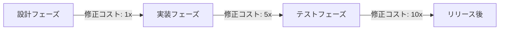
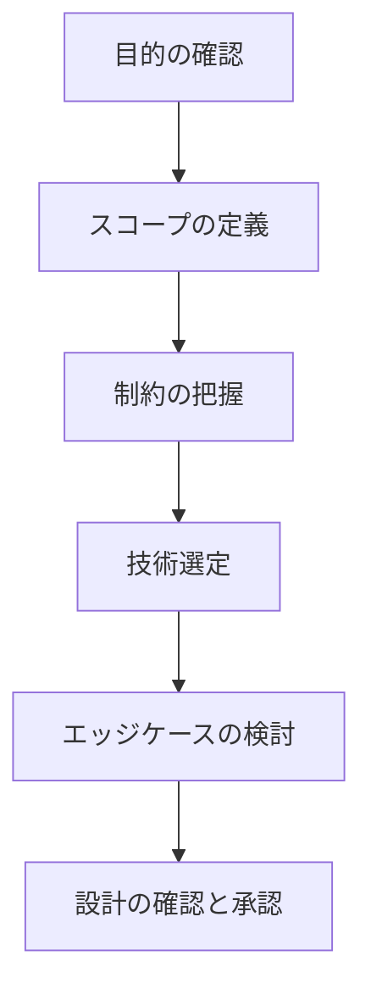
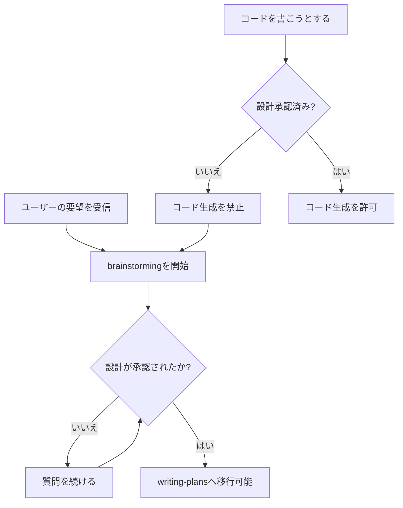
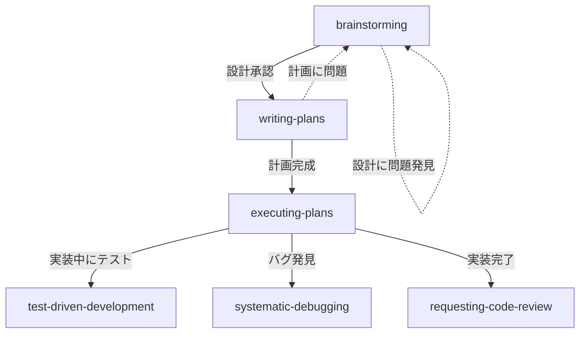

# 第4章 brainstorming: 設計フェーズ

Superpowersのワークフローにおいて、最初に発動するスキルがbrainstormingです。本章では、なぜコードを書く前に設計が必要なのか、そしてSuperpowersがどのようにしてAIエージェントに「まず考える」ことを強制するのかを詳しく解説します。

## 4.1 なぜ設計が最初に必要か

### コードを書く前に考えるべき理由

多くの開発者がAIコーディングエージェントに対して抱く不満の1つが、「いきなりコードを書き始めて、的外れな実装をする」というものです。人間の開発者であっても、要件を十分に理解しないまま実装を始めれば、手戻りが発生します。AIエージェントの場合、この問題はさらに深刻です。

AIエージェントがコードを書き始めると、以下のような問題が発生しがちです。

- ユーザーが意図していない方向に実装が進む（要件の誤解）
- 既存のコードベースの設計方針と矛盾する実装になる（アーキテクチャの不整合）
- 求められていない機能まで実装してしまう（過剰な実装）
- 重要な要件を見落としたまま完了を宣言する（不足する実装）

Superpowersのbrainstormingスキルは、これらの問題を根本から防ぐために設計されました。

### 間違った方向への投資を防ぐ

ソフトウェア開発において、設計の誤りを発見するコストは、開発フェーズが進むほど指数関数的に増大します。この法則は「ボーム（Boehm）の法則」として知られています。



brainstormingスキルは、この原則をAIエージェントの作業フローに組み込みます。設計フェーズで問題を発見し修正すれば、コードを1行も書き直す必要がありません。実装フェーズで発見すれば、数十行から数百行のコードを書き直す必要があるかもしれません。

### 設計の価値を数値で考える

以下は、brainstormingを省略した場合と実施した場合の、典型的な作業時間の比較です。

| シナリオ | 設計 | 実装 | 手戻り | 合計 |
|---|---|---|---|---|
| brainstormingなし | 0分 | 15分 | 20分 | 35分 |
| brainstormingあり | 5分 | 12分 | 2分 | 19分 |

brainstormingに費やす数分間は、結果的に大幅な時間短縮をもたらします。特にAIエージェントの場合、方向性を誤ったまま大量のコードを高速に生成してしまうため、手戻りのコストが人間以上に大きくなります。

## 4.2 ソクラテス式の設計改善プロセス

### ソクラテス式問答法とは

brainstormingスキルの中核にあるのは、ソクラテス式問答法（Socratic Method）です。これは古代ギリシャの哲学者ソクラテスが用いた対話手法で、相手に直接答えを教えるのではなく、質問を通じて相手自身が答えに到達するよう導くものです。

Superpowersでは、この手法をAIエージェントとユーザーの対話に応用しています。エージェントはユーザーの要望を受け取った後、すぐに解決策を提示するのではなく、設計に必要な情報を1つずつ質問していきます。

### 1メッセージに1つの質問

brainstormingスキルの重要なルールが、「1メッセージにつき1つの質問」という制約です。このルールには明確な理由があります。

**複数の質問を同時にすると起こる問題:**

- ユーザーが一部の質問にしか答えない
- 質問の優先順位が不明確になる
- 回答が散漫になり、設計の焦点がぼやける
- 前の質問の回答に依存する質問が無効になる

**1つずつ質問することの利点:**

- 各回答を踏まえて次の質問を調整できる
- 対話が自然な流れで進む
- ユーザーの負担が軽減される
- 設計が段階的に具体化していく

### 質問の段階的深化

brainstormingでは、質問が段階的に深化していきます。以下はその典型的な流れです。



**第1段階: 目的の確認**

まず、ユーザーが何を達成したいのかを正確に理解します。

> 「新しいエンドポイントを追加したい」という要望に対して、「そのエンドポイントはどのようなビジネス要件を満たすものですか？」と質問します。

**第2段階: スコープの定義**

目的が明確になったら、今回の実装で対応する範囲を定義します。

> 「ユーザーのプロフィール情報を返すエンドポイントということですね。プロフィールに含まれる情報はどこまでの範囲ですか？基本情報のみですか、それとも設定情報や統計データも含みますか？」

**第3段階: 制約の把握**

技術的制約やビジネス上の制約を明らかにします。

> 「このエンドポイントに対するアクセス制御はどのようになりますか？認証済みユーザーのみアクセス可能ですか？また、他のユーザーのプロフィールも閲覧できますか？」

**第4段階: 技術選定**

具体的な実装方針を検討します。

> 「既存のルーティング構造を確認しましたが、RESTful な設計パターンに従うと `GET /api/users/:id/profile` が適切に見えます。この設計で問題ありませんか？」

**第5段階: エッジケースの検討**

通常のフローでは発生しにくいが、考慮すべきケースを洗い出します。

> 「存在しないユーザーIDが指定された場合、404を返す方針でよいですか？また、ユーザーがアカウントを削除した場合のプロフィール取得はどう扱いますか？」

**第6段階: 設計の確認と承認**

すべての検討が終わったら、設計全体をまとめて承認を求めます。

### AIエージェントへの効果

ソクラテス式問答法は、AIエージェントに対して特に効果的です。その理由は以下の通りです。

1. AIは不明な点を推測で埋める傾向がありますが、質問を義務づけることでこれを防ぎます
2. 質問と回答を通じて、エージェントは実装に必要な情報を段階的に獲得します
3. ユーザー自身が質問に答えることで、曖昧だった要件が具体化されます
4. 対話の過程で、エージェントの理解とユーザーの意図のずれが早期に発見されます

## 4.3 HARD-GATE: 設計承認なしにコードを書かない

### HARD-GATEとは

HARD-GATEは、Superpowersの中核的な概念の1つです。特定の条件が満たされるまで、次のフェーズへの移行を厳格に禁止する仕組みです。brainstormingにおけるHARD-GATEは、以下のルールを定めています。

> **設計がユーザーによって明示的に承認されるまで、いかなるコードも書いてはならない。**

この制約は、どんなに単純に見えるタスクであっても例外なく適用されます。

### なぜ例外を認めないのか

「こんな簡単な修正にbrainstormingは必要ない」と思うかもしれません。しかし、Superpowersが例外を認めないのには重要な理由があります。

**理由1: 「簡単」の判断が間違っている可能性**

「ボタンのテキストを変更するだけ」に見えたタスクが、実はi18n（国際化）対応、アクセシビリティ、デザインシステムとの整合性など、多くの考慮事項を含んでいたということは珍しくありません。

**理由2: 習慣としての定着**

例外を1つ認めると、次々と例外が生まれます。「これも簡単だから省略しよう」「これくらいなら大丈夫」という判断が積み重なると、brainstormingという習慣自体が形骸化します。

**理由3: AIエージェントの判断の不確実性**

人間の開発者であれば、タスクの複雑さを経験的に判断できます。しかし、AIエージェントにはその判断能力が十分ではありません。すべてのタスクでbrainstormingを実行することで、この不確実性を排除します。

### HARD-GATEの実装メカニズム

brainstormingスキルのHARD-GATEは、以下のように機能します。



エージェントが設計承認前にコードを書こうとした場合、スキルのプロンプトがそれを検知し、brainstormingプロセスに戻すよう指示します。これは「AIの衝動制御」とも言える仕組みです。

### 承認の形式

設計の承認は、ユーザーからの明示的な同意によって行われます。以下のような応答が承認として扱われます。

- 「この設計で進めてください」
- 「OK、実装に入ってください」
- 「問題ありません。計画を作ってください」

曖昧な応答（「まあいいんじゃない？」「多分それで」）の場合、エージェントは確認の質問を追加することがあります。これは、中途半端な承認による実装の問題を防ぐためです。

### HARD-GATEが防ぐアンチパターン

HARD-GATEが存在しない場合、AIエージェントは以下のようなアンチパターンに陥りがちです。

| アンチパターン | 説明 | HARD-GATEによる防止 |
|---|---|---|
| 即座のコード生成 | 要望を受け取った瞬間にコードを書き始める | 設計承認まで生成を禁止 |
| 仮定ベースの実装 | 不明な点を独自に仮定して実装する | 質問による仮定の排除 |
| スコープクリープ | 求められていない機能まで実装する | スコープの明示的な合意 |
| 技術選定の独断 | エージェント独自の判断で技術を選ぶ | 技術選定の事前合意 |

## 4.4 実践例: REST APIに新しいエンドポイントを追加する

ここからは、具体的なbrainstormingの実践例を見ていきましょう。Express.jsで構築されたREST APIに、新しいエンドポイントを追加するシナリオです。

### プロジェクトの前提

以下のようなプロジェクト構造を持つExpress.jsアプリケーションを想定します。

```text
my-api/
├── src/
│   ├── routes/
│   │   ├── auth.ts
│   │   └── users.ts
│   ├── middleware/
│   │   ├── auth.ts
│   │   └── validation.ts
│   ├── models/
│   │   └── user.ts
│   ├── services/
│   │   └── user-service.ts
│   └── app.ts
├── tests/
│   ├── routes/
│   │   └── users.test.ts
│   └── services/
│       └── user-service.test.ts
├── package.json
└── tsconfig.json
```

### brainstormingの開始

**ユーザー:**

> 「ユーザーのブックマーク機能を追加したい。記事をブックマークできるようにしてほしい。」

**エージェント（第1の質問 - 目的の明確化）:**

> ブックマーク機能の追加ですね。いくつか確認させてください。
>
> まず最初の質問です。ブックマークの対象となる「記事」は、このAPIで管理されているリソースですか？それとも外部のURLをブックマークする形ですか？

**ユーザー:**

> 「このAPIで管理している記事（articlesテーブル）をブックマークする形です。」

### スコープの定義

**エージェント（第2の質問 - スコープの確認）:**

> ありがとうございます。articlesテーブルの記事をブックマークするのですね。
>
> ブックマーク機能のスコープについて確認します。以下のどの操作が必要ですか？
>
> - 記事をブックマークに追加する
> - ブックマークを解除する
> - 自分のブックマーク一覧を取得する
> - ブックマークの並び替えやフォルダ分類
>
> 今回のスコープはどこまでですか？

**ユーザー:**

> 「追加、解除、一覧取得の3つ。フォルダ分類は今はいらない。」

### 制約の把握

**エージェント（第3の質問 - 認証とアクセス制御）:**

> 追加、解除、一覧取得の3機能ですね。
>
> アクセス制御について確認します。ブックマーク機能は認証済みユーザーのみが使えるという理解で合っていますか？また、他のユーザーのブックマーク一覧を閲覧できる必要はありますか？

**ユーザー:**

> 「認証必須。他人のブックマークは見れなくてよい。」

### 技術的な検討

**エージェント（第4の質問 - データモデルとAPI設計）:**

> 認証必須で、自分のブックマークのみ閲覧可能ですね。
>
> 既存のコードベースを確認しました。API設計として以下を提案します。
>
> **データモデル:**
>
> - bookmarksテーブル: user_id, article_id, created_at のシンプルな中間テーブル
>
> **エンドポイント:**
>
> - `POST /api/bookmarks` - ブックマーク追加
> - `DELETE /api/bookmarks/:articleId` - ブックマーク解除
> - `GET /api/bookmarks` - ブックマーク一覧取得
>
> 既存のルーティングパターンと一貫性がありますが、この設計で問題ありませんか？

**ユーザー:**

> 「一覧取得にはページネーションをつけてほしい。あと、同じ記事を二重ブックマークしないようにして。」

### エッジケースの検討

**エージェント（第5の質問 - エッジケース）:**

> ページネーションと重複防止ですね。承知しました。
>
> エッジケースの確認です。以下の場合はどう扱いますか？
>
> - 既にブックマーク済みの記事に対してブックマーク追加のリクエストがあった場合（409 Conflictを返す、または何もせずに200を返す）
> - 存在しない記事IDに対してブックマークを追加しようとした場合

**ユーザー:**

> 「既にブックマーク済みなら何もせずに200を返す（冪等性を保つ）。存在しない記事IDなら404。」

### 設計のまとめと承認

**エージェント（設計サマリー）:**

> 設計が固まりました。以下にまとめます。
>
> **ブックマーク機能の設計:**
>
> 1. **データモデル**: bookmarksテーブル（user_id, article_id, created_at）。user_idとarticle_idの複合ユニーク制約
> 2. **エンドポイント**:
>    - `POST /api/bookmarks` - body: `{ articleId }` - 冪等性あり
>    - `DELETE /api/bookmarks/:articleId` - ブックマーク解除
>    - `GET /api/bookmarks?page=1&limit=20` - ページネーション付き一覧
> 3. **アクセス制御**: 全エンドポイントで認証必須。自分のブックマークのみ操作可能
> 4. **エラーハンドリング**: 存在しない記事は404、二重ブックマークは冪等に処理
>
> この設計で計画の作成に進んでよろしいですか？

**ユーザー:**

> 「OKです。進めてください。」

この承認をもって、HARD-GATEが解除され、次のフェーズ（writing-plans）に移行できます。

### brainstormingの所要時間

上記の対話は、実際の作業では3〜5分程度で完了します。この5分間の投資により、以下の成果が得られました。

- 明確なデータモデル設計
- RESTful なAPI設計
- エッジケースの処理方針
- アクセス制御のルール
- ページネーションの仕様

もしbrainstormingなしに実装を始めていたら、エージェントは重複ブックマークの処理やページネーションの有無を独自に判断し、ユーザーの意図と異なる実装を行っていた可能性が高いです。

## 4.5 効果的なbrainstormingのコツ

### コツ1: 具体的な要件を伝える

brainstormingの効果を最大化するには、最初のメッセージから具体的な情報を提供することが重要です。

**悪い例:**

> 「検索機能を追加して」

**良い例:**

> 「記事の検索機能を追加したい。タイトルと本文をキーワードで全文検索できるようにしたい。検索結果はページネーション付きで、関連度順に並べたい。」

良い例のように具体的な要件を伝えると、brainstormingの焦点が定まり、より建設的な質問が得られます。ただし、すべてを最初から決める必要はありません。brainstormingの過程で詳細が明らかになっていくことが、このプロセスの本質です。

### コツ2: 制約を明示する

技術的な制約やビジネス上の制約は、できるだけ早い段階で共有しましょう。

```text
制約の例:
- 「データベースはPostgreSQLを使っている」
- 「レスポンスタイムは200ms以内にしたい」
- 「既存のORMはPrismaを使っている」
- 「認証はJWTベースで実装済み」
- 「この機能は来週月曜にリリースしたい」
```

制約を知らないままbrainstormingを進めると、実現不可能な設計が生まれるリスクがあります。制約は設計の土台であり、早い段階で共有することでbrainstormingの質が大きく向上します。

### コツ3: 既存コードの文脈を共有する

AIエージェントは、既存のコードベースを読み取る能力を持っています。しかし、コードベース全体を完全に理解しているわけではありません。以下のような情報を積極的に共有すると、brainstormingの質が向上します。

- 「このプロジェクトはクリーンアーキテクチャを採用している」（アーキテクチャの方針）
- 「サービス層のクラスは`XxxService`という命名規則」（命名規則）
- 「お気に入り機能が`src/routes/favorites.ts`に実装されていて、似た構造にしたい」（既存の類似機能）
- 「以前Repositoryパターンを使って複雑になりすぎたので、今回はシンプルにしたい」（避けるべきパターン）

### コツ4: 「わからない」を正直に伝える

brainstormingの質問に対して、すべてに明確な答えを持っている必要はありません。「まだ決まっていない」「どちらがいいかわからない」と正直に伝えることで、エージェントはより建設的な提案ができます。

**対話例:**

> **エージェント**: 「検索のインデックスはPostgreSQLのFull Text Searchを使いますか？それともElasticsearchのような外部サービスを使いますか？」
>
> **ユーザー**: 「正直どちらがいいかわからない。データ量は今のところ1万件程度で、将来的には10万件くらいまで増えるかもしれない。」
>
> **エージェント**: 「1万〜10万件規模であれば、PostgreSQLのFull Text Searchで十分なパフォーマンスが得られます。外部サービスの運用コストも不要です。将来的にデータ量が大幅に増えた場合に、Elasticsearchへの移行を検討する形はいかがですか？」

このように、判断材料を共有すれば、エージェントが根拠に基づいた提案をしてくれます。

### コツ5: 設計に対するフィードバックを恐れない

brainstormingはあくまで設計の洗練プロセスです。エージェントの提案に対して、違和感があれば遠慮なく指摘しましょう。

- 「その設計は複雑すぎる。もっとシンプルにできないか？」
- 「パフォーマンスが心配。キャッシュは必要ないか？」
- 「その方法だとテストが書きにくくなりそう。別の方法はないか？」

エージェントは批判的なフィードバックを受け入れ、設計を修正する能力を持っています。brainstormingの段階で設計を磨くことが、高品質な実装への最短ルートです。

## 4.6 brainstormingの落とし穴と対策

### 落とし穴1: brainstormingが長引きすぎる

brainstormingが有効だからといって、際限なく続けるべきではありません。過度なbrainstormingは、以下のような問題を引き起こします。

- 完璧な設計を追求するあまり、実装に着手できない（分析麻痺 / Analysis Paralysis）
- 対話が長くなりすぎて、重要な決定事項が埋もれる（コンテキストの肥大化）
- いつまでも「考える」段階が続き、進捗感がない（モチベーションの低下）

brainstormingは通常5〜10ラウンドの質問で十分です。それ以上続く場合は、スコープが大きすぎる可能性があります。タスクを分割して、それぞれに対してbrainstormingを行うことを検討しましょう。

### 落とし穴2: 表面的な質問に終始する

エージェントの質問が表面的なものに終始し、本質的な設計の議論に踏み込めないことがあります。

**表面的な質問の例:**

> 「変数名は何にしますか？」
> 「ファイルはどのディレクトリに置きますか？」

これらは実装フェーズで決めればよい詳細です。brainstormingでは、以下のような本質的な質問に焦点を当てるべきです。

**本質的な質問の例:**

> 「この機能のデータの一貫性をどのように保証しますか？」
> 「将来的な拡張性を考慮すると、この設計にはどのようなリスクがありますか？」

質問が表面的だと感じたら、「もっと設計の本質に関わる質問をしてほしい」とフィードバックしましょう。

### 落とし穴3: brainstormingをスキップしたくなる誘惑

特に小さな修正や、急いでいるときに、brainstormingをスキップしたくなることがあります。しかし、前述の通り、HARD-GATEは例外を認めません。

**よくある誘惑と対処法:**

| 誘惑 | 対処法 |
|---|---|
| 「1行の変更だから不要」 | 1行の変更でも影響範囲は広い場合がある |
| 「前に似た作業をしたから」 | 前回の文脈と今回の文脈は異なる |
| 「急いでいるから」 | 手戻りの方がより多くの時間を失う |
| 「設計は明らかだから」 | 明らかに見えても確認には価値がある |

## 4.7 brainstormingと他のスキルの関係

brainstormingは、Superpowersのワークフローにおいて出発点となるスキルです。他のスキルとの関係を理解することで、全体の流れがより明確になります。



brainstormingで合意された設計に基づいて、writing-plansで具体的な実装計画を作成します。brainstormingの出力（設計サマリー）が、writing-plansの入力になります。

brainstormingで検討されたエッジケースや仕様は、テストケースの元になります。brainstormingの段階で「冪等性を保つ」「存在しない記事IDには404を返す」といった仕様が決まっていれば、テスト設計がスムーズに進みます。

writing-plansやexecuting-plansの段階で、当初の設計に問題が見つかった場合は、brainstormingに戻ることもできます。これは設計の失敗ではなく、プロセスが正常に機能している証拠です。

### brainstormingの成果物

brainstormingの成果物は、明示的な「設計ドキュメント」ではなく、対話を通じて合意された以下の情報です。

- この機能が何を達成するか（目的）
- 今回の実装で対応する範囲（スコープ）
- 必要なテーブルやフィールドの構造（データモデル）
- エンドポイントのURL、HTTPメソッド、リクエスト・レスポンス形式（API設計）
- 各種エラーケースへの対応方針（エラーハンドリング）
- パフォーマンス要件、セキュリティ要件、互換性要件（制約）
- 今回のスコープに含めないと明示的に決めた事項（除外事項）
- 複数の機能がある場合、どの順序で実装するか（優先順位）

これらの情報が次のwriting-plansスキルへの入力として引き継がれます。brainstormingでの対話が具体的であればあるほど、計画の質も高くなります。

## 4.8 まとめ

brainstormingスキルは、Superpowersのワークフロー全体の基盤です。本章で学んだ重要なポイントを振り返りましょう。

- 間違った方向への投資を防ぐために、設計を先に行います
- 1メッセージに1つの質問で、設計を段階的に深化させます
- どんなに単純なタスクでも、設計承認なしにコードを書くことは禁止です
- 要件、制約、既存コードの情報を積極的に共有することで、brainstormingの質が向上します
- 判断材料を共有すれば、エージェントが根拠ある提案をしてくれます

次章では、brainstormingで合意された設計を、実行可能な計画に変換するwriting-plansスキルと、その計画を忠実に実行するexecuting-plansスキルについて解説します。
