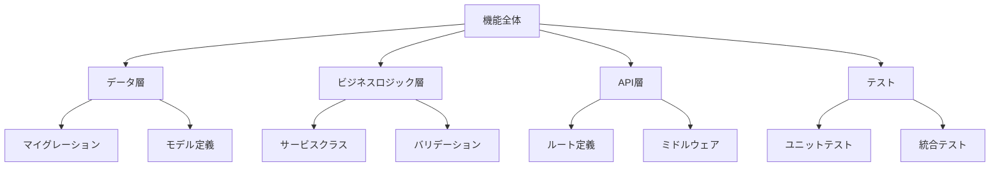
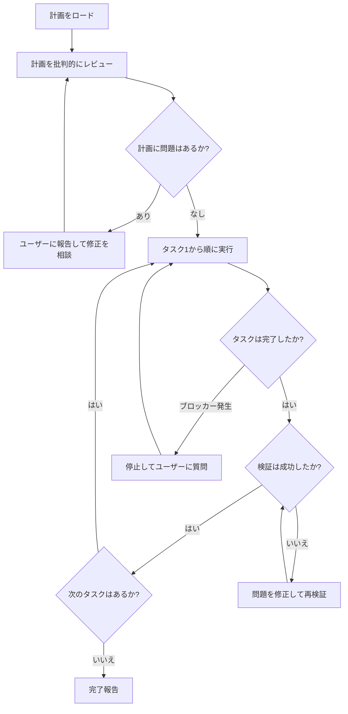
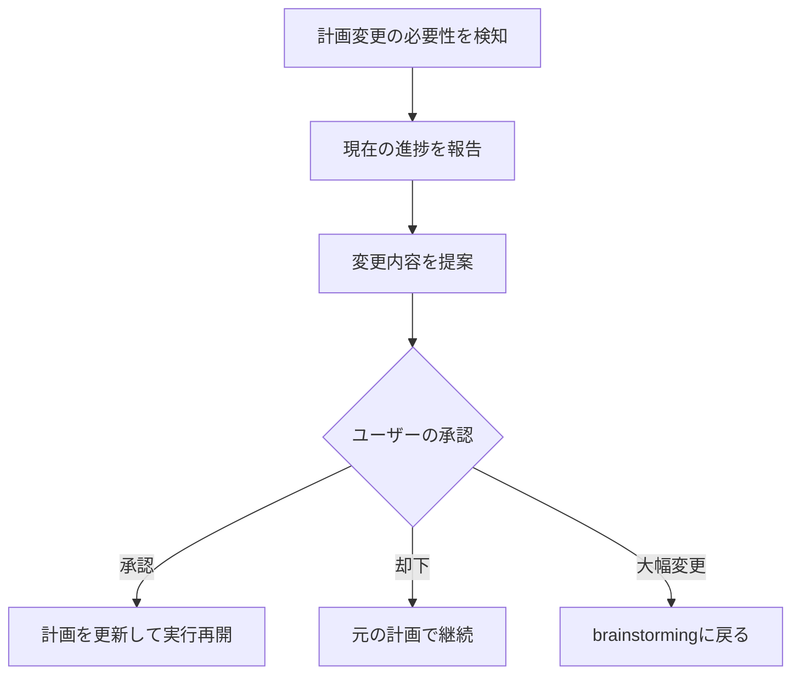

# 第5章 writing-plans / executing-plans: 計画と実行

前章のbrainstormingで設計が承認されたら、次は計画の作成と実行です。Superpowersでは、この2つのフェーズをwriting-plansとexecuting-plansという2つのスキルに分離しています。本章では、良い計画の条件から、計画の作成・実行・変更まで、実践的に解説します。

## 5.1 良い計画の条件

### 「コンテキストゼロのエンジニア」テスト

Superpowersにおける良い計画とは、「コンテキストゼロで趣味の悪いエンジニア（a zero-context, bad-taste engineer）」でも正確に実行できる計画です。この基準は一見厳しく見えますが、AIエージェントに計画を実行させる上で合理的な基準です。

「コンテキストゼロ」とは、以下の状態を意味します。

- プロジェクトの背景知識を持っていない
- 設計意図を理解していない
- 暗黙の前提を知らない
- 「常識的に考えれば分かるだろう」が通用しない

「趣味の悪い」とは、以下を意味します。

- 最も安易な実装を選ぶ傾向がある
- 美しいコードやエレガントな設計を追求しない
- 言われたことだけをそのまま実行する
- 行間を読まない

このようなエンジニアでも正確に実行できる計画とは、すなわち**曖昧さがゼロの計画**です。

### 良い計画と悪い計画の比較

以下に、同じ機能追加に対する良い計画と悪い計画を比較します。

**悪い計画の例:**

```text
1. ブックマークのモデルを作成する
2. ルートを追加する
3. サービス層を実装する
4. テストを書く
```

**良い計画の例:**

```text
タスク1（2分）: bookmarksテーブルのマイグレーション作成
  ファイル: src/migrations/20240115_create_bookmarks.ts
  内容: user_id (integer, NOT NULL, FK -> users.id)
        article_id (integer, NOT NULL, FK -> articles.id)
        created_at (timestamp, NOT NULL, DEFAULT NOW())
        複合ユニーク制約: (user_id, article_id)
        インデックス: user_id, (user_id, created_at DESC)
  検証: マイグレーション実行後、テーブルが正しく作成されることを確認

タスク2（3分）: Bookmarkモデルの作成
  ファイル: src/models/bookmark.ts
  内容: Prismaスキーマに基づくBookmarkモデル定義
        - findByUserId(userId, page, limit): ページネーション付き取得
        - create(userId, articleId): 作成（ON CONFLICT DO NOTHING）
        - delete(userId, articleId): 削除
  検証: 型チェックが通ることを確認（npx tsc --noEmit）

タスク3（5分）: BookmarkServiceの作成
  ファイル: src/services/bookmark-service.ts
  ...（以下続く）
```

違いは明白です。良い計画には、ファイルパス、具体的なカラム定義、検証手順が含まれており、「何をどうすればよいか」が一意に決まります。

### 良い計画の5つの条件

writing-plansスキルが作成する計画は、以下の5つの条件を満たす必要があります。

| 条件 | 説明 | 悪い例 | 良い例 |
|---|---|---|---|
| 時間見積もり | 各タスクに2-5分の見積もり | 「ルートを実装」 | 「タスク3（4分）: ルートの実装」 |
| 正確なファイルパス | 作成・変更するファイルの完全パス | 「モデルを作る」 | `src/models/bookmark.ts` |
| 完全なコード仕様 | プレースホルダーなしの具体的な仕様 | 「適切なバリデーション」 | 「articleIdはpositive integerであること」 |
| 検証手順 | タスク完了の確認方法 | （なし） | `npm test -- bookmark` |
| 依存関係 | タスク間の順序と依存 | （暗黙的） | 「タスク2はタスク1の完了後に実行」 |

## 5.2 writing-plans: 2-5分単位のタスク分解

### なぜ2-5分単位なのか

writing-plansスキルは、実装作業を2〜5分単位の細かいタスクに分解します。この粒度には明確な理由があります。

AIエージェントは長いタスクの途中で文脈を見失うことがあります。2-5分のタスクは、エージェントが一度に集中すべき範囲を明確にします。

細かいタスクに分割することで、実行中のどの段階にいるかが明確になります。10個のタスクのうち7個が完了していれば、進捗は70%です。

タスクが小さいほど、問題が発生した場合の手戻りも小さくなります。1つのタスクで問題が見つかっても、影響は2-5分の作業範囲に限定されます。

小さなタスクは、完了を検証しやすいです。「ファイルが作成された」「テストが通った」「型チェックが通った」など、明確な完了条件を設定できます。

### タスク分解の実践テクニック

大きな機能を2-5分単位のタスクに分解するには、以下のテクニックが有効です。

**テクニック1: レイヤーごとに分割する**



**テクニック2: 依存関係の順序で並べる**

タスクを依存関係の順序で並べることで、各タスクが前のタスクの成果物を利用できるようになります。

```text
タスク1: データベースマイグレーション（依存なし）
タスク2: モデル定義（タスク1に依存）
タスク3: サービス層（タスク2に依存）
タスク4: バリデーション（タスク3に依存）
タスク5: ルート定義（タスク3, 4に依存）
タスク6: ユニットテスト（タスク3に依存）
タスク7: 統合テスト（タスク5に依存）
```

**テクニック3: 1タスク1ファイルの原則**

可能な限り、1つのタスクで変更するファイルは1つに限定します。複数のファイルを同時に変更するタスクは、それぞれのファイルごとのタスクに分割できないか検討しましょう。

### 正確なファイルパスの重要性

writing-plansで作成する計画には、作成・変更するファイルの正確なパスを含める必要があります。これは単なる形式的な要件ではなく、以下の理由で重要です。

- 実行者（executing-plans）がファイルの場所を推測する必要がなくなります
- 同名のファイルが既に存在しないか事前に確認できます
- 計画段階でファイル構成を確認でき、ディレクトリ構造の問題を早期に発見できます

```text
悪い例: 「bookmarkのモデルファイルを作成」
良い例: 「src/models/bookmark.ts を新規作成」

悪い例: 「ルーティングファイルにエンドポイントを追加」
良い例: 「src/routes/bookmarks.ts を新規作成し、
         src/app.ts の import セクションに追加」
```

### 完全なコード仕様

計画の中で、コードの仕様は可能な限り具体的に記述します。Superpowersでは、以下のレベルの具体性を求めます。

**関数のシグネチャ:**

```typescript
// 計画に記載するレベルの具体性
async function createBookmark(
  userId: number,
  articleId: number
): Promise<Bookmark>
```

**データベーススキーマ:**

```sql
-- 計画に記載するレベルの具体性
CREATE TABLE bookmarks (
  id SERIAL PRIMARY KEY,
  user_id INTEGER NOT NULL REFERENCES users(id) ON DELETE CASCADE,
  article_id INTEGER NOT NULL REFERENCES articles(id) ON DELETE CASCADE,
  created_at TIMESTAMP NOT NULL DEFAULT NOW(),
  UNIQUE(user_id, article_id)
);
```

**API レスポンス形式:**

```json
{
  "data": [
    {
      "id": 1,
      "articleId": 42,
      "title": "記事タイトル",
      "createdAt": "2024-01-15T10:30:00Z"
    }
  ],
  "pagination": {
    "page": 1,
    "limit": 20,
    "total": 45
  }
}
```

## 5.3 プレースホルダー禁止の原則

### 計画における「TBD」は失敗のサイン

writing-plansスキルにおいて、プレースホルダー（Placeholder）は明確に禁止されています。これはSuperpowersの中でも特に厳格なルールの1つです。

**禁止される表現の例:**

| 禁止表現 | なぜ禁止か |
|---|---|
| TBD | 決定が先送りされている |
| TODO | 具体的な内容が未定 |
| 「後で実装」 | 実装内容が不明 |
| 「適切な処理」 | 何が「適切」か定義されていない |
| 「必要に応じて」 | 条件が明確でない |
| 「etc.」「など」 | 列挙が不完全 |
| 「同様の処理」 | 何が「同様」か不明確 |

### プレースホルダーが危険な理由

プレースホルダーが計画に含まれていると、executing-plansスキルで実行する際に以下の問題が発生します。

**問題1: 実行者の推測に委ねられる**

「適切なエラーハンドリングを実装」というタスクがあった場合、何が「適切」かは実行者の判断に委ねられます。AIエージェントの場合、この推測が設計者の意図と一致する保証はありません。

**問題2: 品質のばらつき**

プレースホルダーの部分は、実行時の状態（コンテキストウィンドウの残量、モデルの傾向など）によって実装の品質がばらつきます。計画段階で具体化しておけば、このばらつきを排除できます。

**問題3: 検証不能**

「適切に処理する」というタスクの完了をどう検証しますか？具体的な内容が定義されていなければ、完了したかどうかの判断もできません。

### プレースホルダーを具体化する方法

プレースホルダーが出現した場合は、以下の方法で具体化します。

**方法1: 条件と処理の対応表に変換する**

```text
Before: 「適切なエラーハンドリングを実装」

After:
  - article_idが存在しない → 404 Not Found, body: { error: "Article not found" }
  - user_idが無効 → 401 Unauthorized, body: { error: "Authentication required" }
  - データベース接続エラー → 500 Internal Server Error, body: { error: "Internal error" }
  - バリデーションエラー → 400 Bad Request, body: { error: "Invalid articleId" }
```

**方法2: 具体的な実装コードに変換する**

```text
Before: 「入力のバリデーションを実装」

After:
  バリデーションルール:
  - articleId: required, positive integer, max value 2^31-1
  - page: optional, positive integer, default 1
  - limit: optional, positive integer, range 1-100, default 20
```

**方法3: brainstormingに戻る**

プレースホルダーをどう具体化すべきか判断できない場合は、brainstormingに戻ってユーザーに確認します。これは後退ではなく、設計の不足を補う前進です。

## 5.4 executing-plans: 計画の忠実な実行

### executing-plansの基本フロー

executing-plansスキルは、writing-plansで作成された計画を忠実に実行するスキルです。基本フローは以下の通りです。



### ステップ1: 計画のロード

executing-plansスキルが最初に行うのは、計画の全体像を把握することです。計画が別のセッションやファイルで作成されている場合、それを読み込んで理解します。

### ステップ2: 計画の批判的レビュー

計画をロードしたら、実行に入る前に批判的なレビューを行います。このレビューでは以下を確認します。

- 計画内の異なるタスク間で矛盾がないか
- タスクの実行順序が依存関係と一致しているか
- 現在のコードベースや環境設定と計画が一致しているか
- 必要なタスクが抜けていないか

問題が見つかった場合は、実行を開始せずにユーザーに報告します。

**レビューで問題が見つかった場合の対応例:**

> 計画をレビューしました。以下の点を確認させてください。
>
> タスク3で `src/middleware/auth.ts` に変更を加える計画ですが、現在のコードベースを確認したところ、認証ミドルウェアは `src/middleware/authentication.ts` にあります。ファイルパスを修正してよろしいですか？

### ステップ3: 全タスクの順次実行

レビューが完了したら、タスクを順番に実行していきます。各タスクの実行では以下のサイクルを繰り返します。

1. タスクの内容を確認する
2. 計画に従って実装する
3. タスクの検証手順を実行する
4. 検証が成功したら次のタスクへ進む

### ステップ4: 完了報告

すべてのタスクが完了したら、完了報告を行います。この報告には以下が含まれます。

- 実行したタスクの一覧
- 各タスクの検証結果
- 計画からの逸脱（もしあれば）
- 残存する懸念事項（もしあれば）

## 5.5 ブロッカーに当たったら停止して質問する

### ブロッカーの定義

executing-plansにおける「ブロッカー（Blocker）」とは、計画に記載されていない状況に遭遇し、計画の続行が不可能または不適切になった場合を指します。

**ブロッカーの具体例:**

- 計画で指定されたファイルが存在しない
- 計画で想定していたAPIの戻り値が実際と異なる
- 依存するライブラリのバージョンが計画の想定と違う
- テストが予期しない理由で失敗する
- 計画に記載されていない副作用が発生する

### 推測せず停止する原則

ブロッカーに遭遇した場合、executing-plansスキルのルールは明確です。

> **推測で先に進まず、停止してユーザーに質問する。**

この原則は、AIエージェントの最も危険な傾向の1つ — 推測で辻褄を合わせる — を防ぐためのものです。

**悪い対応（推測で進める）:**

> 計画では `src/middleware/auth.ts` を変更する予定でしたが、ファイルが見つかりませんでした。おそらく `src/middleware/authentication.ts` のことだと思うので、こちらを変更します。

**良い対応（停止して質問する）:**

> ブロッカーに遭遇しました。
>
> 計画のタスク3で `src/middleware/auth.ts` を変更する予定ですが、このファイルが存在しません。類似のファイルとして `src/middleware/authentication.ts` があります。
>
> 以下のどちらで対応しますか？
> 1. `src/middleware/authentication.ts` を変更する
> 2. 計画を見直す

この違いは微妙に見えますが、非常に重要です。推測が正しい場合もありますが、間違っている場合のコストは大きいです。たとえば、`auth.ts` は削除されたのではなく、まだ作成されていないファイルだったかもしれません。

### ブロッカーの報告テンプレート

ブロッカーに遭遇した場合の報告は、以下の構造で行われます。

```text
【ブロッカー報告】

■ 発生タスク: タスク3 - 認証ミドルウェアの修正
■ 計画の記載: src/middleware/auth.ts の validateToken 関数を修正
■ 実際の状況: src/middleware/auth.ts が存在しない
■ 確認した代替候補: src/middleware/authentication.ts に validateToken 関数あり
■ 提案する対応:
  1. authentication.ts を変更対象に修正して続行
  2. 計画全体を見直し
■ 質問: どちらの対応で進めますか？
```

## 5.6 計画の途中変更と再計画

### 計画変更が必要になるケース

完璧な計画を作成しても、実行中に変更が必要になることはあります。以下のようなケースが典型的です。

**ケース1: 技術的な発見**

実装を進める中で、計画時には見えていなかった技術的な制約や機会が見つかることがあります。

> 「タスク4でデータベースクエリを実装したところ、既存のクエリビルダーに必要な機能が既に実装されていました。タスク5のカスタムクエリは不要になります。」

**ケース2: 要件の変更**

ユーザーが実装の進捗を見て、要件を変更したいと考えることがあります。

> 「ブックマーク一覧のレスポンスに、記事の著者名も含めてほしい。」

**ケース3: 外部要因**

依存ライブラリのアップデート、チームメンバーによるコード変更など、外部要因で計画の前提が崩れることがあります。

### 計画変更のプロセス

計画の途中変更は、以下のプロセスで行います。



計画の変更は、ユーザーの承認なしに行ってはいけません。「些細な変更だから」と自己判断で計画を変えることは、推測で先に進むのと同じリスクがあります。

### 小さな変更と大きな変更の判断

計画の変更には、規模に応じた対応が必要です。

| 変更の規模 | 対応 | 例 |
|---|---|---|
| 軽微な修正 | ユーザーに報告し承認後に続行 | ファイルパスの修正 |
| 中程度の変更 | 影響範囲を分析し、修正計画を提示 | タスクの追加・削除 |
| 大幅な変更 | brainstormingに戻る | アーキテクチャの見直し |

## 5.7 実践例: APIエンドポイントの追加を計画から実行まで

前章のbrainstormingで合意したブックマーク機能の設計を、計画と実行のフェーズに落とし込む実践例を見ていきましょう。

### writing-plansの出力

brainstormingで合意された設計を基に、writing-plansスキルが以下の計画を生成します。

```text
# ブックマーク機能実装計画

## 前提条件
- brainstormingで合意済みの設計に基づく
- Express.js + TypeScript + Prisma の既存スタック
- 認証ミドルウェアは実装済み（src/middleware/auth.ts）

## タスク一覧

### タスク1（3分）: Prismaスキーマの更新
ファイル: prisma/schema.prisma

追加するモデル:
  model Bookmark {
    id        Int      @id @default(autoincrement())
    userId    Int      @map("user_id")
    articleId Int      @map("article_id")
    createdAt DateTime @default(now()) @map("created_at")
    user      User     @relation(fields: [userId], references: [id],
                        onDelete: Cascade)
    article   Article  @relation(fields: [articleId], references: [id],
                        onDelete: Cascade)

    @@unique([userId, articleId])
    @@index([userId, createdAt(sort: Desc)])
    @@map("bookmarks")
  }

User モデルに追加:
  bookmarks Bookmark[]

Article モデルに追加:
  bookmarks Bookmark[]

検証: npx prisma validate

### タスク2（2分）: マイグレーションの生成と実行
コマンド: npx prisma migrate dev --name add_bookmarks_table
検証: マイグレーションファイルが生成され、データベースに反映されること

### タスク3（4分）: BookmarkServiceの作成
ファイル: src/services/bookmark-service.ts（新規作成）

クラス: BookmarkService
メソッド:
  - async addBookmark(userId: number, articleId: number): Promise<Bookmark>
    - Articleの存在確認（存在しなければ NotFoundError をスロー）
    - upsertで冪等性を確保
  - async removeBookmark(userId: number, articleId: number): Promise<void>
    - deleteMany で該当レコードを削除（存在しなくてもエラーにしない）
  - async getBookmarks(userId: number, page: number, limit: number):
      Promise<{ bookmarks: BookmarkWithArticle[]; total: number }>
    - skip/take でページネーション
    - createdAt DESC で並び替え
    - Article の title を include

検証: npx tsc --noEmit

### タスク4（3分）: バリデーションスキーマの作成
ファイル: src/validators/bookmark-validator.ts（新規作成）

zodスキーマ:
  - addBookmarkSchema: { articleId: z.number().int().positive() }
  - getBookmarksSchema: {
      page: z.number().int().positive().default(1),
      limit: z.number().int().min(1).max(100).default(20)
    }

検証: npx tsc --noEmit

### タスク5（5分）: ルートの作成
ファイル: src/routes/bookmarks.ts（新規作成）

エンドポイント:
  POST /api/bookmarks
    - 認証ミドルウェア適用
    - addBookmarkSchema でバリデーション
    - BookmarkService.addBookmark を呼び出し
    - 成功: 200 { data: bookmark }
    - 記事なし: 404 { error: "Article not found" }
    - バリデーションエラー: 400 { error: "..." }

  DELETE /api/bookmarks/:articleId
    - 認証ミドルウェア適用
    - articleId を number にパース（失敗は 400）
    - BookmarkService.removeBookmark を呼び出し
    - 成功: 204 No Content

  GET /api/bookmarks
    - 認証ミドルウェア適用
    - getBookmarksSchema でクエリパラメータをバリデーション
    - BookmarkService.getBookmarks を呼び出し
    - 成功: 200 { data: bookmarks, pagination: { page, limit, total } }

検証: npx tsc --noEmit

### タスク6（2分）: ルートの登録
ファイル: src/app.ts（既存ファイルの変更）

変更内容:
  - import { bookmarkRouter } from "./routes/bookmarks" を追加
  - app.use("/api/bookmarks", bookmarkRouter) を追加
    （既存の app.use("/api/users", ...) の直後に配置）

検証: npx tsc --noEmit && npm run dev でサーバーが起動すること

### タスク7（5分）: BookmarkServiceのユニットテスト
ファイル: tests/services/bookmark-service.test.ts（新規作成）

テストケース:
  - addBookmark: 正常にブックマークが作成される
  - addBookmark: 同じ記事を二重ブックマークしても冪等に処理される
  - addBookmark: 存在しない記事IDで NotFoundError がスローされる
  - removeBookmark: 正常にブックマークが削除される
  - removeBookmark: 存在しないブックマークを削除してもエラーにならない
  - getBookmarks: ページネーション付きで一覧が取得できる
  - getBookmarks: createdAt DESC で並び替えられる

検証: npm test -- bookmark-service

### タスク8（5分）: 統合テスト
ファイル: tests/routes/bookmarks.test.ts（新規作成）

テストケース:
  - POST /api/bookmarks: 認証済みで正常にブックマーク追加
  - POST /api/bookmarks: 未認証で 401
  - POST /api/bookmarks: 存在しない記事で 404
  - POST /api/bookmarks: 不正な articleId で 400
  - DELETE /api/bookmarks/:articleId: 正常に削除
  - GET /api/bookmarks: ページネーション付きで取得
  - GET /api/bookmarks: 他のユーザーのブックマークが含まれない

検証: npm test -- bookmarks.test

## 合計見積もり: 29分（8タスク）
```

### executing-plansの実行

executing-plansスキルがこの計画を実行する際の流れを見てみましょう。

**計画のロードとレビュー:**

> 計画をロードしました。8つのタスクで合計29分の見積もりです。
>
> 計画をレビューした結果、1点確認があります。タスク4でzodを使用していますが、現在のpackage.jsonにzodが含まれていることを確認しました。問題なく進められます。
>
> タスク1から実行を開始します。

**タスク実行中のブロッカー発生例:**

> 【タスク5実行中にブロッカー発生】
>
> タスク5でルートを作成する際、既存の `src/routes/users.ts` を確認したところ、エラーハンドリングにプロジェクト固有の `AppError` クラスが使われています。計画では一般的なエラーレスポンスを想定していましたが、既存のパターンに合わせて `AppError` を使用すべきでしょうか？
>
> 1. `AppError` を使用して既存パターンに合わせる
> 2. 計画通り一般的なエラーレスポンスで実装する

このように、計画と実際のコードベースの間に差異が見つかった場合、executing-plansスキルは停止してユーザーに確認します。

**完了報告:**

> 全8タスクの実行が完了しました。
>
> **実行結果:**
> - タスク1-8: すべて正常に完了
> - 型チェック: パス
> - ユニットテスト: 7件すべてパス
> - 統合テスト: 7件すべてパス
>
> **計画からの逸脱:**
> - タスク5: AppError クラスを使用（ユーザー承認済み）
>
> **残存する懸念事項:**
> - なし

## 5.8 まとめ

writing-plansとexecuting-plansは、brainstormingで合意された設計を確実に実装するための仕組みです。本章の重要なポイントを振り返りましょう。

- 「コンテキストゼロのエンジニア」でも実行できる具体性を持つ計画を作成します
- 2-5分単位に細かく分割することで、進捗の可視化と手戻りの最小化を実現します
- TBD、TODO、「後で実装」は計画の中に存在してはいけません
- 計画をロードし、批判的にレビューし、全タスクを順次実行します
- 推測で先に進まず、停止してユーザーに質問します
- 変更が必要な場合は、規模に応じてユーザーの承認を得てから対応します

次章では、実装の品質を担保するtest-driven-developmentスキルについて解説します。
