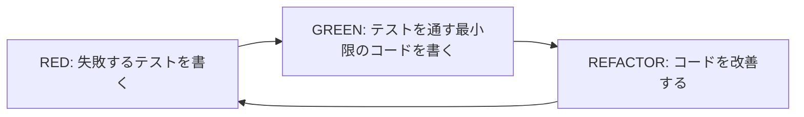
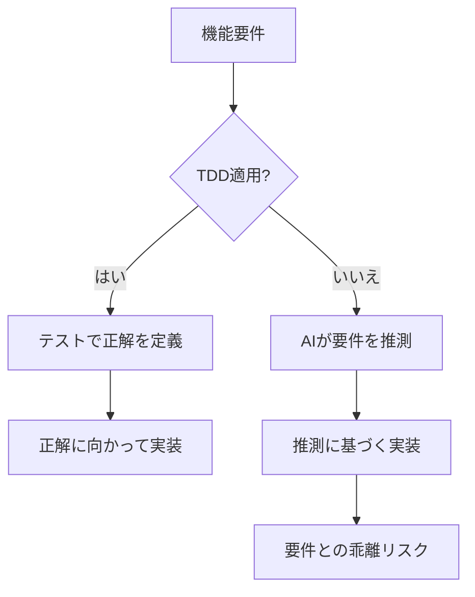
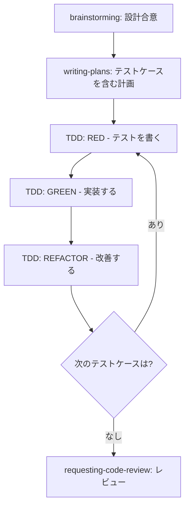

# 第6章 test-driven-development: テスト駆動開発

Superpowersのワークフローにおいて、test-driven-development（TDD）スキルは実装フェーズの品質を根本から支える仕組みです。本章では、Superpowers流のTDDがなぜAIエージェントにとって特に効果的なのか、そしてどのように実践するのかを詳しく解説します。

## 6.1 Superpowers流TDDの原則

### 鉄の掟: 失敗するテストなしにプロダクションコードを書くな

Superpowersのtest-driven-developmentスキルには、絶対に破ってはならないルールがあります。

> **失敗するテストが存在しない状態で、プロダクションコードを1行たりとも書いてはならない。**

これはSuperpowersにおける「鉄の掟（Iron Law）」の1つです。HARD-GATEと同様に、例外は一切認められません。

この掟は、従来のTDDの原則をAIエージェント向けに再定義したものです。Kent Beck が提唱したTDDの基本原則「Never write a single line of code unless you have a failing automated test」をそのまま採用しています。

### なぜ「鉄の掟」なのか

AIエージェントにとって、この掟が「鉄」である理由は明確です。

**理由1: テストが実装の仕様書になる**

テストを先に書くことで、実装の期待される振る舞いが明確に定義されます。AIエージェントは、テストという形で「何を実装すべきか」の具体的な指示を得ることができます。

**理由2: 推測による実装を防ぐ**

テストなしにコードを書くと、AIエージェントは「おそらくこう動くべきだろう」という推測に基づいて実装します。テストが先にあれば、推測の余地は大幅に減少します。

**理由3: 過剰な実装を防ぐ**

AIエージェントは、求められていない機能まで実装してしまう傾向があります。テストが定義する範囲だけを実装すればよいという制約が、この傾向を効果的に抑制します。

**理由4: リファクタリングの安全網**

テストが先に存在することで、実装後のリファクタリングを安全に行えます。リファクタリングの結果、テストが引き続きパスすれば、振る舞いが変わっていないことが保証されます。

### テスト前にコードを書いたら削除してやり直す

Superpowersのtest-driven-developmentスキルには、もう1つの厳格なルールがあります。

> **テストを書く前にプロダクションコードを書いてしまった場合、そのコードを削除して最初からやり直す。**

このルールは、一見非効率に見えるかもしれません。「書いたコードがもったいない」「テストを後から追加すればいいのでは」と思うかもしれません。しかし、このルールには重要な意味があります。

**テスト後付けの問題:**

- テストがコードの振る舞いを追認するだけになり、仕様の検証にならない
- コードに合わせてテストを書くため、バグがテストに含まれる可能性がある
- テストでは検出できない設計上の問題が残る
- 「テストを書くのが面倒」という圧力が生まれ、テストの品質が低下する

**やり直しの価値:**

- 2度目の実装は、1度目の知見を踏まえてより良いコードになる
- テストが真に仕様を表現するものになる
- TDDの習慣が崩れることを防ぐ
- AIエージェントにとって、コードを書くコストは人間より低い

## 6.2 RED-GREEN-REFACTORサイクル

### サイクルの全体像

TDDの核心は、RED-GREEN-REFACTOR（レッド・グリーン・リファクタ）サイクルです。Superpowersのtest-driven-developmentスキルは、このサイクルを厳格に遵守します。



このサイクルは、1つの機能の実装が完了するまで繰り返されます。各フェーズの詳細を見ていきましょう。

### REDフェーズ: 失敗するテストを書く

REDフェーズでは、まだ実装されていない機能に対するテストを書きます。このテストは、実行すると必ず失敗します（だからREDです）。

**REDフェーズのルール:**

1. テストは具体的な入力と期待される出力を含む
2. テストは1つの振る舞いのみを検証する
3. テストを実行して失敗することを確認する
4. 失敗の理由が「未実装」であることを確認する（構文エラーなどではない）

**REDフェーズの例:**

```typescript
// tests/services/bookmark-service.test.ts

describe("BookmarkService", () => {
  describe("addBookmark", () => {
    it("正常にブックマークが作成される", async () => {
      const service = new BookmarkService(mockPrisma);

      const result = await service.addBookmark(1, 42);

      expect(result).toEqual({
        id: expect.any(Number),
        userId: 1,
        articleId: 42,
        createdAt: expect.any(Date),
      });
    });
  });
});
```

このテストを実行すると、`BookmarkService`クラスが存在しないため失敗します。これが正しいREDの状態です。

**テストの実行と確認:**

```bash
$ npm test -- bookmark-service

FAIL  tests/services/bookmark-service.test.ts
  BookmarkService
    addBookmark
      ✕ 正常にブックマークが作成される

  ● BookmarkService > addBookmark > 正常にブックマークが作成される

    Cannot find module '../src/services/bookmark-service'
```

失敗を確認したら、次のGREENフェーズに進みます。

### GREENフェーズ: テストを通す最小限のコードを書く

GREENフェーズでは、REDフェーズで書いたテストを通すための最小限のコードを書きます。ここでの「最小限」は非常に重要です。

**GREENフェーズのルール:**

1. テストを通すためだけのコードを書く
2. テストが要求していない機能は追加しない
3. コードの美しさは気にしない（それはREFACTORフェーズの仕事）
4. テストを実行して成功（GREEN）することを確認する

**GREENフェーズの例:**

```typescript
// src/services/bookmark-service.ts

import { PrismaClient, Bookmark } from "@prisma/client";

export class BookmarkService {
  constructor(private prisma: PrismaClient) {}

  async addBookmark(userId: number, articleId: number): Promise<Bookmark> {
    return this.prisma.bookmark.upsert({
      where: {
        userId_articleId: { userId, articleId },
      },
      update: {},
      create: { userId, articleId },
    });
  }
}
```

この段階では、`addBookmark`メソッドだけを実装します。`removeBookmark`や`getBookmarks`はまだテストがないため、実装しません。

**テストの実行と確認:**

```bash
$ npm test -- bookmark-service

PASS  tests/services/bookmark-service.test.ts
  BookmarkService
    addBookmark
      ✓ 正常にブックマークが作成される
```

テストがパスしたら、REFACTORフェーズに進みます。

### REFACTORフェーズ: コードを改善する

REFACTORフェーズでは、テストがパスする状態を維持しながら、コードを改善します。

**REFACTORフェーズのルール:**

1. テストの振る舞いを変えない（テストは引き続きパスする）
2. コードの可読性、保守性、パフォーマンスを改善する
3. 重複を排除する
4. 命名を改善する
5. リファクタリング後にテストを再実行して、引き続きパスすることを確認する

**REFACTORフェーズの判断基準:**

リファクタリングが必要かどうかは、以下の観点で判断します。

| 観点 | 質問 | リファクタリングの例 |
|---|---|---|
| 可読性 | コードの意図が明確か？ | 変数名の改善、コメントの追加 |
| 重複 | 同じロジックが複数箇所にないか？ | 共通関数の抽出 |
| 責務 | 1つの関数が複数の責務を持っていないか？ | 関数の分割 |
| 構造 | プロジェクトの規約に沿っているか？ | ファイル構成の調整 |

GREENフェーズで書いたコードが十分にきれいな場合は、リファクタリングをスキップして次のREDフェーズに進むこともあります。

### サイクルの繰り返し

REFACTORが完了（またはスキップ）したら、次の機能に対するテストを書く新しいREDフェーズに入ります。

```text
サイクル1: addBookmark（正常系）
  RED   → テスト作成（BookmarkService未実装で失敗）
  GREEN → addBookmark実装（テストパス）
  REFACTOR → 必要に応じてリファクタリング

サイクル2: addBookmark（冪等性）
  RED   → テスト作成（重複ブックマークのテスト、失敗を確認）
  GREEN → upsertの動作確認（テストパス）
  REFACTOR → 必要に応じてリファクタリング

サイクル3: addBookmark（存在しない記事）
  RED   → テスト作成（NotFoundErrorのテスト、失敗）
  GREEN → 記事存在チェックを追加（テストパス）
  REFACTOR → エラーハンドリングの整理

サイクル4: removeBookmark
  RED   → テスト作成（removeBookmark未実装で失敗）
  GREEN → removeBookmark実装（テストパス）
  REFACTOR → 必要に応じてリファクタリング

（以下、getBookmarksも同様に続く）
```

## 6.3 鉄の掟の実践的な意味

### 掟が破られるパターン

AIエージェントが鉄の掟を破りがちなパターンを理解しておくことで、それを防ぐ意識が生まれます。

**パターン1: 「ついでに」の実装**

```text
テスト: addBookmarkの正常系テストを書いた
期待: addBookmarkのみ実装する
実際: addBookmark, removeBookmark, getBookmarksをすべて実装してしまう
```

テストが存在するのはaddBookmarkだけなのに、「ついでに」他のメソッドも実装してしまうパターンです。これはGREENフェーズの「最小限」ルールに違反しています。

**パターン2: テストの後回し**

```text
エージェントの思考: 「まず全体の骨格を作ってから、テストを書こう」
実際: 全メソッドを実装した後にテストを書き始める
```

これは最も一般的な掟違反です。骨格を先に作ると、テストは実装の追認になってしまいます。

**パターン3: エラーハンドリングの先行実装**

```text
テスト: 正常系のテストのみ書いた
期待: 正常系のみ実装する
実際: エラーハンドリングも先に実装してしまう
```

「エラーハンドリングは当然必要だろう」という推測で実装してしまうパターンです。エラーハンドリングのテストを書いてから、エラーハンドリングのコードを書くべきです。

### 掟を守るためのチェックリスト

テストを書く前に以下を確認しましょう。

```text
□ これから書くプロダクションコードに対応するテストは存在するか？
  → 存在しない場合、まずテストを書く

□ テストを実行して失敗することを確認したか？
  → 確認していない場合、テストを実行する

□ 失敗の理由は「未実装」であることを確認したか？
  → 構文エラーやインポートエラーの場合、テストコードを修正する

□ これから書くコードはテストを通すための最小限か？
  → テストが要求していない機能を含んでいないか確認する
```

## 6.4 AIエージェントとTDDの相性

### なぜAIにTDDが効果的か

AIコーディングエージェントにTDDを適用することは、人間の開発者以上に効果的です。その理由を詳しく見ていきましょう。

**理由1: 推測を防ぐ最も効果的な仕組み**

AIエージェントの最大の弱点は、不明な点を推測で埋めてしまうことです。TDDでは、テストが「正解」を定義するため、エージェントは推測に頼る必要がありません。



**理由2: 品質の定量的な担保**

TDDによって作成されたテストスイートは、実装の品質を定量的に評価できます。「テストがすべてパスしている」という事実は、「実装が仕様通りである」ことの強力な証拠です。

AIエージェントが生成したコードの品質を人間がレビューする際、テストスイートがあるかないかで、レビューの効率は大きく変わります。

**理由3: リファクタリングの安全な自動化**

AIエージェントはコードの生成だけでなく、リファクタリングにも優れています。しかし、テストなしのリファクタリングは、既存の振る舞いを壊すリスクがあります。TDDで作成されたテストスイートがあれば、AIエージェントは安全にリファクタリングを行えます。

**理由4: コードレビューの効率化**

テストが先に書かれていることで、コードレビューの際に以下が可能になります。

- テストを見れば実装の意図がわかる
- テストがパスしていれば基本的な動作は保証されている
- エッジケースの考慮が十分かをテストケースで確認できる

### AIエージェントならではのTDDの利点

AIエージェントがTDDを実践する場合、人間にはない利点があります。

**利点1: テストを書くコストが低い**

人間の開発者にとって、テストを先に書くことは心理的なハードルがあります。「早く実装したい」「テストは面倒」という気持ちが生まれがちです。AIエージェントにはこのような心理的なバイアスがないため、TDDを純粋にプロセスとして実行できます。

**利点2: やり直しのコストが低い**

テスト前にコードを書いてしまった場合、人間であれば「もったいない」と感じます。しかし、AIエージェントにとってコードの再生成は低コストです。掟に従って削除してやり直すことへの抵抗がありません。

**利点3: サイクルの速度が速い**

RED-GREEN-REFACTORの各フェーズを高速に繰り返せます。人間がTDDを実践する場合、1サイクルに数分〜数十分かかりますが、AIエージェントは数秒〜数分で1サイクルを完了できます。

**利点4: 一貫したテスト品質**

人間の開発者は疲労や集中力の低下によって、テストの品質にばらつきが生じます。AIエージェントは常に一定の品質でテストを生成できます。

### TDDが特に効果的なシナリオ

AIエージェントにTDDが特に効果的なシナリオを紹介します。

| シナリオ | TDDが効果的な理由 |
|---|---|
| ビジネスロジックの実装 | 複雑な条件分岐をテストで明確化できる |
| バリデーションの実装 | 有効・無効な入力パターンをテストで網羅できる |
| API エンドポイントの追加 | リクエスト・レスポンスの仕様をテストで定義できる |
| バグ修正 | バグを再現するテストを先に書くことで確実に修正できる |
| リファクタリング | 既存の振る舞いをテストで保護した上でコードを変更できる |

## 6.5 実践例: バリデーション機能をTDDで実装する

ここからは、ブックマーク機能のバリデーションをTDDで実装する完全なフローを見ていきましょう。

### 実装対象の仕様

第5章の計画で定義されたバリデーション仕様を再確認します。

```text
バリデーションルール:
- addBookmark:
  - articleId: required, positive integer
- getBookmarks:
  - page: optional, positive integer, default 1
  - limit: optional, positive integer, range 1-100, default 20
```

### サイクル1: articleIdの必須チェック

**RED: 失敗するテストを書く**

```typescript
// tests/validators/bookmark-validator.test.ts

import { describe, it, expect } from "vitest";
import { addBookmarkSchema } from "../../src/validators/bookmark-validator";

describe("addBookmarkSchema", () => {
  it("articleIdが未指定の場合にバリデーションエラーになる", () => {
    const result = addBookmarkSchema.safeParse({});

    expect(result.success).toBe(false);
    if (!result.success) {
      expect(result.error.issues[0].path).toContain("articleId");
    }
  });
});
```

**テストを実行して失敗を確認:**

```bash
$ npx vitest run tests/validators/bookmark-validator.test.ts

 ❌ FAIL  tests/validators/bookmark-validator.test.ts
  addBookmarkSchema
    ✕ articleIdが未指定の場合にバリデーションエラーになる
      Error: Cannot find module '../../src/validators/bookmark-validator'
```

モジュールが存在しないため失敗します。これが正しいREDの状態です。

**GREEN: テストを通す最小限のコードを書く**

```typescript
// src/validators/bookmark-validator.ts

import { z } from "zod";

export const addBookmarkSchema = z.object({
  articleId: z.number(),
});
```

この段階では、`articleId`が`number`であることだけを定義します。「positive integer」の制約はまだテストがないため追加しません。

**テストを実行して成功を確認:**

```bash
$ npx vitest run tests/validators/bookmark-validator.test.ts

 ✅ PASS  tests/validators/bookmark-validator.test.ts
  addBookmarkSchema
    ✓ articleIdが未指定の場合にバリデーションエラーになる
```

**REFACTOR: この段階ではリファクタリング不要。次のサイクルへ。**

### サイクル2: articleIdの正の整数チェック

**RED: 失敗するテストを書く**

```typescript
it("articleIdが負の数の場合にバリデーションエラーになる", () => {
  const result = addBookmarkSchema.safeParse({ articleId: -1 });

  expect(result.success).toBe(false);
});

it("articleIdが小数の場合にバリデーションエラーになる", () => {
  const result = addBookmarkSchema.safeParse({ articleId: 1.5 });

  expect(result.success).toBe(false);
});

it("articleIdが0の場合にバリデーションエラーになる", () => {
  const result = addBookmarkSchema.safeParse({ articleId: 0 });

  expect(result.success).toBe(false);
});
```

**テストを実行して失敗を確認:**

```bash
$ npx vitest run tests/validators/bookmark-validator.test.ts

 ❌ FAIL  tests/validators/bookmark-validator.test.ts
  addBookmarkSchema
    ✓ articleIdが未指定の場合にバリデーションエラーになる
    ✕ articleIdが負の数の場合にバリデーションエラーになる
    ✕ articleIdが小数の場合にバリデーションエラーになる
    ✕ articleIdが0の場合にバリデーションエラーになる
```

現在の実装では`z.number()`のみなので、負の数、小数、0がバリデーションを通過してしまいます。

**GREEN: テストを通す最小限のコードを書く**

```typescript
// src/validators/bookmark-validator.ts

import { z } from "zod";

export const addBookmarkSchema = z.object({
  articleId: z.number().int().positive(),
});
```

`z.number().int().positive()`に変更することで、整数かつ正の数のみを許可します。

**テストを実行して成功を確認:**

```bash
$ npx vitest run tests/validators/bookmark-validator.test.ts

 ✅ PASS  tests/validators/bookmark-validator.test.ts
  addBookmarkSchema
    ✓ articleIdが未指定の場合にバリデーションエラーになる
    ✓ articleIdが負の数の場合にバリデーションエラーになる
    ✓ articleIdが小数の場合にバリデーションエラーになる
    ✓ articleIdが0の場合にバリデーションエラーになる
```

**REFACTOR: リファクタリング不要。次のサイクルへ。**

### サイクル3: articleIdの正常系テスト

**RED: 失敗するテストを書く**

```typescript
it("有効なarticleIdの場合にバリデーションが成功する", () => {
  const result = addBookmarkSchema.safeParse({ articleId: 42 });

  expect(result.success).toBe(true);
  if (result.success) {
    expect(result.data.articleId).toBe(42);
  }
});
```

**テストを実行:**

```bash
$ npx vitest run tests/validators/bookmark-validator.test.ts

 ✅ PASS  tests/validators/bookmark-validator.test.ts
  addBookmarkSchema
    ✓ articleIdが未指定の場合にバリデーションエラーになる
    ✓ articleIdが負の数の場合にバリデーションエラーになる
    ✓ articleIdが小数の場合にバリデーションエラーになる
    ✓ articleIdが0の場合にバリデーションエラーになる
    ✓ 有効なarticleIdの場合にバリデーションが成功する
```

このテストは最初からパスしました。TDDでは、テストが最初からパスする場合も重要な情報です。「この振る舞いは既に実装されている」ことが確認できました。

ただし、一般的にはREDフェーズで失敗を確認することが望ましいです。最初からパスするテストが頻発する場合は、テストの書き方を見直す必要があるかもしれません。

### サイクル4: getBookmarksのページネーションバリデーション

**RED: 失敗するテストを書く**

```typescript
import {
  addBookmarkSchema,
  getBookmarksSchema,
} from "../../src/validators/bookmark-validator";

describe("getBookmarksSchema", () => {
  it("パラメータ未指定でデフォルト値が適用される", () => {
    const result = getBookmarksSchema.safeParse({});

    expect(result.success).toBe(true);
    if (result.success) {
      expect(result.data.page).toBe(1);
      expect(result.data.limit).toBe(20);
    }
  });

  it("pageに0を指定するとバリデーションエラーになる", () => {
    const result = getBookmarksSchema.safeParse({ page: 0 });

    expect(result.success).toBe(false);
  });

  it("limitに101を指定するとバリデーションエラーになる", () => {
    const result = getBookmarksSchema.safeParse({ limit: 101 });

    expect(result.success).toBe(false);
  });

  it("limitに0を指定するとバリデーションエラーになる", () => {
    const result = getBookmarksSchema.safeParse({ limit: 0 });

    expect(result.success).toBe(false);
  });

  it("有効なpage, limitが指定された場合にバリデーションが成功する", () => {
    const result = getBookmarksSchema.safeParse({ page: 3, limit: 50 });

    expect(result.success).toBe(true);
    if (result.success) {
      expect(result.data.page).toBe(3);
      expect(result.data.limit).toBe(50);
    }
  });
});
```

**テストを実行して失敗を確認:**

```bash
$ npx vitest run tests/validators/bookmark-validator.test.ts

 ❌ FAIL  tests/validators/bookmark-validator.test.ts
  getBookmarksSchema
    ✕ パラメータ未指定でデフォルト値が適用される
      Error: getBookmarksSchema is not exported
```

`getBookmarksSchema`がまだ定義されていないため失敗します。

**GREEN: テストを通す最小限のコードを書く**

```typescript
// src/validators/bookmark-validator.ts

import { z } from "zod";

export const addBookmarkSchema = z.object({
  articleId: z.number().int().positive(),
});

export const getBookmarksSchema = z.object({
  page: z.number().int().positive().default(1),
  limit: z.number().int().min(1).max(100).default(20),
});
```

**テストを実行して成功を確認:**

```bash
$ npx vitest run tests/validators/bookmark-validator.test.ts

 ✅ PASS  tests/validators/bookmark-validator.test.ts
  addBookmarkSchema
    ✓ articleIdが未指定の場合にバリデーションエラーになる
    ✓ articleIdが負の数の場合にバリデーションエラーになる
    ✓ articleIdが小数の場合にバリデーションエラーになる
    ✓ articleIdが0の場合にバリデーションエラーになる
    ✓ 有効なarticleIdの場合にバリデーションが成功する
  getBookmarksSchema
    ✓ パラメータ未指定でデフォルト値が適用される
    ✓ pageに0を指定するとバリデーションエラーになる
    ✓ limitに101を指定するとバリデーションエラーになる
    ✓ limitに0を指定するとバリデーションエラーになる
    ✓ 有効なpage, limitが指定された場合にバリデーションが成功する
```

すべてのテストがパスしました。

**REFACTOR: コードの最終確認**

ここでリファクタリングの必要性を検討します。現在のバリデーションコードは十分にシンプルで、重複もありません。リファクタリングは不要と判断し、バリデーション機能の実装を完了とします。

### TDD完了後の最終確認

すべてのサイクルが完了したら、テストスイート全体を実行して最終確認を行います。

```bash
$ npx vitest run tests/validators/bookmark-validator.test.ts

 ✅ PASS  tests/validators/bookmark-validator.test.ts (10 tests)

Test Files  1 passed (1)
     Tests  10 passed (10)
```

この10個のテストが、バリデーション機能の仕様書であり、品質保証でもあります。将来この機能を変更する際にも、テストが既存の振る舞いを保護してくれます。

## 6.6 TDDの落とし穴と対策

### 落とし穴1: テストの粒度が粗すぎる

1つのテストで複数の振る舞いを検証してしまうと、テストが失敗したときに原因の特定が困難になります。

**悪い例:**

```typescript
it("バリデーションが正しく動作する", () => {
  expect(addBookmarkSchema.safeParse({}).success).toBe(false);
  expect(addBookmarkSchema.safeParse({ articleId: -1 }).success).toBe(false);
  expect(addBookmarkSchema.safeParse({ articleId: 1.5 }).success).toBe(false);
  expect(addBookmarkSchema.safeParse({ articleId: 42 }).success).toBe(true);
});
```

**良い例:** 前述の実践例のように、1つのテストで1つの振る舞いを検証します。

### 落とし穴2: テストに実装の詳細が漏れる

テストは「何をするか（振る舞い）」を検証すべきであり、「どうやるか（実装の詳細）」を検証すべきではありません。

**悪い例:**

```typescript
it("upsertが呼ばれる", async () => {
  await service.addBookmark(1, 42);
  expect(mockPrisma.bookmark.upsert).toHaveBeenCalledWith({
    where: { userId_articleId: { userId: 1, articleId: 42 } },
    update: {},
    create: { userId: 1, articleId: 42 },
  });
});
```

このテストは、内部でupsertを使っているという実装の詳細に依存しています。実装をcreate + catchに変更しただけでテストが壊れてしまいます。

**良い例:**

```typescript
it("ブックマークが作成される", async () => {
  const result = await service.addBookmark(1, 42);
  expect(result.userId).toBe(1);
  expect(result.articleId).toBe(42);
});
```

振る舞い（ブックマークが作成される）を検証しており、実装の詳細には依存していません。

### 落とし穴3: テストが脆弱（Flaky Test）

外部リソース（データベース、API、ファイルシステム）に依存するテストは、環境によって結果が変わる可能性があります。

**対策:**

- ユニットテストではモック（Mock）やスタブ（Stub）を使用する
- 統合テストではテスト用のデータベースを使用する
- テスト間の依存関係を排除する（各テストは独立して実行可能にする）
- タイムスタンプやランダム値に依存するテストでは、値を固定化する

### 落とし穴4: GREENフェーズでの過剰実装

GREENフェーズで「ついでに」テストが要求していない機能まで実装してしまうパターンです。

**対策:** GREENフェーズでコードを書いた後、以下の質問を自問します。

- このコードの各行は、現在のテストをパスするために必要か？
- テストが要求していないエッジケースの処理を含んでいないか？
- まだテストが書かれていない機能を先行実装していないか？

## 6.7 TDDと他のスキルの連携

### brainstormingとの関係

brainstormingで合意された設計が、テストの方向性を決定します。brainstormingで「冪等性を保つ」と合意されていれば、テストにはその冪等性を検証するケースが含まれます。

### writing-plansとの関係

writing-plansで作成された計画には、各タスクのテストケースが含まれています。TDDスキルは、これらのテストケースをRED-GREEN-REFACTORサイクルで実装していきます。



### systematic-debuggingとの関係

TDDで作成されたテストスイートは、バグの検出と修正にも活用されます。systematic-debuggingスキルで問題を調査する際、既存のテストが問題の切り分けに役立ちます。また、バグが見つかった場合は、そのバグを再現するテストを先に書いてから修正するというTDDの原則に従います。

## 6.8 まとめ

test-driven-developmentスキルは、AIエージェントの実装品質を根本から向上させる仕組みです。本章で学んだ重要なポイントを振り返りましょう。

- 失敗するテストなしにプロダクションコードを書いてはならない。テスト前にコードを書いたら削除してやり直します
- 失敗するテストを書き、テストを通す最小限のコードを書き、コードを改善する。このRED-GREEN-REFACTORサイクルを繰り返します
- TDDは推測を防ぎ、品質を担保し、リファクタリングの安全網となるため、AIエージェントにとって特に効果的です
- 1つのテストで1つの振る舞いを検証します。実装の詳細ではなく、振る舞いをテストします
- テストを通すために必要な最小限のコードだけを書きます

次章では、実装中に問題が発生した場合のsystematic-debuggingスキルについて解説します。
