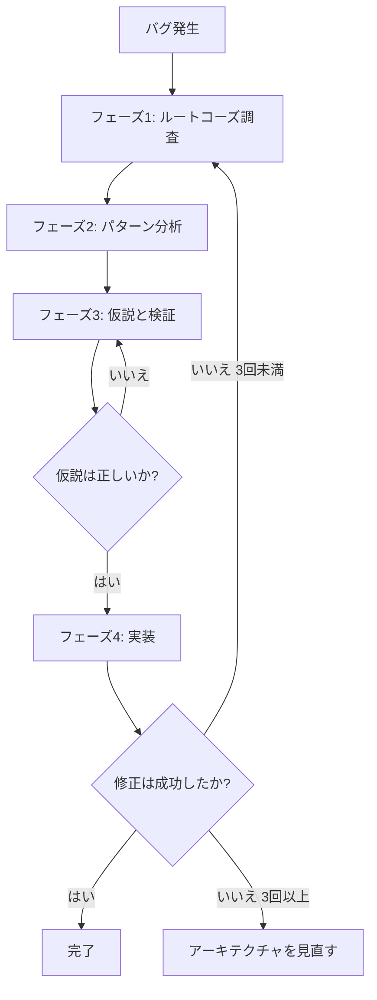
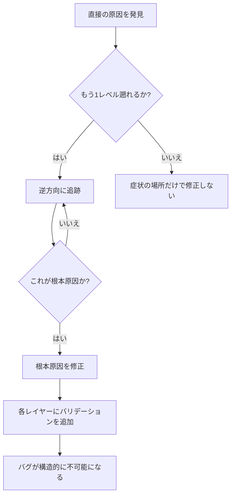
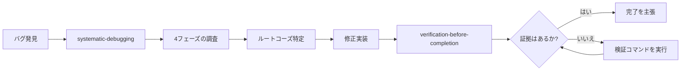

# 第7章 systematic-debugging / verification: デバッグと検証

ソフトウェア開発において、バグの修正は避けて通れない作業です。しかし、多くの開発者が「とりあえず修正してみる」というアプローチを取り、結果として時間を浪費し、新たなバグを生み出してしまいます。Superpowersは、この問題に対して2つのスキルで対処します。`systematic-debugging`（体系的デバッグ）は根本原因を特定するための4フェーズの調査プロセスを定義し、`verification-before-completion`（完了前検証）は修正が本当に機能しているかを証拠に基づいて確認することを要求します。

本章では、この2つのスキルの連携を解説します。

## 7.1 systematic-debugging: 体系的デバッグの原則

### なぜ「とりあえず修正」が失敗するのか

AIコーディングエージェント（AI Coding Agent）に限らず、人間の開発者にとっても「推測による修正」は最も一般的なデバッグ手法です。エラーが発生したとき、経験と直感に基づいて「おそらくここが原因だろう」と仮説を立て、修正を試みます。うまくいくこともありますが、うまくいかない場合は次の推測を試し、さらに次の推測を試し...という悪循環に陥ります。

Superpowersのsystematic-debuggingスキルは、この問題を明確に言語化しています。

> Random fixes waste time and create new bugs. Quick patches mask underlying issues.
>
> （場当たり的な修正は時間を浪費し、新たなバグを生む。手早いパッチは根本的な問題を覆い隠す。）

このスキルの核心にあるのは、次の原則です。

> ALWAYS find root cause before attempting fixes. Symptom fixes are failure.
>
> （修正を試みる前に、常にルートコーズ（Root Cause）を特定せよ。症状の修正は失敗である。）

### 鉄の掟（Iron Law）

systematic-debuggingには、明確な鉄の掟が定義されています。

```
NO FIXES WITHOUT ROOT CAUSE INVESTIGATION FIRST
（ルートコーズ調査なしに修正を行ってはならない）
```

この掟は例外なく適用されます。フェーズ1（ルートコーズ調査）を完了していない限り、修正を提案することすら許可されません。

スキル定義では、以下の場面で**特に**このプロセスを使うべきだと述べています。

- 時間的プレッシャーがあるとき（緊急事態は推測を魅力的にする）
- 「ちょっとした修正」が明白に見えるとき
- すでに複数の修正を試したとき
- 前回の修正がうまくいかなかったとき
- 問題を完全には理解していないとき

逆に言えば、「問題が単純に見える」「急いでいる」「マネージャーが今すぐ直せと言っている」といった理由でプロセスを省略することは許可されていません。体系的なアプローチは、推測と試行錯誤のアプローチよりも**常に速い**というのがSuperpowersの立場です。

## 7.2 4フェーズのルートコーズ分析

systematic-debuggingスキルは、4つのフェーズで構成される調査プロセスを定義しています。各フェーズは順番に完了する必要があり、前のフェーズを飛ばすことはできません。



### フェーズ1: ルートコーズ調査

フェーズ1は、修正を試みる**前に**必ず完了しなければならない調査ステップです。5つのサブステップで構成されます。

**1. エラーメッセージの精読**

当たり前のようですが、エラーメッセージを注意深く読むことは多くの開発者が怠りがちなステップです。

- エラーメッセージや警告を読み飛ばさない
- スタックトレース（Stack Trace）を最後まで読む
- 行番号、ファイルパス、エラーコードを記録する
- エラーメッセージにはしばしば解決策そのものが含まれている

**2. 再現性の確認**

- バグを確実にトリガーできるか
- 正確な再現手順は何か
- 毎回発生するか
- 再現できない場合はデータを集める（推測しない）

**3. 最近の変更の確認**

- この問題を引き起こしうる変更は何か
- `git diff`、最近のコミットを確認
- 新しい依存関係、設定変更
- 環境の差異

**4. マルチコンポーネントシステムでの証拠収集**

システムが複数のコンポーネント（Component）で構成されている場合、修正を提案する**前に**診断用の計測コードを追加します。

```bash
# レイヤー1: ワークフロー
echo "=== ワークフローで利用可能なシークレット: ==="
echo "IDENTITY: ${IDENTITY:+SET}${IDENTITY:-UNSET}"

# レイヤー2: ビルドスクリプト
echo "=== ビルドスクリプト内の環境変数: ==="
env | grep IDENTITY || echo "IDENTITYは環境変数にない"

# レイヤー3: 署名スクリプト
echo "=== キーチェーンの状態: ==="
security list-keychains
security find-identity -v

# レイヤー4: 実際の署名
codesign --sign "$IDENTITY" --verbose=4 "$APP"
```

このアプローチの目的は、**どのレイヤーで問題が発生しているか**を特定することです。上の例では「シークレットからワークフローへの受け渡しは成功しているが、ワークフローからビルドスクリプトへの受け渡しで失敗している」といった発見につながります。

**5. データフロー追跡**

エラーがコールスタック（Call Stack）の深い位置で発生している場合、データの流れを逆方向に追跡します。

### ルートコーズ・トレーシングの技法

Superpowersの`root-cause-tracing`（ルートコーズ・トレーシング）は、systematic-debuggingの補助テクニックとして提供されています。

> Bugs often manifest deep in the call stack. Your instinct is to fix where the error appears, but that's treating a symptom.
>
> （バグはしばしばコールスタックの深い位置で顕在化する。エラーが現れた場所で修正したくなるが、それは症状の治療に過ぎない。）

トレーシングのプロセスは次の5ステップです。

1. **症状を観察する**: `Error: git init failed in /Users/jesse/project/packages/core`
2. **直接の原因を見つける**: `execFileAsync('git', ['init'], { cwd: projectDir })`
3. **何がこれを呼び出したか問う**: `WorktreeManager.createSessionWorktree()` が呼び出し元
4. **さらに遡り続ける**: `projectDir = ''`（空文字列）が渡されていた
5. **元の引き金を見つける**: テストのセットアップが`beforeEach`の実行前に値にアクセスしていた

このプロセスの鍵は「もう1つ上のレイヤーを追跡できるか?」を常に問い続けることです。追跡を打ち切って症状の場所で修正することは、明示的に禁止されています。



### フェーズ2: パターン分析

ルートコーズ調査の次は、パターン分析です。

1. **動作している類似コードを見つける**: 同じコードベースにある似た機能で正常に動作しているものを探す
2. **リファレンス（Reference）実装と比較する**: パターンを実装する場合は、リファレンス実装を**完全に**読む。流し読みではなく、すべての行を読む
3. **差異を特定する**: 動作するコードと壊れたコードの違いをすべてリストアップする。「それは関係ないだろう」と仮定しない
4. **依存関係を理解する**: このコンポーネントが必要とする他のコンポーネント、設定、環境は何か

### フェーズ3: 仮説と検証

科学的方法（Scientific Method）に基づいたアプローチです。

1. **単一の仮説を立てる**: 「Xが根本原因だと考える。なぜならYだから」と明確に述べる
2. **最小限のテストを行う**: 仮説を検証するための**最小限の**変更を加える。一度に1つの変数だけを変える
3. **続行する前に確認する**: うまくいったらフェーズ4へ。うまくいかなかったら**新しい**仮説を立てる。修正の上に修正を重ねない
4. **分からないときは正直に言う**: 「Xについて理解していない」と認める。知ったふりをしない

### フェーズ4: 実装

根本原因が特定されたら、修正を実装します。

1. **失敗するテストケースを作る**: もっとも単純な再現。可能なら自動テスト
2. **単一の修正を実装する**: 特定されたルートコーズに対処する。一度に**1つの変更だけ**。「ついでに」の改善はしない
3. **修正を検証する**: テストが通るか? 他のテストが壊れていないか?
4. **修正がうまくいかない場合**: 停止する。試した修正の回数を数える。3回未満ならフェーズ1に戻る。**3回以上ならアーキテクチャを問い直す**

### 3回以上の修正失敗: アーキテクチャ問題のシグナル

Superpowersは、3回以上修正が失敗した場合を特別に扱います。これはバグではなくアーキテクチャ（Architecture）の問題であるシグナルです。

次のようなパターンが見られたら、アーキテクチャを疑うべきです。

- 修正するたびに、別の場所で新しい共有状態や結合の問題が明らかになる
- 修正に「大規模なリファクタリング」が必要
- 修正するたびに別の場所で新しい症状が発生する

このような場合は、**さらに修正を試みることを中止し**、根本的な設計について人間のパートナーと議論します。これは仮説の失敗ではなく、設計の誤りです。

## 7.3 防御的多層バリデーション

systematic-debuggingスキルの補助テクニックとして、`defense-in-depth`（多層防御バリデーション）があります。

> When you fix a bug caused by invalid data, adding validation at one place feels sufficient. But that single check can be bypassed by different code paths, refactoring, or mocks.
>
> （不正なデータによるバグを修正するとき、1箇所にバリデーションを追加すれば十分に感じる。しかし、その単一のチェックは異なるコードパス、リファクタリング、モックによって回避される可能性がある。）

4つのレイヤーでバリデーションを行うことで、バグを「修正」するのではなく「構造的に不可能」にします。

**レイヤー1: エントリーポイントのバリデーション**

API境界で明らかに不正な入力を拒否します。

```typescript
function createProject(name: string, workingDirectory: string) {
  if (!workingDirectory || workingDirectory.trim() === '') {
    throw new Error('workingDirectory cannot be empty');
  }
  if (!existsSync(workingDirectory)) {
    throw new Error(
      `workingDirectory does not exist: ${workingDirectory}`
    );
  }
  // ... 処理を続行
}
```

**レイヤー2: ビジネスロジックのバリデーション**

データがこの操作にとって意味を持つかを確認します。

```typescript
function initializeWorkspace(
  projectDir: string,
  sessionId: string
) {
  if (!projectDir) {
    throw new Error(
      'projectDir required for workspace initialization'
    );
  }
  // ... 処理を続行
}
```

**レイヤー3: 環境ガード**

特定のコンテキスト（Context）で危険な操作を防ぎます。

```typescript
async function gitInit(directory: string) {
  // テスト時はtempディレクトリ外でのgit initを拒否
  if (process.env.NODE_ENV === 'test') {
    const normalized = normalize(resolve(directory));
    const tmpDir = normalize(resolve(tmpdir()));
    if (!normalized.startsWith(tmpDir)) {
      throw new Error(
        `テスト中にtempディレクトリ外でgit initを拒否: ${directory}`
      );
    }
  }
  // ... 処理を続行
}
```

**レイヤー4: デバッグ計測**

フォレンジック（Forensics）のためのコンテキスト情報を記録します。

```typescript
async function gitInit(directory: string) {
  const stack = new Error().stack;
  logger.debug('About to git init', {
    directory,
    cwd: process.cwd(),
    stack,
  });
  // ... 処理を続行
}
```

4つのレイヤーすべてが必要です。テスト中、各レイヤーが他のレイヤーでは検出できないバグを捕捉したケースが報告されています。異なるコードパスがエントリーバリデーションを回避し、モックがビジネスロジックチェックを回避し、プラットフォーム（Platform）固有のエッジケースに環境ガードが必要でした。

## 7.4 条件ベースの待機

フレーキーテスト（Flaky Test）の原因の多くは、任意の遅延時間を使ったタイミング推測です。systematic-debuggingの補助テクニックである`condition-based-waiting`（条件ベースの待機）は、この問題に対する解決策を提供します。

```typescript
// 悪い例: タイミングを推測
await new Promise(r => setTimeout(r, 50));
const result = getResult();
expect(result).toBeDefined();

// 良い例: 条件を待つ
await waitFor(() => getResult() !== undefined);
const result = getResult();
expect(result).toBeDefined();
```

汎用的なポーリング（Polling）関数の実装例です。

```typescript
async function waitFor<T>(
  condition: () => T | undefined | null | false,
  description: string,
  timeoutMs = 5000
): Promise<T> {
  const startTime = Date.now();

  while (true) {
    const result = condition();
    if (result) return result;

    if (Date.now() - startTime > timeoutMs) {
      throw new Error(
        `${description}の待機が${timeoutMs}msでタイムアウト`
      );
    }

    await new Promise(r => setTimeout(r, 10)); // 10msごとにポーリング
  }
}
```

ただし、任意のタイムアウトが正しい場合もあります。たとえば、100msごとにティック（Tick）するツールの動作を検証するときは、まず条件ベースで開始を待ち、その後に既知のタイミングに基づいた待機を行います。このような場合は必ず理由をコメントに残します。

## 7.5 レッドフラグ: プロセスに戻るべきシグナル

systematic-debuggingスキルは、プロセスを逸脱しかけていることを示すレッドフラグ（Red Flag）を定義しています。以下のような思考が頭をよぎったら、**停止してフェーズ1に戻る**べきです。

- 「とりあえず今だけ修正して、後で調査しよう」
- 「Xを変更してみて、動くか確認しよう」
- 「複数の変更を加えて、テストを実行しよう」
- 「テストは省略して、手動で確認しよう」
- 「おそらくXが原因だ、修正しよう」
- 「完全には理解していないが、これでうまくいくかもしれない」
- 「パターンではXだが、別のやり方で適用しよう」
- 「主な問題はこれだ:（調査なしに修正をリストアップする）」
- 「もう1回だけ修正を試そう」（すでに2回以上試した場合）

### 合理化防止テーブル

エージェントが自分自身を説得してプロセスを省略する際の典型的な言い訳と、その現実を対比した表です。

| 言い訳 | 現実 |
|--------|------|
| 「単純な問題だからプロセスは不要」 | 単純な問題にもルートコーズがある。単純なバグにはプロセスも速い |
| 「緊急事態でプロセスの時間がない」 | 体系的デバッグは推測と試行錯誤よりも**速い** |
| 「まず試してみて、それから調査しよう」 | 最初の修正がパターンを決める。最初から正しくやるべき |
| 「修正が動くか確認してからテストを書こう」 | テストされていない修正は定着しない。先にテストで証明する |
| 「複数の修正を一度にやれば時間の節約」 | 何が効いたか分離できない。新たなバグの原因になる |
| 「リファレンスが長すぎるので、パターンを適用しよう」 | 部分的な理解はバグを保証する。完全に読むべき |
| 「問題が見える、修正しよう」 | 症状が見える ≠ ルートコーズを理解している |
| 「もう1回だけ修正を試そう」（2回以上の失敗後） | 3回以上の失敗 = アーキテクチャの問題。再修正ではなくパターンを疑え |

### ユーザーからのシグナル

ユーザーが以下のような発言をした場合、それはエージェントのアプローチが間違っていることを示すシグナルです。

- 「それは起きていないの?」 -- 検証せずに仮定した
- 「それで何が分かるの?」 -- 証拠収集を追加すべきだった
- 「推測をやめて」 -- 理解せずに修正を提案している
- 「根本から考え直して」 -- 症状ではなく基本を疑うべき
- 「行き詰まった?」（苛立ちを込めて） -- アプローチが機能していない

## 7.6 verification-before-completion: 完了前検証

### 「検証なしに完了を主張するのは不誠実」

systematic-debuggingが「修正前に原因を調査せよ」と要求するのに対し、verification-before-completionは「修正後に結果を検証せよ」と要求します。この2つのスキルは一対のものです。

verification-before-completionの冒頭には、強烈な宣言があります。

> Claiming work is complete without verification is dishonesty, not efficiency.
>
> （検証なしに作業の完了を主張するのは、効率性ではなく不誠実さである。）

### 鉄の掟

```
NO COMPLETION CLAIMS WITHOUT FRESH VERIFICATION EVIDENCE
（新鮮な検証証拠なしに完了を主張してはならない）
```

「このメッセージ内で」検証コマンドを実行していなければ、テストが通っていると主張することはできません。過去の実行結果は無効です。

### ゲート関数

verification-before-completionは、完了を主張する前に必ず通過しなければならないゲート関数を定義しています。

```
完了や満足を表明する前に:

1. 特定: この主張を証明するコマンドは何か?
2. 実行: コマンドを完全に実行する（新鮮に、完全に）
3. 読む: 出力全体を読み、終了コードを確認し、失敗数を数える
4. 検証: 出力は主張を裏付けるか?
   - いいえ → 証拠とともに実際の状態を報告
   - はい → 証拠とともに主張を述べる
5. それからはじめて: 主張を行う

どのステップを省略しても = 検証ではなく虚偽
```

### 一般的な失敗パターン

| 主張 | 必要な証拠 | 不十分な根拠 |
|------|-----------|-------------|
| テストが通る | テストコマンドの出力: 0 failures | 過去の実行、「通るはず」 |
| リンターがクリーン | リンター出力: 0 errors | 部分的チェック、外挿 |
| ビルドが成功 | ビルドコマンド: exit 0 | リンター通過、ログが良さそう |
| バグが修正された | 元の症状のテスト: パス | コードを変更した、修正されたはず |
| 回帰テストが動作する | RED-GREENサイクルの検証 | テストが1回通った |
| エージェントが完了した | VCSの差分に変更がある | エージェントの「成功」報告 |
| 要件が満たされている | 行ごとのチェックリスト | テストが通っている |

### 正しいパターンと誤ったパターン

**テストの検証:**

```
正しい: [テストコマンドを実行] [出力: 34/34 pass] 「全テスト通過」
誤り: 「もう通るはずです」 / 「正しく見えます」
```

**回帰テスト（TDDのRED-GREEN）:**

```
正しい: テスト作成 → 実行（パス） → 修正をリバート → 実行（失敗すべき）
       → 修正を復元 → 実行（パス）
誤り: 「回帰テストを書きました」（RED-GREEN検証なし）
```

**ビルドの検証:**

```
正しい: [ビルド実行] [出力: exit 0] 「ビルド成功」
誤り: 「リンターが通った」（リンターはコンパイルをチェックしない）
```

**要件の検証:**

```
正しい: 計画を再読 → チェックリスト作成 → 各項目を検証 → ギャップ
       または完了を報告
誤り: 「テストが通ったので、フェーズ完了です」
```

**エージェント委任の検証:**

```
正しい: エージェント成功報告 → VCSの差分を確認 → 変更を検証
       → 実際の状態を報告
誤り: エージェントの報告を信頼する
```

## 7.7 推測的表現はレッドフラグ

verification-before-completionスキルの最も特徴的なルールの1つは、**推測的表現の禁止**です。

以下の表現は「レッドフラグ」として定義されています。

- 「should」（~のはず）を使う
- 「probably」（おそらく）を使う
- 「seems to」（~のようだ）を使う
- 検証前に満足を表明する（「Great!」「Perfect!」「Done!」など）
- コミット/プッシュ/PR作成の前に検証しない
- エージェントの成功報告を信頼する
- 部分的な検証に依存する
- 「今回だけ」と考える
- 疲れて早く終わらせたいと思う
- **成功を暗示するいかなる表現も、検証を実行していない場合は該当する**

### 合理化防止テーブル

| 言い訳 | 現実 |
|--------|------|
| 「もう動くはずです」 | 検証コマンドを**実行せよ** |
| 「自信があります」 | 自信 ≠ 証拠 |
| 「今回だけ」 | 例外なし |
| 「リンターが通った」 | リンター ≠ コンパイラ |
| 「エージェントが成功と言った」 | 独立して検証せよ |
| 「疲れた」 | 疲労 ≠ 言い訳 |
| 「部分的チェックで十分」 | 部分的は何も証明しない |
| 「言葉が違うのでルールは適用されない」 | 文言ではなく精神に従え |

最後の項目は特に重要です。「テストが通る」という直接的な主張だけでなく、成功を**暗示する**あらゆる表現にこのルールが適用されます。言い換えの手法でルールを回避しようとすることは、スキル定義で明示的に禁止されています。

## 7.8 なぜこれほど厳格なのか

verification-before-completionスキルは、なぜこのルールがここまで厳格なのかの根拠も示しています。

> From 24 failure memories:
> - your human partner said "I don't believe you" - trust broken
> - Undefined functions shipped - would crash
> - Missing requirements shipped - incomplete features
> - Time wasted on false completion -> redirect -> rework
> - Violates: "Honesty is a core value. If you lie, you'll be replaced."

24件の失敗記録から導かれたルールであり、検証なしの完了宣言が「信頼の破壊」「未定義関数のリリース」「要件の欠落」「偽の完了宣言による手戻り」を引き起こした実績があるのです。

## 7.9 実践例: テスト失敗の原因を体系的に調査する

ここでは、AIエージェントがsystematic-debuggingとverification-before-completionの両スキルを使って、テスト失敗を体系的に調査するフローを追ってみましょう。

### シナリオ

Node.jsプロジェクトで、CI（Continuous Integration）上のテストが断続的に失敗しています。ローカル環境では再現したりしなかったりする状態です。

```
FAIL src/services/notification.test.ts
  NotificationService
    ✗ should send notification after user action (2345ms)
      Expected: "notification_sent"
      Received: undefined
```

### フェーズ1: ルートコーズ調査

**ステップ1: エラーメッセージの精読**

```
テスト名: "should send notification after user action"
失敗箇所: notification.test.ts
タイムアウト: 2345ms（デフォルトの5000ms以内だが通常より遅い）
期待値: "notification_sent"
実際の値: undefined（通知が送信されていないか、
         完了前にアサーションが実行されている）
```

**ステップ2: 再現性の確認**

```bash
# ローカルで10回実行
for i in {1..10}; do
  npx jest notification.test.ts --silent 2>&1 | tail -1
done
```

結果: 10回中3回失敗。フレーキーテスト（Flaky Test）の典型的なパターンです。

**ステップ3: 最近の変更の確認**

```bash
git log --oneline -10 -- src/services/notification*
```

直近のコミットで、NotificationServiceに非同期処理が追加されていることを発見します。

**ステップ4: データフロー追跡**

テストコードを確認します。

```typescript
test('should send notification after user action', async () => {
  const service = new NotificationService();
  await service.handleUserAction('click');
  // 50msの固定遅延で通知完了を待つ
  await new Promise(r => setTimeout(r, 50));
  const status = service.getLastNotificationStatus();
  expect(status).toBe('notification_sent');
});
```

問題を発見しました。50msの固定遅延で非同期処理の完了を待っています。

### フェーズ2: パターン分析

同じプロジェクト内の他のテストを検索すると、イベントベース（Event-Based）の待機を使っているテストが見つかります。

```typescript
// 動作している類似テスト
test('should process queue item', async () => {
  const queue = new TaskQueue();
  queue.enqueue('task1');
  // 条件ベースの待機
  await waitFor(
    () => queue.getStatus('task1') === 'completed'
  );
  expect(queue.getResult('task1')).toBeDefined();
});
```

差異が明確です。動作するテストは条件ベースの待機を使い、失敗するテストは固定遅延を使っています。

### フェーズ3: 仮説と検証

**仮説**: 「50msの固定遅延が根本原因。非同期の通知処理がCI環境では50ms以上かかることがあり、処理完了前にアサーションが実行されている」

**最小限のテスト**: 遅延を50msから5000msに変更して確認します。

```typescript
await new Promise(r => setTimeout(r, 5000));
```

10回実行して10回成功。仮説が支持されます。ただし、5000msの固定遅延は解決策ではありません。

### フェーズ4: 実装

条件ベースの待機パターンを適用します。

```typescript
test('should send notification after user action', async () => {
  const service = new NotificationService();
  await service.handleUserAction('click');
  // 条件ベースの待機に変更
  await waitFor(
    () => service.getLastNotificationStatus() !== undefined,
    'notification status to be set'
  );
  const status = service.getLastNotificationStatus();
  expect(status).toBe('notification_sent');
});
```

### verification-before-completionの適用

修正したら、完了を主張する**前に**検証を実行します。

```bash
# 10回実行して安定性を確認
for i in {1..10}; do
  npx jest notification.test.ts --silent 2>&1 | tail -1
done
# 出力: 10回中10回パス
```

```bash
# テストスイート全体も確認
npx jest --silent
# 出力: Tests: 247 passed, 247 total
```

ここでようやく「テストが安定して通ること」を証拠とともに主張できます。「もう動くはずです」ではなく、「10回連続で成功し、全247テストがパスしています」と報告するのです。

## 7.10 2つのスキルの統合

systematic-debuggingとverification-before-completionは、バグ修正の「入口」と「出口」を守るスキルです。



- **入口のガード**: 修正を始める前にルートコーズを特定する（systematic-debugging）
- **出口のガード**: 完了を主張する前に証拠を提示する（verification-before-completion）

この2つのガードにより、「推測で修正して、推測で完了を宣言する」という最悪のパターンが構造的に排除されます。

### 実世界での効果

Superpowersの公式資料では、体系的デバッグの効果として以下の数値が示されています。

| 指標 | 体系的アプローチ | 推測と試行錯誤 |
|------|----------------|--------------|
| 修正にかかる時間 | 15--30分 | 2--3時間 |
| 初回修正の成功率 | 95% | 40% |
| 新たなバグの導入 | ほぼゼロ | 頻繁 |

15--30分対2--3時間という差は、体系的アプローチが「慎重で遅い」のではなく、「効率的で速い」ことを示しています。推測と試行錯誤のアプローチが2--3時間かかるのは、間違った修正の実装、その修正のデバッグ、さらなる修正の試行というサイクルが繰り返されるためです。

## 7.11 まとめ

本章で解説した2つのスキルのポイントをまとめます。

**systematic-debugging:**

- 鉄の掟: ルートコーズ調査なしに修正を行ってはならない
- 4フェーズ: 調査 → パターン分析 → 仮説検証 → 実装
- 3回以上の修正失敗はアーキテクチャ問題のシグナル
- 補助テクニック: ルートコーズ・トレーシング、多層防御バリデーション、条件ベースの待機

**verification-before-completion:**

- 鉄の掟: 新鮮な検証証拠なしに完了を主張してはならない
- 推測的表現（should, probably, likely）はレッドフラグ
- 過去の実行結果は無効。現在の実行結果のみが証拠
- 「リンターが通った」はビルド成功の証拠にならない
- エージェントの成功報告は独立して検証が必要

次章では、コードレビューのスキル -- `requesting-code-review`と`receiving-code-review` -- について解説します。修正したコードの品質を、他者の目を通じてさらに高めるプロセスです。
