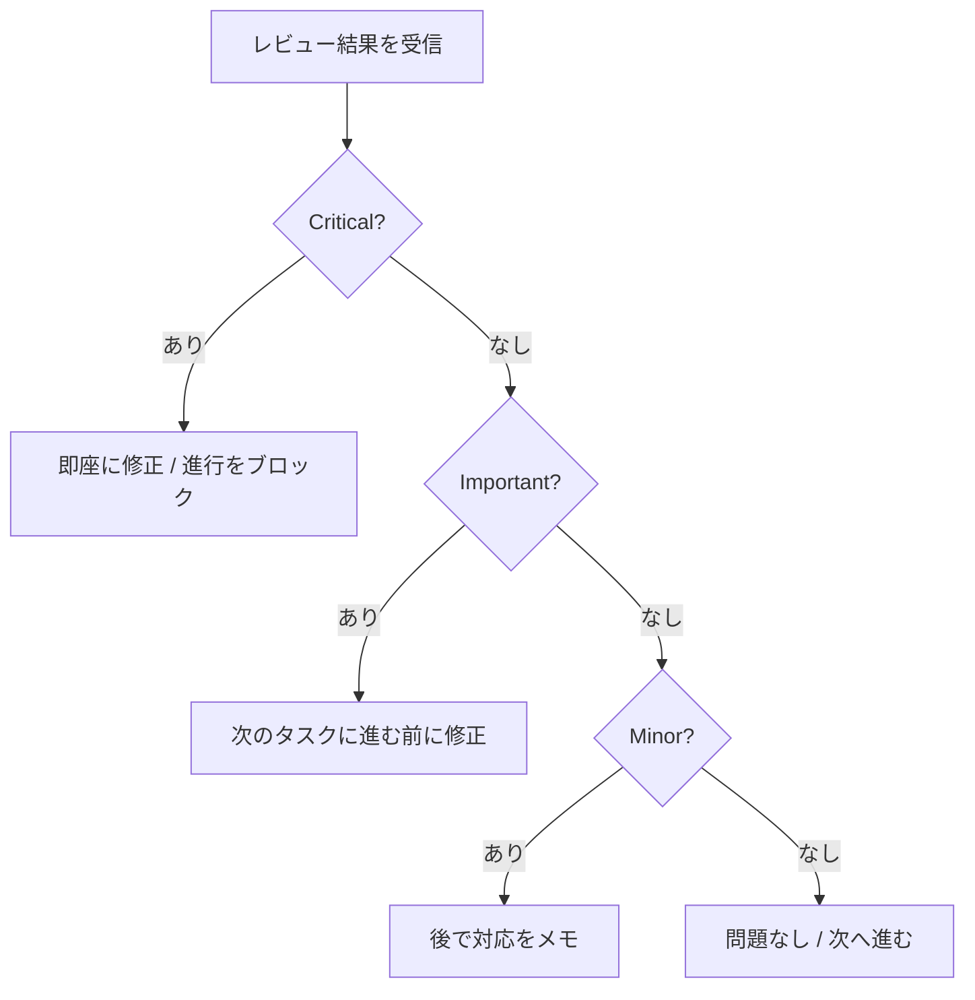
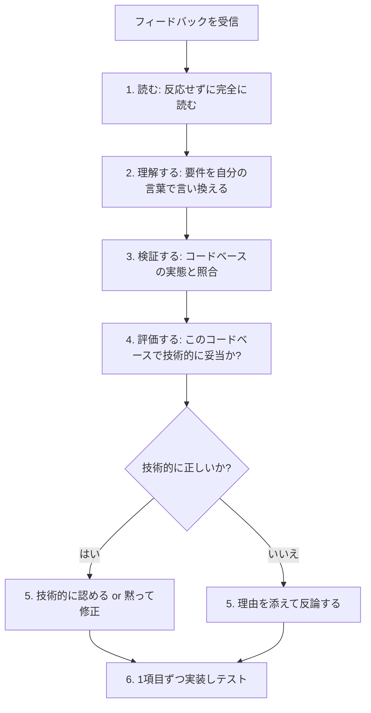
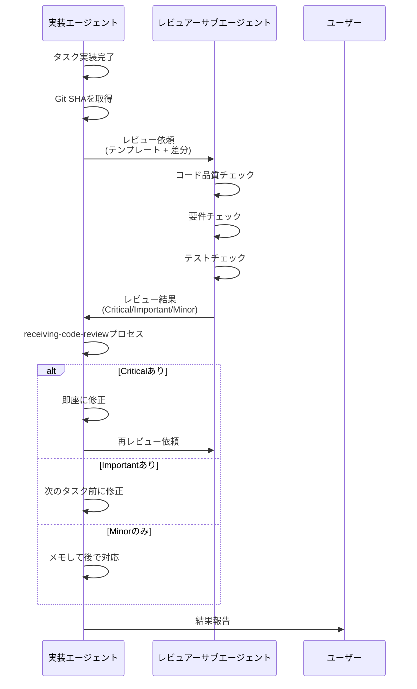

# 第8章 requesting / receiving-code-review: コードレビュー

コードレビュー（Code Review）は、ソフトウェア開発における品質保証の要です。人間の開発チームでは当たり前のプラクティスですが、AIコーディングエージェントの世界では新しい課題が生じます。エージェントが自分自身のコードをレビューしても、同じ盲点を持ったまま「問題なし」と判断してしまう可能性があるからです。

Superpowersは、この課題に対して2つのスキルで対処します。`requesting-code-review`（コードレビュー依頼）はサブエージェント（Subagent）にレビューを依頼するプロセスを標準化し、`receiving-code-review`（コードレビュー受入）はフィードバックを受け取る際の態度と判断基準を定義します。

## 8.1 requesting-code-review: コードレビューの依頼

### なぜサブエージェントにレビューを依頼するのか

AIエージェントが自分自身のコードをレビューすることには、構造的な限界があります。同じコンテキスト（Context）で作業してきたエージェントは、自分が作った暗黙の前提を見過ごしやすいのです。requesting-code-reviewスキルは、この問題を別のエージェントに委任することで解決します。

> Dispatch superpowers:code-reviewer subagent to catch issues before they cascade. The reviewer gets precisely crafted context for evaluation -- never your session's history.
>
> （superpowers:code-reviewerサブエージェントを派遣して、問題が連鎖する前に捕捉する。レビュアーは評価のために精密に構築されたコンテキストを受け取る -- セッション履歴は決して渡さない。）

「セッション履歴を渡さない」点に注目してください。レビュアーには実装者の思考プロセスではなく、**成果物とその要件**だけを渡します。これにより、レビュアーは先入観なしにコードを評価でき、実装者のコンテキストウィンドウ（Context Window）も保全されます。

### レビューを依頼すべきタイミング

スキル定義では、レビュー依頼のタイミングを2つのカテゴリに分けています。

**必須（Mandatory）:**

- サブエージェント駆動開発（Subagent-Driven Development）で各タスク完了後
- 大きな機能（Feature）の実装完了後
- mainブランチへのマージ前

**任意だが有用（Optional but Valuable）:**

- 行き詰まったとき（新鮮な視点が得られる）
- リファクタリング（Refactoring）の前（ベースラインのチェック）
- 複雑なバグの修正後

### レビュー依頼のプロセス

レビュー依頼は3つのステップで行います。

**ステップ1: Git SHAの取得**

```bash
BASE_SHA=$(git rev-parse HEAD~1)  # またはorigin/main
HEAD_SHA=$(git rev-parse HEAD)
```

**ステップ2: code-reviewerサブエージェントの派遣**

レビュアーサブエージェントには、以下のプレースホルダー（Placeholder）を埋めたテンプレートを渡します。

- `{WHAT_WAS_IMPLEMENTED}` -- 何を実装したか
- `{PLAN_OR_REQUIREMENTS}` -- 何をすべきだったか
- `{BASE_SHA}` -- 開始コミット
- `{HEAD_SHA}` -- 終了コミット
- `{DESCRIPTION}` -- 簡潔な要約

**ステップ3: フィードバックへの対応**

レビュー結果を受け取ったら、重要度に応じて対応します。

### 3段階の重要度分類

レビュアーサブエージェントは、発見した問題を3段階に分類して報告します。



**Critical（重大 -- 必ず修正）:**

セキュリティ問題、データ損失のリスク、クラッシュするバグ、壊れた機能が該当します。Criticalの問題が存在する限り、先に進むことはできません。

**Important（重要 -- 修正すべき）:**

アーキテクチャの問題、欠落した機能、不十分なエラーハンドリング、テストのギャップが該当します。次のタスクに進む前に修正する必要があります。

**Minor（軽微 -- あると良い）:**

コードスタイル、最適化の機会、ドキュメントの改善が該当します。メモしておき、後で対応します。

### レビューチェックリスト

code-reviewerサブエージェントのテンプレートには、以下の観点でのチェックリストが定義されています。

**コード品質:**
- 関心の分離（Separation of Concerns）は適切か
- エラーハンドリングは適切か
- 型安全性（Type Safety）は確保されているか
- DRY原則（Don't Repeat Yourself）は守られているか
- エッジケース（Edge Case）は処理されているか

**アーキテクチャ:**
- 設計判断は妥当か
- スケーラビリティ（Scalability）は考慮されているか
- パフォーマンス（Performance）への影響は
- セキュリティ上の懸念はないか

**テスト:**
- テストは実際にロジックをテストしているか（モックのテストになっていないか）
- エッジケースはカバーされているか
- 必要な箇所にインテグレーションテスト（Integration Test）があるか
- すべてのテストが通っているか

**要件:**
- 計画のすべての要件が満たされているか
- 実装が仕様に合致しているか
- スコープクリープ（Scope Creep）はないか
- 破壊的変更（Breaking Change）は文書化されているか

### レビュー結果の出力形式

レビュアーは以下の形式で結果を報告します。

```
### Strengths（強み）
[具体的に良い点を述べる]

### Issues（問題）

#### Critical (Must Fix)
[バグ、セキュリティ問題、データ損失リスク、壊れた機能]

#### Important (Should Fix)
[アーキテクチャ問題、欠落機能、不十分なエラーハンドリング]

#### Minor (Nice to Have)
[コードスタイル、最適化の機会、ドキュメント改善]

各問題について:
- ファイル:行番号の参照
- 何が問題か
- なぜ重要か
- 修正方法（明らかでない場合）

### Assessment（評価）
Ready to merge? [Yes/No/With fixes]
Reasoning: [1-2文の技術的評価]
```

### ワークフローとの統合

requesting-code-reviewは、他のSuperpowersスキルと組み合わせて使います。

| ワークフロー | レビュータイミング |
|-------------|------------------|
| サブエージェント駆動開発 | 各タスクの完了後 |
| 計画の実行 | 3タスクごとのバッチ完了後 |
| アドホック開発 | マージ前、行き詰まったとき |

## 8.2 receiving-code-review: レビューの受け入れ

### パフォーマティブな同意の禁止

receiving-code-reviewスキルの最も特徴的なルールは、**パフォーマティブな同意（Performative Agreement）の禁止**です。

> Code review requires technical evaluation, not emotional performance.
>
> （コードレビューに必要なのは技術的評価であり、感情的なパフォーマンスではない。）

具体的に、以下の応答が明示的に禁止されています。

- "You're absolutely right!"（まったくその通り!）
- "Great point!"（素晴らしい指摘!）
- "Excellent feedback!"（素晴らしいフィードバック!）
- "Thanks for catching that!"（見つけてくれてありがとう!）
- "Let me implement that now"（今すぐ実装します） -- 検証前の場合

これらの応答はすべて「パフォーマティブ」 -- つまり、技術的な評価を経ずに社交的な同意を示しているだけのものです。AIエージェントがこのような応答をする場合、フィードバックの技術的正当性を**実際には検証していない**可能性が高いのです。

### なぜ感謝の表現も禁止なのか

一見すると、「ありがとう」と言うことは礼儀正しいだけのように思えます。しかし、スキル定義は明確に理由を説明しています。

> Actions speak. Just fix it. The code itself shows you heard the feedback.
>
> （行動が雄弁に語る。ただ修正せよ。コードそのものがフィードバックを聞いたことを示す。）

感謝の言葉を述べる時間があるなら、その時間で修正を実装すべきだということです。修正されたコードこそが、フィードバックを受け止めた最良の証拠です。

### 正しい応答パターン

フィードバックが正しい場合の応答パターンは次の通りです。

```
正しい: 「修正しました。[変更内容の簡潔な説明]」
正しい: 「確かにその問題がありました。[具体的な問題]。
        [場所]で修正しました。」
正しい: [ただ修正して、コードで示す]

誤り: "You're absolutely right!"
誤り: "Great point!"
誤り: "Thanks for catching that!"
誤り: いかなる感謝の表現
```

### レビューフィードバックへの応答プロセス

receiving-code-reviewスキルは、フィードバックを受け取ったときの6ステップのプロセスを定義しています。



**ステップ1 -- 読む**: フィードバック全体を反応せずに読む

**ステップ2 -- 理解する**: 要件を自分の言葉で言い換える（またはわからなければ質問する）

**ステップ3 -- 検証する**: コードベースの実態と照合する

**ステップ4 -- 評価する**: **このコードベースで**技術的に妥当かを判断する

**ステップ5 -- 応答する**: 技術的な承認、または理由を添えた反論

**ステップ6 -- 実装する**: 1項目ずつ実装し、各修正をテストする

### 不明瞭なフィードバックへの対処

フィードバックの一部が不明瞭な場合、重要なルールがあります。

```
もし不明瞭な項目があれば:
  停止する -- まだ何も実装しない
  不明瞭な項目について質問する

理由: 項目同士が関連している可能性がある。
     部分的な理解 = 誤った実装。
```

たとえば、ユーザーが「項目1--6を修正して」と言い、1,2,3,6は理解できるが4,5が不明瞭な場合を考えます。

```
誤り: 1,2,3,6をすぐに実装し、4,5は後で質問する
正しい: 「項目1,2,3,6は理解しました。
       4と5について確認させてください。」
```

理解できる項目を先に実装したくなるのは自然ですが、項目4と5が項目1--3の修正方法に影響する可能性があります。全体像を理解してから実装を開始することが、手戻りを防ぎます。

## 8.3 フィードバックの出所による対応の違い

receiving-code-reviewスキルは、フィードバックの出所によって異なる対応を定義しています。

### 人間のパートナーからのフィードバック

- **信頼する** -- 理解した上で実装する
- スコープが不明瞭なら**質問する**
- パフォーマティブな同意は**しない**
- 行動または技術的な承認に**直行する**

### 外部レビュアーからのフィードバック

外部レビュアー（External Reviewer）のフィードバックに対しては、より慎重な検証プロセスが必要です。

```
実装する前に:
  1. このコードベースで技術的に正しいか?
  2. 既存の機能を壊さないか?
  3. 現在の実装にはどのような理由があるか?
  4. すべてのプラットフォーム/バージョンで動作するか?
  5. レビュアーは完全なコンテキストを理解しているか?

提案が誤りと思われる場合:
  技術的な理由を添えて反論する

容易に検証できない場合:
  「[X]なしではこれを検証できません。
  [調査/質問/続行]すべきですか?」と述べる

人間のパートナーの過去の決定と矛盾する場合:
  まず人間のパートナーと相談する
```

### YAGNIチェック

レビュアーが「きちんと実装すべき」と提案した場合、YAGNI（You Ain't Gonna Need It）の原則に基づくチェックが推奨されています。

```
レビュアーが「きちんと実装すべき」と提案した場合:
  コードベースで実際の使用状況をgrepする

  使われていない場合: 「このエンドポイントは呼び出されていません。
                    削除すべきでは（YAGNI）?」
  使われている場合: きちんと実装する
```

この原則の背景には、次の考え方があります。

> "You and reviewer both report to me. If we don't need this feature, don't add it."
>
> （あなたもレビュアーも私に報告する立場だ。必要ない機能は追加するな。）

## 8.4 技術的検証を経てから実装する原則

receiving-code-reviewスキルの核心は、**検証なしに実装しない**という原則です。これはverification-before-completionスキル（第7章参照）と通底する考え方です。

### 実装の順序

複数の項目にわたるフィードバックを受けた場合の実装順序は、次のように定義されています。

```
複数項目のフィードバックに対して:
  1. 不明瞭な点をすべて先に確認する
  2. 以下の順序で実装する:
     - ブロッキング（Blocking）の問題（破壊、セキュリティ）
     - 単純な修正（タイポ、インポート）
     - 複雑な修正（リファクタリング、ロジック）
  3. 各修正を個別にテストする
  4. リグレッション（Regression）がないことを確認する
```

### よくある間違い

| 間違い | 修正方法 |
|--------|---------|
| パフォーマティブな同意 | 要件を述べるか、ただ行動する |
| 盲目的な実装 | まずコードベースと照合する |
| テストなしのバッチ処理 | 1つずつ実装し、各々テスト |
| レビュアーが正しいと仮定 | 既存の機能を壊さないか確認 |
| 反論を避ける | 技術的正確さ > 快適さ |
| 部分的な実装 | すべての項目を先に確認 |
| 検証できないまま進行 | 制約を述べ、方向性を確認 |

## 8.5 フィードバックが技術的に誤っている場合の対処法

receiving-code-reviewスキルは、**反論すべき場面で適切に反論する方法**も定義しています。

### 反論すべき場面

以下の場合は、フィードバックに対して技術的な反論を行うべきです。

- 提案が既存の機能を壊す
- レビュアーが完全なコンテキストを持っていない
- YAGNIに違反する（使われていない機能）
- このスタック（Technology Stack）では技術的に誤っている
- レガシー（Legacy）や互換性の理由がある
- 人間のパートナーのアーキテクチャ上の決定と矛盾する

### 反論の方法

反論は、防御的（Defensive）ではなく技術的に行います。

- 技術的な根拠を使う
- 具体的な質問をする
- 動作するテストやコードを参照する
- アーキテクチャに関わる場合は人間のパートナーを巻き込む

### 具体例: 正しいレビュー受入のパターン

**パフォーマティブな同意（悪い例）:**

```
レビュアー: 「レガシーコードを削除すべき」
誤り: "You're absolutely right! Let me remove that..."
（まったくその通り! 削除します...）
```

**技術的検証（良い例）:**

```
レビュアー: 「レガシーコードを削除すべき」
正しい: 「確認しました...ビルドターゲットは10.15+ですが、
       このAPIは13+が必要です。後方互換性のために
       レガシーが必要です。現在の実装はバンドルIDが
       間違っています -- 修正するか、13未満の
       サポートを落とすか、どちらにしますか?」
```

**YAGNI適用（良い例）:**

```
レビュアー: 「データベース、日付フィルター、CSVエクスポートを
         備えた適切なメトリクス追跡を実装すべき」
正しい: 「コードベースをgrepしましたが、このエンドポイントを
       呼び出すコードはありません。削除すべきでは（YAGNI）?
       それとも見落としている呼び出し元がありますか?」
```

**不明瞭な項目（良い例）:**

```
ユーザー: 「項目1-6を修正して」
項目1,2,3,6は理解できるが、4,5は不明瞭。
正しい: 「項目1,2,3,6は理解しました。
       4と5について実装前に確認させてください。」
```

### 反論が誤っていた場合の対処

反論したものの、レビュアーが正しかった場合の対処法も定義されています。

```
正しい: 「確認したところ、あなたが正しかったです。
       [X]を調べたところ[Y]でした。修正します。」
正しい: 「検証の結果、あなたの指摘が正しかったです。
       私の理解が誤っていた理由は[理由]です。修正します。」

誤り: 長い謝罪
誤り: なぜ反論したかの弁明
誤り: 過剰な説明
```

事実を述べて先に進む。これがSuperpowersの方針です。

## 8.6 GitHubでのレビューコメントへの対応

receiving-code-reviewスキルは、GitHub上でのレビューコメントへの対応についても言及しています。

> When replying to inline review comments on GitHub, reply in the comment thread, not as a top-level PR comment.
>
> （GitHubでインラインレビューコメントに返信する場合、コメントスレッド内で返信する。PRのトップレベルコメントとしてではない。）

```bash
# インラインコメントのスレッドに返信する
gh api repos/{owner}/{repo}/pulls/{pr}/comments/{id}/replies \
  -f body="修正しました。バリデーションを追加しました。"
```

トップレベルコメントとして返信すると、どのコメントに対する回答かが不明確になり、レビューの追跡が困難になります。

## 8.7 2つのスキルの連携

requesting-code-reviewとreceiving-code-reviewは、コードレビューの「依頼側」と「受入側」を定義する一対のスキルです。



この連携において重要な原則は以下の通りです。

1. **レビュアーにはセッション履歴を渡さない**: 成果物と要件のみを渡す
2. **レビュー結果を盲信しない**: 技術的に検証してから実装する
3. **パフォーマティブな同意をしない**: 行動で応答する
4. **反論すべき場面では反論する**: 技術的正確さが最優先

### レビューを省略してはいけない場面

スキル定義では、以下の状況でレビューを省略してはならないとしています。

- 「単純な変更だから」 -- 単純さは問題がないことの保証にならない
- Criticalな問題を無視する -- 進行はブロックされなければならない
- 未修正のImportantな問題がある状態で先に進む
- 妥当な技術的フィードバックに対して反論する -- フィードバックが誤りの場合のみ反論すべき

## 8.8 実践例: レビューフィードバックの処理

### シナリオ

会話インデックスの検証・修復機能を実装したエージェントが、コードレビューを依頼します。

**レビュー依頼:**

```
WHAT_WAS_IMPLEMENTED: 会話インデックスの検証・修復機能
PLAN_OR_REQUIREMENTS: タスク2（計画ファイルより）
BASE_SHA: a7981ec
HEAD_SHA: 3df7661
DESCRIPTION: verifyIndex()とrepairIndex()を追加。
            4種類の問題タイプに対応。
```

**レビュー結果:**

```
### Strengths
- クリーンなアーキテクチャ
- 実際のロジックをテストするテスト（モックのテストではない）

### Issues

#### Important
1. 進捗インジケーターが欠落
   - ファイル: indexer.ts:130
   - 問題: 長時間操作中にユーザーへのフィードバックがない
   - 修正: 100アイテムごとに進捗を報告する

#### Minor
1. マジックナンバー
   - ファイル: indexer.ts:45
   - 問題: 100という数値がハードコードされている
   - 修正: PROGRESS_INTERVAL定数として抽出する

### Assessment
Ready to merge: With fixes
```

**エージェントの対応（receiving-code-reviewプロセス）:**

```
1. 読む: レビュー全体を読み、2つの指摘を確認

2. 理解する:
   - Important: 検証処理中にユーザーに進捗を表示する必要がある
   - Minor: 100というマジックナンバーを定数化すべき

3. 検証する:
   - 計画を確認 → 「100アイテムごとに進捗を報告」という
     要件が確かにある
   - 既存のコードを確認 → 進捗報告の仕組みがない

4. 評価する:
   - Important指摘は妥当。計画の要件を見落としていた
   - Minor指摘も妥当。保守性の向上につながる

5. 応答する: [修正を開始]

6. 実装する:
   - 進捗インジケーターを追加
   - PROGRESS_INTERVAL定数を抽出
   - 各修正を個別にテスト
```

レスポンスには「素晴らしい指摘です!」や「ありがとうございます!」は含まれません。技術的な評価と修正の行動だけです。

## 8.9 レビュアーが間違っている場合

### シナリオ

レビュアーが「このエンドポイントにレート制限（Rate Limiting）を実装すべき」と指摘しました。

**誤った対応:**

```
"You're absolutely right! Let me add rate limiting..."
```

検証なしに同意し、実装を開始しています。

**正しい対応:**

```
コードベースを確認しました。このエンドポイントは内部サービス間通信
専用で、外部からはアクセスできません。ネットワークポリシーで
内部トラフィックのみに制限されています。

レート制限を追加すると:
1. 内部サービスのバースト処理が遅延する
2. 障害時のリカバリーが複雑になる
3. 不要なインフラが追加される

外部向けエンドポイントには既にAPI Gatewayレベルで
レート制限が設定されています。

このエンドポイントにも必要な理由がありますか?
```

技術的な根拠に基づいた反論です。レビュアーがコンテキストを完全に理解していなかった場合、この反論は適切です。

## 8.10 まとめ

本章で解説した2つのスキルのポイントをまとめます。

**requesting-code-review:**

- サブエージェントにレビューを依頼し、新鮮な視点で品質を確認する
- レビュアーにはセッション履歴を渡さない。成果物と要件のみ
- Critical/Important/Minorの3段階で問題を分類する
- Criticalは進行をブロック、Importantは次のタスク前に修正、Minorは後で対応

**receiving-code-review:**

- パフォーマティブな同意（"You're absolutely right!"等）は禁止
- 感謝の表現も禁止。行動で応答する
- フィードバックは技術的に検証してから実装する
- 誤ったフィードバックには技術的根拠を添えて反論する
- 不明瞭な項目は全体を確認してから実装する
- 反論が誤りだった場合は、事実を述べて先に進む

次章では、Git操作とサブエージェント -- `using-git-worktrees`、`dispatching-parallel-agents`、`subagent-driven-development`、`finishing-a-development-branch` -- について解説します。複数のエージェントを並行して活用する高度なワークフローです。
