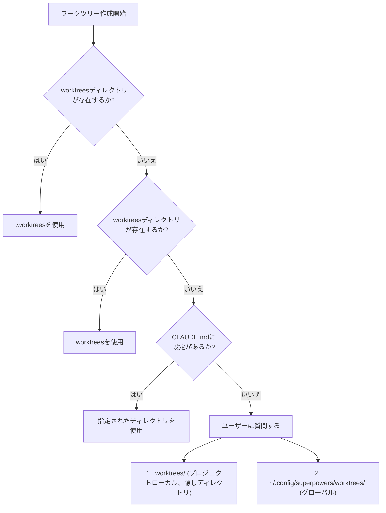
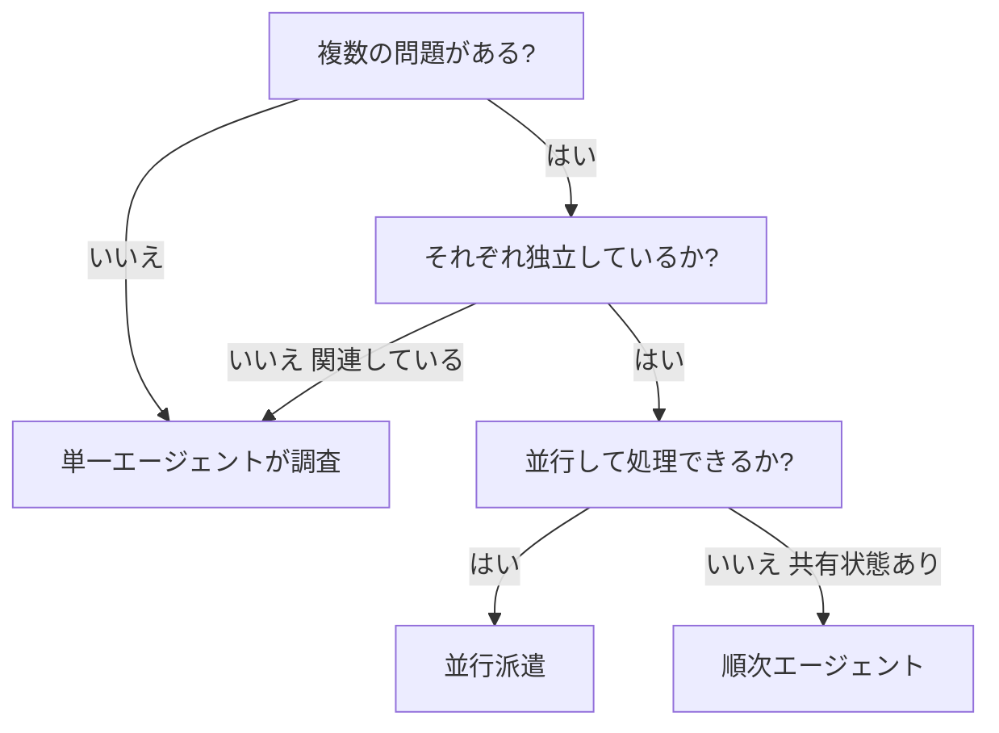
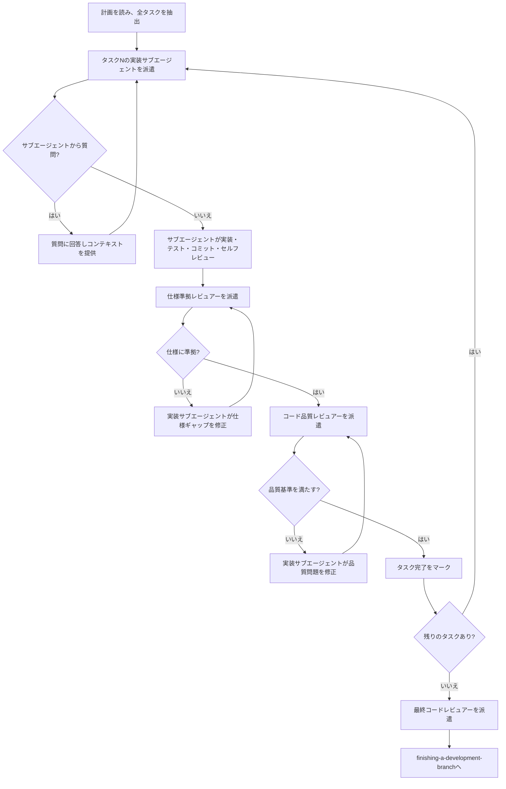
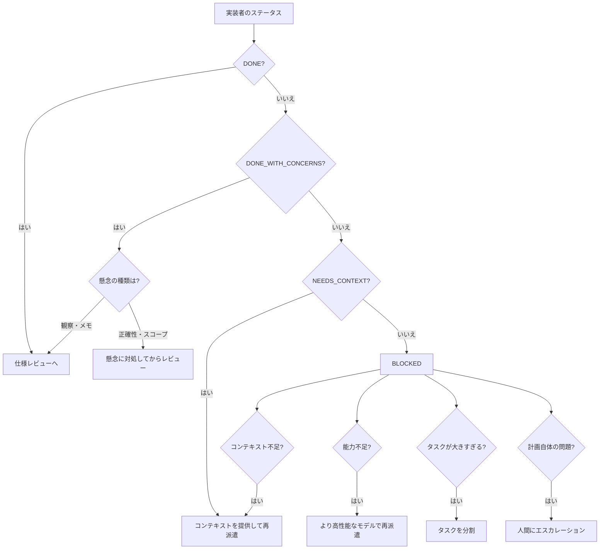
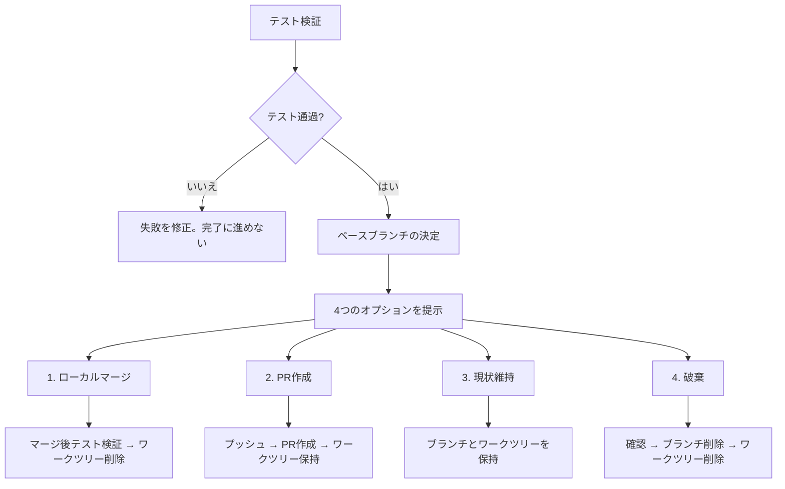
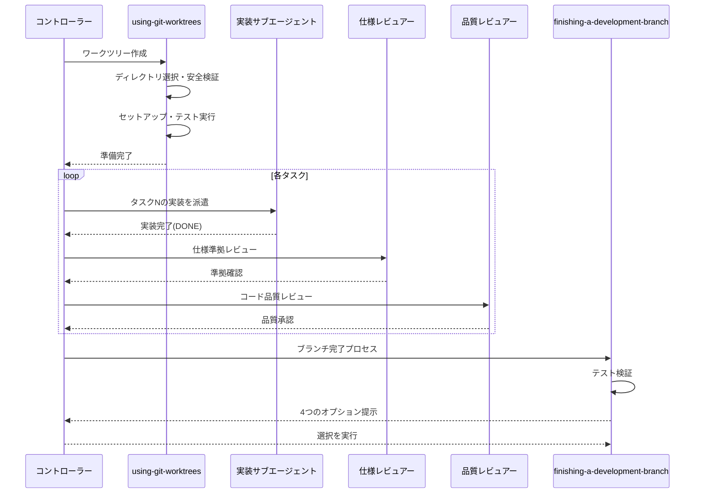

# 第9章 Git操作とサブエージェント

AIコーディングエージェントは、複数のタスクを並行して処理できます。本章では、Superpowersが提供する4つのスキル -- `using-git-worktrees`（Gitワークツリーの活用）、`dispatching-parallel-agents`（並行エージェントの派遣）、`subagent-driven-development`（サブエージェント駆動開発）、`finishing-a-development-branch`（開発ブランチの完了） -- を解説します。

これらのスキルは互いに密接に連携し、「隔離された環境の準備 → タスクの並行実行 → 品質レビュー → ブランチの統合」という一貫したワークフローを構成します。

## 9.1 using-git-worktrees: 隔離されたワークスペースの作成

### Gitワークツリーとは

Gitワークツリー（Git Worktree）は、同じリポジトリ（Repository）を共有しながら、異なるブランチ（Branch）を同時にチェックアウトできるGitの機能です。通常のGit操作では、ブランチを切り替えるたびに作業ディレクトリの内容が変わりますが、ワークツリーを使えば複数のブランチを異なるディレクトリで同時に操作できます。

> Git worktrees create isolated workspaces sharing the same repository, allowing work on multiple branches simultaneously without switching.
>
> （Gitワークツリーは同じリポジトリを共有する隔離されたワークスペースを作成し、切り替えなしに複数のブランチで同時に作業できるようにする。）

AIエージェントにとって、この機能は特に重要です。サブエージェントが互いに干渉することなく独立して作業するための基盤となるからです。

### ディレクトリの優先順位

using-git-worktreesスキルは、ワークツリーを作成するディレクトリの選択に明確な優先順位を定義しています。



**優先順位1: 既存のディレクトリを確認する**

```bash
# 優先順位に従ってチェック
ls -d .worktrees 2>/dev/null     # 隠しディレクトリ（優先）
ls -d worktrees 2>/dev/null      # 代替
```

両方存在する場合は`.worktrees`が優先されます。

**優先順位2: CLAUDE.mdを確認する**

```bash
grep -i "worktree.*director" CLAUDE.md 2>/dev/null
```

CLAUDE.mdにワークツリーディレクトリの指定があれば、質問せずにそれを使います。

**優先順位3: ユーザーに質問する**

既存のディレクトリもCLAUDE.mdの指定もない場合のみ、ユーザーに選択を求めます。

### .gitignoreの安全検証

プロジェクトローカルのディレクトリ（`.worktrees`または`worktrees`）を使用する場合、**ワークツリーを作成する前に**そのディレクトリがGitに無視されていることを検証する必要があります。

```bash
# ディレクトリが.gitignoreで無視されているかチェック
git check-ignore -q .worktrees 2>/dev/null
```

**無視されていない場合:**

スキル定義では「壊れたものは即座に修正する」という原則に従い、次のステップを実行します。

1. `.gitignore`に適切な行を追加する
2. 変更をコミットする
3. ワークツリーの作成に進む

この安全検証が重要な理由は、ワークツリーの内容が誤ってリポジトリにコミットされることを防ぐためです。ワークツリーにはソースコード、依存関係、ビルド成果物が含まれるため、それらがリポジトリに混入すると深刻な問題を引き起こします。

グローバルディレクトリ（`~/.config/superpowers/worktrees/`）を使用する場合は、プロジェクト外部のため`.gitignore`の検証は不要です。

### ワークツリー作成の手順

ワークツリーの作成は以下の手順で行われます。

**1. プロジェクト名の検出**

```bash
project=$(basename "$(git rev-parse --show-toplevel)")
```

**2. ワークツリーの作成**

```bash
# ブランチ名に基づいてパスを決定
git worktree add ".worktrees/$BRANCH_NAME" -b "$BRANCH_NAME"
cd ".worktrees/$BRANCH_NAME"
```

**3. プロジェクトセットアップの自動検出と実行**

```bash
# Node.js
if [ -f package.json ]; then npm install; fi

# Rust
if [ -f Cargo.toml ]; then cargo build; fi

# Python
if [ -f requirements.txt ]; then pip install -r requirements.txt; fi
if [ -f pyproject.toml ]; then poetry install; fi

# Go
if [ -f go.mod ]; then go mod download; fi
```

プロジェクトの種類を自動検出し、適切なセットアップコマンドを実行します。セットアップコマンドをハードコードするのではなく、プロジェクトファイルに基づいて検出することが重要です。

**4. クリーンなベースラインの検証**

```bash
# テストを実行してワークツリーが正常に動作することを確認
npm test  # または cargo test, pytest, go test ./... など
```

テストが失敗した場合は、失敗内容を報告し、続行するかどうかをユーザーに確認します。新しいバグと既存の問題を区別できるよう、ベースラインの検証は省略できません。

**5. 準備完了の報告**

```
Worktree ready at /Users/user/project/.worktrees/feature-auth
Tests passing (47 tests, 0 failures)
Ready to implement auth feature
```

### よくある間違い

| 間違い | 問題 | 対策 |
|--------|------|------|
| .gitignore検証の省略 | ワークツリー内容がgit statusに表示される | 作成前に必ず`git check-ignore`を実行 |
| ディレクトリの場所を仮定 | プロジェクト規約との不整合 | 優先順位に従う: 既存 > CLAUDE.md > 質問 |
| テスト失敗のまま続行 | 新しいバグと既存の問題の区別が不可能に | 失敗を報告し、許可を得てから続行 |
| セットアップコマンドのハードコード | 異なるツールを使うプロジェクトで失敗 | プロジェクトファイルから自動検出 |

## 9.2 dispatching-parallel-agents: 並行エージェントの派遣

### 並行処理の判断基準

dispatching-parallel-agentsスキルは、2つ以上の独立したタスクを並行して処理するためのスキルです。



**並行派遣を使うべき場面:**

- 3つ以上のテストファイルが異なる根本原因で失敗している
- 複数のサブシステム（Subsystem）が独立して壊れている
- 各問題が他の問題のコンテキストなしに理解できる
- 調査間に共有状態がない

**使うべきでない場面:**

- 失敗が関連している（1つを修正すれば他も直る可能性がある）
- システム全体の状態を理解する必要がある
- エージェント同士が干渉する可能性がある（同じファイルを編集するなど）

### 各エージェントへの指示の構造

並行エージェントの成功は、各エージェントに与える指示の質に大きく依存します。

**良い指示の4要素:**

1. **焦点を絞ったスコープ**: 1つの問題ドメインに限定
2. **明確な目標**: 「これらのテストを通す」など具体的
3. **制約**: 「他のコードを変更しない」「本番コードには触れない」
4. **期待する出力**: 「発見と修正の要約を返す」

**良い例:**

```markdown
src/agents/agent-tool-abort.test.tsの3つの失敗するテストを修正:

1. "should abort tool with partial output capture"
   - 'interrupted at'がメッセージに含まれることを期待
2. "should handle mixed completed and aborted tools"
   - fast toolが完了の代わりに中止される
3. "should properly track pendingToolCount"
   - 3つの結果を期待するが0が返る

タイミング/レースコンディションの問題です。あなたのタスク:

1. テストファイルを読み、各テストが何を検証するか理解する
2. 根本原因を特定する -- タイミングの問題か実際のバグか
3. 修正方法:
   - 任意のタイムアウトをイベントベースの待機に置換
   - abort実装にバグがあれば修正
   - 変更された動作をテストしている場合はテストの期待値を調整

タイムアウトを増やすだけにしないこと -- 本当の問題を見つけよ。

返却: 発見と修正の要約。
```

**悪い例との比較:**

- 悪い: 「すべてのテストを修正して」 -- 範囲が広すぎてエージェントが迷う
- 悪い: 「レースコンディションを修正して」 -- どこにあるか分からない
- 悪い: 「直して」 -- 何が変わったか分からない

### 結果の統合

並行エージェントが完了したら、以下の手順で統合します。

1. **各要約を読む**: 何が変わったかを理解する
2. **競合を確認する**: 同じコードを編集していないか
3. **テストスイート全体を実行する**: すべての修正が一緒に動作するか確認
4. **スポットチェック**: エージェントは体系的な誤りをすることがある

### 実世界の事例

スキル定義では、実際のデバッグセッション（2025年10月3日）からの事例が紹介されています。

**シナリオ**: 大規模リファクタリング後に3つのファイルで6つのテスト失敗

**失敗の分布:**

- `agent-tool-abort.test.ts`: 3件の失敗（タイミング問題）
- `batch-completion-behavior.test.ts`: 2件の失敗（ツール未実行）
- `tool-approval-race-conditions.test.ts`: 1件の失敗（実行カウント = 0）

**判断**: 独立したドメイン -- abort処理、バッチ完了、レースコンディションはそれぞれ別の問題

**派遣:**

| エージェント | 担当ファイル | 発見と修正 |
|-------------|-------------|-----------|
| Agent 1 | agent-tool-abort.test.ts | タイムアウトをイベントベースの待機に置換 |
| Agent 2 | batch-completion-behavior.test.ts | イベント構造のバグ修正（threadIdの位置） |
| Agent 3 | tool-approval-race-conditions.test.ts | 非同期ツール実行完了の待機を追加 |

**結果**: すべての修正が独立しており、競合なし。テストスイート全体が通過。3つの問題が1つの問題を解くのと同等の時間で解決されました。

## 9.3 subagent-driven-development: サブエージェント駆動開発

### コンセプト

subagent-driven-developmentは、実装計画（Plan）の各タスクに対して新鮮なサブエージェントを派遣し、2段階のレビューを経て完了させるワークフローです。

> Fresh subagent per task + two-stage review (spec then quality) = high quality, fast iteration
>
> （タスクごとに新鮮なサブエージェント + 2段階レビュー（仕様 → 品質） = 高品質で高速なイテレーション）

**なぜ「新鮮な」サブエージェントか**: タスクを実行するサブエージェントは、コントローラー（Controller）のセッション履歴を引き継ぎません。コントローラーが必要な情報を精密に構築して渡します。これにより、各サブエージェントは自分のタスクにのみ集中でき、コンテキストの汚染が防がれます。

### 全体のプロセス



### 2段階レビュー

subagent-driven-developmentの品質保証の核心は、**仕様準拠レビュー**と**コード品質レビュー**の2段階構成です。

**第1段階: 仕様準拠レビュー（Spec Compliance Review）**

仕様準拠レビュアーの役割は、実装者が要求された通りのものを作ったかを検証することです。スキル定義のレビュアーテンプレートには、印象的な注意書きがあります。

> The implementer finished suspiciously quickly. Their report may be incomplete, inaccurate, or optimistic. You MUST verify everything independently.
>
> （実装者は疑わしいほど早く完了した。報告は不完全、不正確、または楽観的である可能性がある。すべてを独立して検証しなければならない。）

チェックポイント:

- **欠落した要件**: 要求されたすべてが実装されているか
- **不要な追加機能**: 要求されていないものを作っていないか
- **誤解**: 要件を異なる解釈で実装していないか
- **報告ではなくコードで検証する**: 実装者の報告を信頼しない

**第2段階: コード品質レビュー（Code Quality Review）**

仕様準拠レビューが通過した**後に**のみ実行されます。この順序は重要です -- そもそも仕様と異なるものの品質を評価しても意味がないからです。

コード品質レビューでは、requesting-code-reviewスキル（第8章参照）のテンプレートを使用し、加えて以下を確認します。

- 各ファイルが明確な責務と定義されたインターフェース（Interface）を持っているか
- ユニットが独立して理解・テストできるように分解されているか
- 計画のファイル構造に従っているか
- この変更で新しく作られたファイルが既に大きくなっていないか

### 実装者サブエージェントのステータス

実装者サブエージェントは、4つのステータスのいずれかを報告します。

**DONE**: 仕様準拠レビューに進む

**DONE_WITH_CONCERNS**: 作業は完了したが疑念がある。正確性やスコープに関する懸念なら、レビュー前に対処する。「このファイルが大きくなっている」のような観察なら、メモしてレビューに進む

**NEEDS_CONTEXT**: 提供されなかった情報が必要。不足しているコンテキストを提供して再派遣する

**BLOCKED**: タスクを完了できない。ブロッカーの性質に応じて対処する



エスカレーションに関するルールも定義されています。

> Never ignore an escalation or force the same model to retry without changes. If the implementer said it's stuck, something needs to change.
>
> （エスカレーションを無視したり、変更なしに同じモデルにリトライさせてはならない。実装者が行き詰まったと言うなら、何かを変える必要がある。）

### サブエージェントの質問への対応

実装者サブエージェントは、作業開始前や作業中に質問をすることが推奨されています。

```
作業開始前に、以下についてご質問があれば:
- 要件や受入基準
- アプローチや実装戦略
- 依存関係や前提条件
- タスク説明で不明確な点

今すぐ質問してください。作業開始前に懸念を提起してください。
```

コントローラーは質問に対して明確かつ完全に回答し、必要であれば追加のコンテキストを提供します。サブエージェントを急かして実装に移らせてはいけません。

## 9.4 モデル選択の指針

subagent-driven-developmentスキルは、サブエージェントに使用するモデル（Model）の選択について明確な指針を提供しています。

> Use the least powerful model that can handle each role to conserve cost and increase speed.
>
> （各役割を処理できる最も低性能なモデルを使用し、コストを節約しスピードを上げる。）

### タスクの複雑さとモデルの対応

| タスクの種類 | 適切なモデル | 判断基準 |
|-------------|-------------|---------|
| 機械的な実装タスク | 安価で高速なモデル | 1--2ファイル、完全な仕様がある |
| 統合と判断が必要なタスク | 標準モデル | 複数ファイル、統合の考慮が必要 |
| アーキテクチャ・設計・レビュー | 最高性能モデル | 設計判断、コードベース全体の理解が必要 |

**複雑さのシグナル:**

- 1--2ファイルに完全な仕様がある → 安価なモデル
- 複数ファイルにまたがり統合の考慮がある → 標準モデル
- 設計判断やコードベース全体の理解が必要 → 最高性能モデル

この指針の背景には、計画が十分に詳細であれば、大部分の実装タスクは「機械的」であるという考え方があります。writing-plansスキル（第5章参照）で詳細な計画を作成することが、安価なモデルの効果的な活用を可能にするのです。

## 9.5 finishing-a-development-branch: 開発ブランチの完了

### 4つのオプション

すべてのタスクが完了し、テストが通過したら、finishing-a-development-branchスキルがブランチの統合方法を案内します。



### ステップ1: テスト検証

ブランチ完了のオプションを提示する**前に**、テストが通過していることを検証します。

```bash
# プロジェクトのテストスイートを実行
npm test  # またはcargo test, pytest, go test ./...
```

テストが失敗している場合は、オプションの提示に進みません。修正が先です。

### ステップ2: ベースブランチの決定

```bash
# 一般的なベースブランチを試行
git merge-base HEAD main 2>/dev/null || \
  git merge-base HEAD master 2>/dev/null
```

不明な場合はユーザーに確認します。

### ステップ3: 4つのオプション

ユーザーに対して、正確に4つの選択肢を提示します。余計な説明は加えず、簡潔に示します。

```
実装が完了しました。どうしますか?

1. <ベースブランチ>にローカルでマージ
2. プッシュしてPull Requestを作成
3. ブランチをそのままにする（後で対処）
4. この作業を破棄する

どのオプションにしますか?
```

### 各オプションの詳細

**オプション1: ローカルマージ**

```bash
git checkout <base-branch>
git pull
git merge <feature-branch>
# マージ結果でテストを検証
npm test
# テスト通過後にフィーチャーブランチを削除
git branch -d <feature-branch>
```

マージ後にもテストを実行することが重要です。マージによって新たな問題が発生する可能性があるためです。ワークツリーはクリーンアップします。

**オプション2: PR作成**

```bash
git push -u origin <feature-branch>
gh pr create --title "<タイトル>" --body "$(cat <<'EOF'
## Summary
- 変更点1
- 変更点2

## Test Plan
- [ ] テスト手順
EOF
)"
```

ワークツリーは保持します（PRのレビュー中に追加の修正が必要になる可能性があるため）。

**オプション3: 現状維持**

ブランチとワークツリーの両方を保持します。「後で自分で対処する」というユーザーの意思を尊重します。

**オプション4: 破棄**

作業の破棄は取り消せないため、必ず確認を求めます。

```
以下が永久に削除されます:
- ブランチ <name>
- すべてのコミット: <commit-list>
- ワークツリー: <path>

確認するために 'discard' と入力してください。
```

正確な確認入力（`discard`）を待ちます。確認なしに破棄を実行してはいけません。

### ワークツリーのクリーンアップ

| オプション | ワークツリー |
|-----------|-------------|
| 1. ローカルマージ | 削除する |
| 2. PR作成 | 保持する |
| 3. 現状維持 | 保持する |
| 4. 破棄 | 削除する |

## 9.6 4つのスキルの連携: 統合ワークフロー

ここまで解説した4つのスキルは、以下のように一貫したワークフローを構成します。



**フェーズ1: 環境準備（using-git-worktrees）**

- 隔離されたワークスペースを作成
- 安全検証（.gitignore）
- ベースラインテストの確認

**フェーズ2: 実装（subagent-driven-development / dispatching-parallel-agents）**

- タスクごとに新鮮なサブエージェントを派遣
- 独立したタスクは並行派遣も可能
- 2段階レビュー（仕様 → 品質）で品質を保証

**フェーズ3: 統合（finishing-a-development-branch）**

- テスト検証
- 4つの統合オプションから選択
- ワークツリーのクリーンアップ

## 9.7 実践例: 3つの独立した機能の並行開発

### シナリオ

Webアプリケーションに3つの独立した機能を追加する計画があります。

1. ユーザー認証のリファクタリング（3ファイル）
2. 通知システムの追加（2ファイル）
3. エクスポート機能の追加（2ファイル）

### ワークフロー

**ステップ1: ワークツリーの作成**

```bash
# .worktreesディレクトリが存在し、.gitignoreで無視されていることを確認
git check-ignore -q .worktrees  # OK

# 各機能用のワークツリーを作成
git worktree add .worktrees/auth-refactor -b feature/auth-refactor
git worktree add .worktrees/notifications -b feature/notifications
git worktree add .worktrees/export -b feature/export
```

**ステップ2: 並行エージェントの派遣**

3つの機能は互いに独立しているため、dispatching-parallel-agentsパターンを適用できます。

```
Agent 1 → .worktrees/auth-refactor で認証リファクタリング
Agent 2 → .worktrees/notifications で通知システム追加
Agent 3 → .worktrees/export でエクスポート機能追加
```

各エージェントには焦点を絞った指示を与えます。

**ステップ3: 各エージェントでsubagent-driven-developmentを実行**

各並行エージェント内で、subagent-driven-developmentのプロセスが回ります。

```
Agent 1 (認証リファクタリング):
  → 実装サブエージェント派遣 → 仕様レビュー → 品質レビュー
  → DONE

Agent 2 (通知システム):
  → 実装サブエージェント派遣 → 仕様レビュー
  → 仕様ギャップ発見（進捗報告が欠落）
  → 修正 → 再レビュー → 品質レビュー → DONE

Agent 3 (エクスポート機能):
  → 実装サブエージェント派遣 → NEEDS_CONTEXT
  → CSVフォーマットの仕様を提供 → 再派遣
  → 仕様レビュー → 品質レビュー → DONE
```

**ステップ4: ブランチの完了**

各ワークツリーでfinishing-a-development-branchスキルを使用します。

```
feature/auth-refactor:
  テスト通過 → オプション2: PR作成

feature/notifications:
  テスト通過 → オプション2: PR作成

feature/export:
  テスト通過 → オプション1: ローカルマージ
```

## 9.8 レッドフラグと注意事項

4つのスキルに共通する、やってはいけないことをまとめます。

**using-git-worktrees:**
- プロジェクトローカルのワークツリーを.gitignore検証なしに作成しない
- ベースラインテストの検証を省略しない
- テストが失敗したまま続行しない（ユーザーの許可なく）

**dispatching-parallel-agents:**
- 関連する問題を別々のエージェントに分けない
- 共有状態がある問題を並行処理しない
- エージェントの結果を統合後にテストスイート全体を実行する

**subagent-driven-development:**
- main/masterブランチで直接実装を開始しない（ユーザーの明示的同意なし）
- レビュー（仕様準拠・コード品質のどちらも）を省略しない
- 複数の実装サブエージェントを並行派遣しない（競合の危険）
- サブエージェントに計画ファイルを読ませない（全文を提供する）
- **コード品質レビューを仕様準拠レビューの前に実行しない**（順序が重要）
- サブエージェントの質問を無視しない

**finishing-a-development-branch:**
- テストが失敗した状態でオプションを提示しない
- 確認なしに作業を破棄しない
- force pushをユーザーの明示的要求なしに実行しない

## 9.9 まとめ

本章で解説した4つのスキルのポイントをまとめます。

**using-git-worktrees:**
- ディレクトリの優先順位: `.worktrees` > `worktrees` > CLAUDE.md > ユーザーに質問
- プロジェクトローカルの場合、.gitignoreの安全検証が必須
- プロジェクトセットアップの自動検出とベースラインテストの確認

**dispatching-parallel-agents:**
- 2つ以上の独立したタスクを並行処理
- 各エージェントに焦点を絞ったスコープ、明確な目標、制約を付与
- 結果統合後にテストスイート全体を実行

**subagent-driven-development:**
- タスクごとに新鮮なサブエージェントを派遣
- 2段階レビュー: 仕様準拠 → コード品質（この順序を厳守）
- 実装者のステータス（DONE/DONE_WITH_CONCERNS/NEEDS_CONTEXT/BLOCKED）に応じた対応
- モデル選択: 機械的タスク → 安価なモデル、判断タスク → 最高性能モデル

**finishing-a-development-branch:**
- テスト検証 → ベースブランチ決定 → 4つのオプション
- ローカルマージ / PR作成 / 現状維持 / 破棄
- 破棄にはタイプ確認（`discard`）が必須
- ワークツリーのクリーンアップは状況に応じて判断
