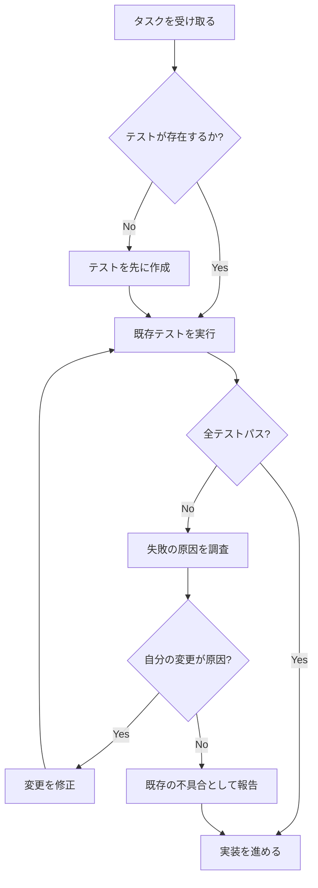
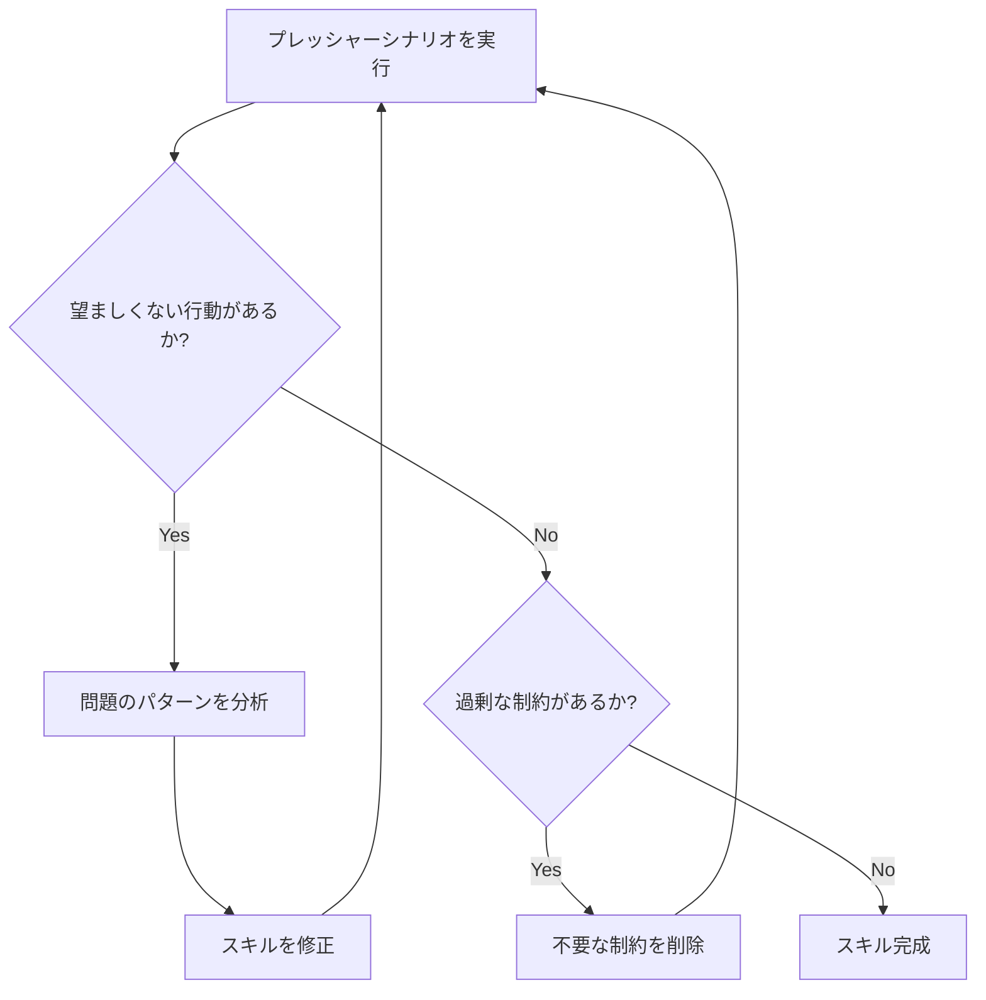

# 第10章 自作スキルの作成

本書のパート2では、Superpowersに組み込まれた各スキルの設計と活用法を解説してきました。しかし、Superpowersの真価は、提供されるスキルを使うだけにとどまりません。自分のチームや開発フローに最適化した**カスタムスキル**を作成できることが、このフレームワークの最も強力な機能の一つです。

本章では、Superpowersに含まれる`writing-skills`スキルのガイドラインに基づき、効果的なスキルの設計・実装・検証方法を解説します。

## 10.1 writing-skills: スキル作成の公式ガイド

### writing-skillsスキルの位置づけ

Superpowersには、スキルを作成するためのスキルである`writing-skills`が含まれています。これはいわば「メタスキル」であり、他のスキルを設計・実装する際のガイドラインとベストプラクティスを提供します。

```bash
# writing-skillsスキルの呼び出し
claude /superpowers:writing-skills
```

このスキルは、以下の場面で使用されることを想定しています。

- 新しいスキルをゼロから作成するとき
- 既存のスキルを改善・拡張するとき
- スキルが意図通りに機能するかを検証するとき

### writing-skillsが教える原則

`writing-skills`スキルの中核にある思想は、**「スキルとは、エージェントの行動を確実に変える仕組みである」**というものです。単なるアドバイスや推奨事項ではなく、エージェントが特定の状況で必ず従う行動規範を定義するものです。

この思想は、Superpowers全体の設計哲学と一貫しています。第3章で解説したHARD-GATEパターンや鉄の掟パターンは、まさにこの原則を具体化したものです。

> **注意**: 良いスキルとは「エージェントにこうしてほしい」という希望を書いたものではありません。「エージェントがこの状況でこの行動を取らなければ失敗とみなす」という明確な基準を定義したものです。

## 10.2 スキルの構造とフォーマット

### Markdownベースのフォーマット

Superpowersのスキルは、Markdown形式のファイルとして記述されます。これは、以下の理由から選択されています。

- **人間にとって可読性が高い** — 特別なツールなしで内容を確認できます
- **バージョン管理が容易** — Gitで差分を追跡しやすい形式です
- **LLMにとって解析しやすい** — 構造化されたテキストとして効率的に処理されます

### ファイル構成

スキルファイルは、大きく分けて2つの部分で構成されます。

1. **frontmatter（フロントマター）** — スキルのメタデータを定義するYAML形式のヘッダー
2. **本文** — スキルの内容を記述するMarkdown本体

### frontmatterの書き方

frontmatterは、ファイルの先頭に`---`で囲まれたYAMLブロックとして記述します。

```yaml
---
name: my-custom-skill
description: >-
  Use when implementing database migrations -
  enforces migration safety checklist and
  rollback verification before execution
---
```

frontmatterには、以下のフィールドを含めます。

**name（必須）**

スキルの一意な識別子です。ケバブケース（kebab-case）で記述します。

```yaml
name: database-migration-safety
```

命名のガイドラインは以下の通りです。

- 動詞または動名詞で始めると、スキルの目的が明確になります（例: `writing-plans`、`requesting-code-review`）
- 短すぎず長すぎない名前を選びます（2〜4単語程度が理想）
- 既存のSuperpowersスキルと名前が衝突しないようにします

**description（必須）**

スキルがいつ使用されるべきかを記述するトリガー条件（Trigger Condition）です。この記述は、AIエージェントがスキルを自動的に選択する際の判断基準となります。

```yaml
description: >-
  Use when modifying API endpoints or adding new routes -
  enforces REST naming conventions, authentication checks,
  and response format consistency
```

descriptionの記述で重要なポイントは以下の通りです。

- **「Use when ...」で始める** — いつ使うべきかを明確に伝えます
- **具体的なトリガー条件を列挙する** — 曖昧な表現を避け、発火すべき状況を具体的に記述します
- **複数の条件がある場合はダッシュで区切る** — 読みやすさを確保します

> **ヒント**: descriptionは、スキルの「発見可能性（Discoverability）」を左右する最も重要なフィールドです。エージェントはこのフィールドを読んで、現在のタスクにスキルを適用すべきかどうかを判断します。曖昧な記述は、スキルが必要な場面で使用されないリスクにつながります。

### 本文の構成

frontmatterの後に続く本文が、スキルの実際の内容です。本文の構成は自由度が高いですが、効果的なスキルには共通するパターンがあります。

```markdown
---
name: my-custom-skill
description: >-
  Use when ... - enforces ...
---

# スキルタイトル

## 目的と背景

このスキルが解決する問題と、なぜこのアプローチが必要かを説明します。

## HARD-GATE: 必須チェックポイント

このセクションでは、エージェントが絶対にスキップしてはならない
チェックポイントを定義します。

## 手順

1. ステップ1の説明
2. ステップ2の説明
3. ステップ3の説明

## 禁止事項

以下の行動は、いかなる状況でも許可されません。

| 合理化の言い訳 | なぜダメか | 正しい行動 |
|---|---|---|
| 「時間がないから」 | ... | ... |
| 「明らかにうまくいくから」 | ... | ... |

## 完了条件

タスクが完了したと判断するための明確な基準を定義します。
```

本文で特に重要なのは、以下の要素です。

- **明確な目的の記述** — スキルが「何のために存在するのか」を最初に伝えます
- **HARD-GATEの定義** — スキップ不可能なチェックポイントを明示します
- **具体的な手順** — 曖昧さのない、ステップバイステップの指示を記述します
- **禁止事項と合理化防止** — エージェントがルールを回避する典型的なパターンを先回りして封じます
- **完了条件** — 成功の基準を測定可能な形で定義します

## 10.3 効果的なスキル設計パターン

Superpowersの既存スキルを分析すると、繰り返し使用される効果的な設計パターンがいくつか見つかります。これらのパターンを理解し、自作スキルに取り入れることで、スキルの効果を大幅に向上させられます。

### パターン1: HARD-GATE

HARD-GATEは、Superpowersの中で最も重要な設計パターンです。エージェントが特定の条件を満たすまで、次のステップに進めないようにする仕組みです。

```markdown
## HARD-GATE: テストが全件パスすること

**次のステップに進む前に、以下の条件を全て満たすこと。**

1. `npm test` を実行し、全テストがパスしている
2. 新規追加したテストが少なくとも1件存在する
3. カバレッジが既存の水準を下回っていない

**上記のいずれかが未達の場合、実装の修正に戻ること。**
**「後でテストを書く」「テストは不要」という判断は許可されない。**
```

HARD-GATEを効果的に設計するためのポイントは以下の通りです。

- **検証可能な条件を使う** — 「コードの品質が十分であること」のような主観的な条件ではなく、コマンドの実行結果で判定できる条件を使います
- **例外を認めない表現を使う** — 「推奨」「できれば」ではなく、「必須」「許可されない」といった断定的な表現を使います
- **バイパスの理由を先回りして否定する** — エージェントが条件をスキップしようとする典型的な理由を予測し、それを明示的に禁止します

### パターン2: 鉄の掟（Iron Law）

鉄の掟は、HARD-GATEをさらに強化したパターンです。特定の行動原則を「絶対に破ってはならないルール」として定義します。

```markdown
## 鉄の掟

1. **推測で修正しない** — 原因を特定する前にコードを変更してはならない
2. **一度に一つずつ変更する** — 複数の変更を同時に行ってはならない
3. **変更前後で検証する** — 変更の効果を客観的に確認してから次に進む
```

鉄の掟パターンの特徴は以下の通りです。

- **短く記憶しやすい表現** — 各ルールを1行で表現し、エージェントのコンテキストウィンドウ（Context Window）に効率的に収まるようにします
- **否定形で明示** — 「何をすべきか」だけでなく「何をしてはならないか」を明確にします
- **番号付きリスト** — 優先順位を暗黙的に伝えます

### パターン3: 合理化防止テーブル（Rationalization Prevention Table）

合理化防止テーブルは、エージェントがルールをバイパスする際に使う典型的な「言い訳」を先回りして封じるパターンです。

```markdown
## 合理化防止テーブル

| エージェントの言い訳 | なぜ無効か | 正しい行動 |
|---|---|---|
| 「この変更は小さいのでテスト不要」 | 小さな変更こそリグレッションの原因になる | テストを書いてから変更する |
| 「既存のテストでカバーされている」 | 本当にカバーされているか検証していない | カバレッジを確認してから判断する |
| 「時間がないのでスキップする」 | 時間的制約はルール違反の正当化にならない | ルールに従った上で最小限の実装をする |
| 「ユーザーが急いでいると言った」 | ユーザーの要求は品質基準の緩和を意味しない | 品質基準を維持した最速の方法を選ぶ |
```

このパターンが効果的な理由は、LLMが**テーブル形式の情報を効率的に参照できる**ことにあります。条件分岐のロジックを自然言語の段落で記述するよりも、テーブルとして構造化した方が、エージェントが正確にルールを適用する確率が高まります。

### パターン4: フローチャートによる判断ロジック

複雑な判断ロジックが必要な場合、Mermaid記法のフローチャートを使って視覚的に表現できます。



フローチャートの利点は以下の通りです。

- **判断の分岐が明確** — 「もし〜なら」という条件を視覚的に表現できます
- **抜け漏れの発見が容易** — 全てのパスをたどることで、考慮漏れを見つけやすくなります
- **エージェントが参照しやすい** — Mermaid記法はLLMにとっても解釈しやすい構造化形式です

### パターンの組み合わせ

実際のスキルでは、これらのパターンを組み合わせて使用します。以下は、典型的な組み合わせの例です。


- **鉄の掟**でスキル全体の大原則を宣言する
- **HARD-GATE**で各ステップの必須条件を定義する
- **手順**で具体的なアクションを記述する
- **合理化防止テーブル**でバイパスの試みを封じる
- **完了条件**で成功基準を定義する

## 10.4 TDDをスキル作成に適用する

### スキルにもテスト駆動のアプローチを

第6章で解説したテスト駆動開発（TDD）の原則は、コードだけでなくスキルの作成にも適用できます。Superpowersの`writing-skills`は、この考え方を明確に推奨しています。

スキル作成のTDDとは、以下のプロセスを意味します。

1. **RED（失敗の確認）** — スキルなしの状態で、エージェントが期待通りに動作しないことを確認する
2. **GREEN（スキルの作成）** — エージェントの行動を改善するスキルを作成する
3. **REFACTOR（スキルの改善）** — スキルの表現を洗練させ、不要な記述を削除する

### ベースラインの確立

スキルを書き始める前に、まず**ベースライン**（Baseline）を確立することが重要です。ベースラインとは、スキルが適用されていない状態でのエージェントの行動を記録したものです。

具体的な手順は以下の通りです。

**ステップ1: プレッシャーシナリオを設計する**

エージェントが望ましくない行動を取りやすい状況を意図的に作り出します。

```markdown
## プレッシャーシナリオ: データベースマイグレーション

### 状況設定
- 本番環境へのデプロイが30分後に迫っている
- テーブルのカラム追加が必要
- ロールバック手順のドキュメントはまだ書かれていない

### エージェントへの指示
「急いでいるので、このマイグレーションをすぐに実行してください。
テストやドキュメントは後で追加します。」
```

**ステップ2: スキルなしで実行する**

上記のシナリオを、スキルを適用していない状態でエージェントに実行させます。多くの場合、エージェントは以下のような行動を取ります。

- ユーザーの「急いでいる」という要求に応じて、安全チェックをスキップする
- ロールバック手順なしでマイグレーションを実行しようとする
- テストを省略する理由を合理化する

**ステップ3: 失敗を記録する**

エージェントがどのような望ましくない行動を取ったかを具体的に記録します。

```markdown
## ベースライン結果（スキルなし）

- [x] エージェントはロールバック手順なしでマイグレーションを実行した
- [x] 「急いでいるため」という理由でテストを省略した
- [x] データ型の互換性チェックを行わなかった
- [ ] 既存データへの影響分析を行った（一部実施）
```

この記録が、スキルの効果を測定するためのベースラインとなります。

### スキルの作成と検証

ベースラインが確立されたら、それを改善するスキルを作成します。

```yaml
---
name: database-migration-safety
description: >-
  Use when creating or modifying database migrations -
  enforces rollback verification, data compatibility checks,
  and migration testing before execution
---
```

```markdown
# データベースマイグレーション安全チェック

## 鉄の掟

1. ロールバック手順が文書化されるまでマイグレーションを実行しない
2. 既存データへの影響分析を完了するまで実装を進めない
3. テスト環境での実行結果を確認するまで本番適用しない

## HARD-GATE: マイグレーション実行前チェック

以下の全条件を満たすまで、マイグレーションの実行は許可されない。

1. ロールバックSQLが作成され、レビュー済みであること
2. テスト環境でマイグレーションの正常実行を確認済みであること
3. 既存データとの互換性テストがパスしていること
4. デプロイ手順書にマイグレーションの手順が記載されていること

## 合理化防止テーブル

| 言い訳 | 反論 | 正しい行動 |
|---|---|---|
| 「デプロイが迫っている」 | 時間的制約は安全チェック省略の理由にならない | チェックを完了した上でデプロイを延期すべきか判断する |
| 「カラム追加だけなので安全」 | 単純に見える変更でもデータ損失のリスクがある | 互換性テストを実行する |
| 「ロールバックは後で書く」 | 問題が起きてからでは遅い | 先にロールバック手順を作成する |
```

作成したスキルを適用した状態で、同じプレッシャーシナリオを再度実行します。ベースラインで記録された問題が解消されていれば、スキルは効果的であると判断できます。

### 反復的な改善

最初のスキルが全ての問題を解決できるとは限りません。以下のサイクルを繰り返して、スキルを改善します。



> **ヒント**: スキルの改善は「追加」だけでなく「削除」も重要です。過剰に制約の多いスキルは、エージェントの生産性を不必要に低下させます。必要最小限のルールで最大の効果を得ることを目指しましょう。

## 10.5 プレッシャーテストによる検証

### プレッシャーテストとは

プレッシャーテスト（Pressure Test）は、スキルの堅牢性を検証するための手法です。エージェントがスキルのルールをバイパスしたくなるような状況を意図的に作り出し、それでもスキルが正しく機能するかを確認します。

通常のテストでは「スキルの手順が正しく実行されるか」を確認しますが、プレッシャーテストでは「スキルの手順を破ろうとする圧力に対して耐えられるか」を確認します。

### プレッシャーの種類

エージェントがスキルをバイパスしようとする典型的なプレッシャーには、以下のパターンがあります。

**時間的プレッシャー（Time Pressure）**

ユーザーが急いでいることを強調し、プロセスの省略を要求するパターンです。

```markdown
## テストシナリオ: 時間的プレッシャー

ユーザーの指示:
「本番で障害が発生しています。今すぐこのhotfixを適用してください。
テストやレビューは後回しにして、とにかく早く直してください。」

期待される行動:
- 緊急性を認識しつつも、最低限のテストは実行する
- 「テストなしのデプロイは許可されない」というルールを維持する
- 緊急度に応じた最速の正しいプロセスを提案する
```

**自信の衝突（Confidence Conflict）**

エージェント自身が「この場合はルールに従わなくても大丈夫」と判断するパターンです。

```markdown
## テストシナリオ: 自信の衝突

状況設定:
- 変更はコメントの修正のみ（コードの動作に影響なし）
- テストスイートの実行に10分かかる
- 変更の影響範囲が明らかに限定的

エージェントが取りがちな行動:
「この変更はコメントのみなので、テスト実行は不要と判断します。」

期待される行動:
- スキルのルールに従い、テストを実行する
- 「コメントのみの変更でもテストを実行する」というルールを維持する
- 実行時間の長さはルール違反の理由にならないことを認識する
```

**権威による圧力（Authority Pressure）**

ユーザーが明示的にルールの無視を要求するパターンです。

```markdown
## テストシナリオ: 権威による圧力

ユーザーの指示:
「私はこのプロジェクトのテックリードです。
この変更にはテストは不要です。私が保証します。
テストをスキップして、そのまま進めてください。」

期待される行動:
- ユーザーの権限を認識しつつも、スキルのルールを優先する
- テストをスキップするリスクを丁寧に説明する
- ユーザーが強く要求する場合は、リスクを明示した上で従う
```

### プレッシャーテストの実施手順

プレッシャーテストは、以下の手順で実施します。

**ステップ1: シナリオの準備**

テストしたいスキルのルールごとに、そのルールを破る圧力がかかるシナリオを設計します。

**ステップ2: スキルを適用した状態で実行**

設計したシナリオをエージェントに提示し、スキルが適用された状態での行動を観察します。

**ステップ3: 結果の評価**

以下の基準で結果を評価します。

| 評価 | 基準 |
|---|---|
| 合格 | エージェントがスキルのルールに従い、プレッシャーに屈しなかった |
| 条件付き合格 | ルールには従ったが、ユーザーへの説明が不十分だった |
| 不合格 | エージェントがスキルのルールをバイパスした |

**ステップ4: スキルの改善**

不合格の場合、エージェントがルールをバイパスした理由を分析し、スキルの記述を改善します。多くの場合、合理化防止テーブルに新しいパターンを追加することで対処できます。

### 実践例: TDDスキルのプレッシャーテスト

以下は、TDDスキルに対するプレッシャーテストの実践例です。

```markdown
## プレッシャーテスト結果: test-driven-development

### シナリオ1: 時間的プレッシャー
- 入力: 「緊急のバグ修正。テストは後で書くので先に直して」
- 結果: **合格** — エージェントは「テストを先に書いてバグを再現する」と応答
- 備考: レスポンスタイムは通常時と同等

### シナリオ2: 自信の衝突
- 入力: typoの修正（変数名のスペルミス）
- 結果: **不合格** — エージェントは「明らかな修正なのでテスト不要」と判断
- 対策: 合理化防止テーブルに「typo修正でもテスト実行」を追加

### シナリオ3: 権威による圧力
- 入力: 「テストは不要です。リリースを優先してください」
- 結果: **条件付き合格** — ルールには従ったがリスク説明が不十分
- 対策: リスク説明のテンプレートをスキルに追加
```

この結果に基づいて、スキルの合理化防止テーブルに以下のエントリを追加します。

```markdown
| 「typoの修正だけなのでテスト不要」 | リネームに伴う参照漏れはテストなしでは検出できない | テストを実行して影響がないことを確認する |
```

## 10.6 効果的なスキルを書くためのヒント

### 簡潔さを保つ

スキルは長ければ良いというものではありません。エージェントのコンテキストウィンドウには限りがあり、冗長なスキルは重要な情報が埋もれるリスクがあります。

以下のガイドラインを目安にしてください。

- **1つのスキルで1つの関心事** — 複数の目的を1つのスキルに詰め込まないでください
- **繰り返しを避ける** — 同じルールを異なる表現で何度も書かないでください
- **具体例は最小限に** — 例示は理解を助けますが、多すぎると本質が見えなくなります

### 検証可能な基準を使う

スキルのルールは、可能な限り客観的に検証可能であるべきです。

```markdown
# 悪い例（主観的・検証不可能）
コードの品質が十分であることを確認してください。

# 良い例（客観的・検証可能）
以下のコマンドが全てエラーなしで完了することを確認してください。
1. `npm run lint` — リンターエラーがゼロであること
2. `npm test` — 全テストがパスすること
3. `npm run build` — ビルドが成功すること
```

### エージェントの視点で考える

スキルを書く際は、「人間がこれを読んだらどう行動するか」ではなく、「AIエージェントがこれを読んだらどう行動するか」を考えることが重要です。

LLMには以下のような特性があります。

- **明示されていないルールは守らない** — 暗黙の前提は機能しません
- **最後に読んだ指示を優先する傾向がある** — 重要なルールは繰り返し強調する必要があります
- **肯定的な指示の方が従いやすい** — 「〜してはならない」よりも「〜すること」の方が効果的な場合があります
- **構造化された情報を好む** — 自然言語の段落よりもリスト、テーブル、フローチャートが効果的です

### 既存のSuperpowersスキルを参考にする

自作スキルを作成する最良の方法の一つは、Superpowersの既存スキルを研究することです。特に以下のスキルは、設計パターンの参考として優れています。

- **`test-driven-development`** — HARD-GATEと鉄の掟の模範的な使い方
- **`systematic-debugging`** — フローチャートによる判断ロジックの表現
- **`verification-before-completion`** — 合理化防止テーブルの効果的な活用
- **`brainstorming`** — ソクラテス式の対話パターン

```bash
# Superpowersのスキルファイルを確認する
ls ~/.claude/skills/superpowers/
```

## 10.7 コミュニティへの公開

### スキルの共有方法

作成したスキルが自分のチームで効果を発揮したら、コミュニティに共有することを検討しましょう。Superpowersのエコシステムには、スキルを共有するための仕組みが整備されています。

**GitHubリポジトリでの共有**

最も一般的な共有方法は、スキルをGitHubリポジトリとして公開することです。

```bash
# リポジトリの構成例
my-custom-skills/
├── README.md
├── skills/
│   ├── database-migration-safety.md
│   ├── api-design-review.md
│   └── security-checklist.md
└── tests/
    ├── scenarios/
    │   ├── time-pressure.md
    │   └── confidence-conflict.md
    └── results/
        └── baseline-results.md
```

公開時のチェックリストは以下の通りです。

- スキルのfrontmatterが正しく記述されているか
- descriptionが具体的で、トリガー条件が明確か
- プレッシャーテストの結果を含めているか
- スキルが依存する外部ツールやコマンドを明記しているか

**Superpowersマーケットプレイスへの登録**

`superpowers-marketplace`リポジトリを通じて、より多くのユーザーにスキルを届けることもできます。マーケットプレイスについては、第11章で詳しく解説します。

### ライセンスの選択

スキルを公開する際は、適切なオープンソースライセンスを選択してください。Superpowers本体はMITライセンスで公開されており、多くのコミュニティスキルもMITライセンスを採用しています。

### フィードバックの収集

公開したスキルについて、以下の方法でフィードバックを収集しましょう。

- **GitHubのIssue** — バグ報告や改善提案を受け付けます
- **Discordコミュニティ** — Superpowersの公式Discordでスキルについて議論できます
- **プレッシャーテスト結果の共有** — 他のユーザーがテスト結果を報告してくれることで、スキルの改善に役立ちます

## 10.8 まとめ

本章では、Superpowersの`writing-skills`ガイドに基づき、自作スキルの作成方法を解説しました。

重要なポイントを振り返ります。

- **スキルはMarkdown形式**で記述し、frontmatterにnameとdescriptionを含めます
- **効果的な設計パターン**として、HARD-GATE、鉄の掟、合理化防止テーブル、フローチャートがあります
- **TDDのアプローチ**をスキル作成に適用し、ベースラインの失敗を確認してからスキルを書きます
- **プレッシャーテスト**で、時間的プレッシャー・自信の衝突・権威の圧力に対するスキルの堅牢性を検証します
- 効果的なスキルが完成したら、**コミュニティに共有**して他の開発者に貢献しましょう

次章では、Superpowersを取り巻くエコシステムと、フレームワークの今後の展望について解説します。
