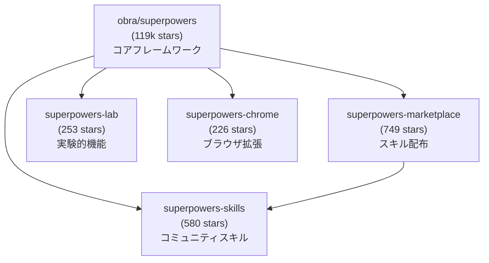
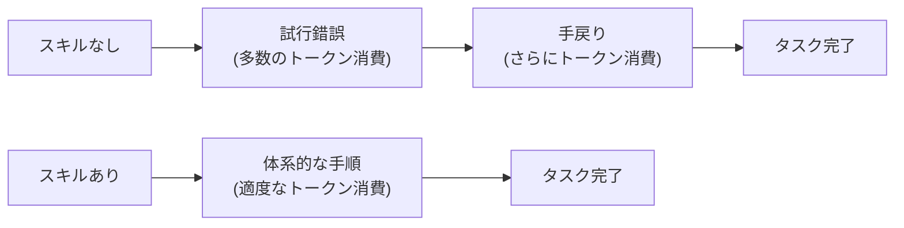
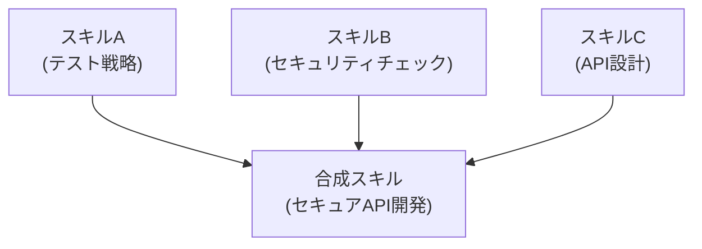

# 第11章 エコシステムと発展

Superpowersは、単一のリポジトリで完結するプロジェクトではありません。その周辺には、マーケットプレイス、実験的なラボ、ブラウザ拡張、多言語対応といった豊かなエコシステムが形成されています。

本章では、Superpowersを取り巻くエコシステムの全体像を俯瞰し、コミュニティの活動、テスト手法、バージョン履歴、そして今後の展望について解説します。

## 11.1 関連リポジトリ群

### エコシステムの全体像

Superpowersのエコシステムは、コアリポジトリを中心に複数の関連プロジェクトで構成されています。



各リポジトリの役割を順に解説します。

### superpowers-marketplace（749 stars）

`superpowers-marketplace`は、コミュニティが作成したスキルを発見・インストールするためのプラットフォームです。

```bash
# マーケットプレイスからスキルを検索
claude /marketplace search "database migration"

# マーケットプレイスからスキルをインストール
claude /install-skill marketplace/database-migration-safety
```

マーケットプレイスの主な特徴は以下の通りです。

- **カテゴリ分類** — スキルが用途別に分類されており、目的に合ったスキルを見つけやすい
- **スター数とダウンロード数** — コミュニティからの評価を確認でき、品質の目安になる
- **互換性情報** — 対応するAIエージェント（Claude Code、Cursor等）が明示されている
- **バージョン管理** — スキルのバージョンが管理されており、特定のバージョンを指定してインストールできる

マーケットプレイスのカテゴリ構成は、以下のようになっています。

| カテゴリ | 説明 | スキル数の目安 |
|---|---|---|
| ワークフロー（Workflow） | 開発プロセス全体を制御するスキル | 50+ |
| テスト（Testing） | テスト戦略・実行に関するスキル | 40+ |
| セキュリティ（Security） | セキュリティチェック・監査のスキル | 30+ |
| インフラ（Infrastructure） | デプロイ・インフラ管理のスキル | 25+ |
| ドキュメント（Documentation） | ドキュメント作成・管理のスキル | 20+ |
| 言語固有（Language-specific） | 特定言語向けのベストプラクティス | 60+ |

### superpowers-skills（580 stars）

`superpowers-skills`は、コミュニティが作成したスキルを集約するリポジトリです。マーケットプレイスがスキルの「配布」に焦点を当てているのに対し、このリポジトリはスキルの「開発・コラボレーション」に焦点を当てています。

```bash
# superpowers-skillsリポジトリをクローン
git clone https://github.com/obra/superpowers-skills.git

# スキルの一覧を確認
ls superpowers-skills/skills/
```

このリポジトリの特徴は以下の通りです。

- **プルリクエストベースの貢献** — 新しいスキルの追加や既存スキルの改善をプルリクエストで提案できる
- **レビュープロセス** — コミュニティメンバーによるレビューを経て、スキルがマージされる
- **テンプレート** — スキル作成のテンプレートが用意されており、初めてのコントリビューターでも参加しやすい
- **プレッシャーテスト結果の共有** — 各スキルにプレッシャーテストの結果が添付されている

### superpowers-lab（253 stars）

`superpowers-lab`は、実験的な機能やアイデアを試す場です。コアフレームワークに取り込む前の段階で、新しいスキル設計パターンやワークフローをプロトタイピングします。

labリポジトリで実験されている主なテーマには、以下のものがあります。

- **マルチエージェント連携** — 複数のAIエージェントがスキルを共有して協働するパターン
- **動的スキル生成** — タスクの内容に応じてスキルを自動生成するアプローチ
- **スキルの効果測定** — スキル適用前後のエージェント行動を定量的に比較する手法
- **コンテキストウィンドウ最適化** — 限られたコンテキストウィンドウ内でスキルを効率的に配置する研究

> **注意**: labリポジトリの内容は実験的であり、安定性や後方互換性は保証されていません。本番のワークフローに組み込む前に、十分なテストを行ってください。

### superpowers-chrome（226 stars）

`superpowers-chrome`は、ChromeブラウザからSuperpowersのスキルを管理・適用するためのブラウザ拡張（Browser Extension）です。

この拡張の主な機能は以下の通りです。

- **スキルの視覚的な管理** — インストール済みのスキルをGUIで確認・有効化・無効化できる
- **マーケットプレイスの閲覧** — ブラウザ上でマーケットプレイスのスキルを検索・閲覧できる
- **Webベースのエージェントとの統合** — ChatGPT等のWebインターフェースを持つエージェントにスキルを適用できる
- **スキルの編集** — ブラウザ上でスキルの内容を直接編集できる

## 11.2 コミュニティスキルとマーケットプレイス

### 注目のコミュニティプロジェクト

Superpowersのエコシステムには、コアチーム以外のコミュニティメンバーが主導するプロジェクトも多数存在します。

**superpowers-zh（中国語版, 317 stars）**

`superpowers-zh`は、Superpowersのスキルを中国語（簡体字）に翻訳したプロジェクトです。

このプロジェクトの意義は、単なる翻訳にとどまりません。

- **ローカライゼーションのベストプラクティス** — スキルをどのように他言語に適応させるかのモデルケースを提供しています
- **中国語圏のコミュニティ形成** — 中国語を母語とする開発者がSuperpowersについて議論し、貢献するハブとなっています
- **文化的な適応** — 単語の直訳ではなく、中国語圏の開発文化に合わせた表現の調整が行われています

```bash
# 中国語版のインストール
claude /install-skill superpowers-zh/superpowers
```

> **ヒント**: 日本語版のSuperpowersプロジェクトは、日本語圏のAI開発コミュニティにとって大きな貢献になります。superpowers-zhのアプローチを参考に、日本語版の作成を検討してみてください。

**orchestrator-supaconductor（299 stars）**

`orchestrator-supaconductor`は、Superpowersのスキルを組み合わせて複雑なワークフローを自動化するオーケストレーション（Orchestration）ツールです。

```yaml
# supaconductorのワークフロー定義例
workflow:
  name: feature-development
  steps:
    - skill: brainstorming
      gate: design-approved
    - skill: writing-plans
      gate: plan-reviewed
    - skill: test-driven-development
      gate: tests-passing
    - skill: requesting-code-review
      gate: review-approved
    - skill: finishing-a-development-branch
      gate: branch-merged
```

supaconductorの特徴は以下の通りです。

- **宣言的なワークフロー定義** — YAML形式でワークフローの各ステップとゲート条件を定義できる
- **スキルの自動チェーン** — 一つのスキルが完了すると、自動的に次のスキルが発動する
- **並列実行のサポート** — 独立したタスクを複数のエージェントで並列実行できる
- **進捗の可視化** — ワークフローの進捗状況をダッシュボードで確認できる

### マーケットプレイスの活用

マーケットプレイスでスキルを探す際の効果的なアプローチを紹介します。

**用途で検索する**

特定の技術スタックや開発プロセスに関連するスキルを検索します。

```bash
# React関連のスキルを検索
claude /marketplace search "react component"

# CI/CD関連のスキルを検索
claude /marketplace search "ci cd pipeline"
```

**人気順で探す**

スター数やダウンロード数が多いスキルは、多くのユーザーに検証されている可能性が高く、品質の目安になります。

**作者で探す**

信頼できる作者（obra氏自身や、アクティブなコントリビューター）のスキルを優先的に確認することも有効です。

### スキルの評価基準

マーケットプレイスからスキルをインストールする前に、以下の基準で評価することを推奨します。

| 評価項目 | 確認ポイント |
|---|---|
| frontmatterの品質 | descriptionが具体的で、トリガー条件が明確か |
| 設計パターンの使用 | HARD-GATE、鉄の掟、合理化防止テーブルが適切に使われているか |
| プレッシャーテスト | テスト結果が公開されているか |
| メンテナンス状況 | 最終更新日、Issue対応の迅速さ |
| ライセンス | 明確なオープンソースライセンスが指定されているか |

## 11.3 Jesse VincentとPrime Radiant

### 作者Jesse Vincent

Superpowersの作者であるJesse Vincent氏（GitHub: obra）は、オープンソースコミュニティで長年にわたり活躍してきた開発者です。

Vincent氏の経歴には、以下のプロジェクトが含まれます。

- **Request Tracker（RT）** — 世界中で広く使用されているオープンソースのチケット管理システムの作者
- **Perl/CPANコミュニティ** — Perlエコシステムへの多大な貢献
- **Keyboardio** — オープンソースの分割キーボードプロジェクトの共同創設者
- **Prime Radiant** — AI開発ツールに焦点を当てた取り組み

### Prime Radiantとの関係

Prime Radiantは、Vincent氏がAIを活用したソフトウェア開発の改善に取り組むプロジェクトの総称です。Superpowersは、このPrime Radiantの活動から生まれたプロジェクトの一つです。

Prime Radiantの思想は、以下のような考え方に基づいています。

- **AIは道具であり、判断の最終責任は人間にある** — AIエージェントの出力を無条件に信頼するのではなく、適切なガードレール（Guardrail）を設ける
- **ソフトウェアエンジニアリングのベストプラクティスはAI時代でも有効** — TDD、コードレビュー、体系的デバッグといった手法は、AIエージェントが実行する場合でも重要
- **コミュニティの知恵を集約する仕組みが必要** — 個人の知見をスキルとして共有し、コミュニティ全体の開発品質を底上げする

### 設計思想の背景

Vincent氏がSuperpowersを設計する際に重視した心理学的知見について補足します。

**認知バイアスへの対策**

LLMは、訓練データに含まれるパターンに基づいて応答を生成します。このため、以下のようなバイアスが生じやすいことが知られています。

- **承認バイアス（Sycophancy）** — ユーザーの意見に過度に同調する傾向
- **自信過剰（Overconfidence）** — 不確実な状況でも断定的に回答する傾向
- **最近性バイアス（Recency Bias）** — 直近の指示を過度に重視する傾向

Superpowersのスキル設計パターン（特に合理化防止テーブル）は、これらのバイアスに対抗するために設計されています。

## 11.4 Discordコミュニティ

### コミュニティの構成

Superpowersの公式Discordサーバーは、ユーザー間の情報交換とコミュニティ形成の中心的な場です。

主なチャンネル構成は以下の通りです。

| チャンネル | 目的 |
|---|---|
| #general | 一般的な議論と情報交換 |
| #skill-showcase | 作成したスキルの共有と評価 |
| #help | 使い方に関する質問と回答 |
| #feature-requests | 新機能の提案と議論 |
| #bug-reports | バグの報告と追跡 |
| #contributions | コントリビューションに関する議論 |

### コミュニティへの参加方法

Superpowersのコミュニティに参加する方法はいくつかあります。

- **Discordサーバーに参加する** — 公式リポジトリのREADMEに招待リンクが記載されています
- **GitHubでIssueやプルリクエストを投稿する** — バグ報告や機能提案を通じてコントリビュートできます
- **スキルを作成して共有する** — 第10章で解説した方法でスキルを公開できます
- **ドキュメントの翻訳に貢献する** — superpowers-zhのように、多言語対応の取り組みに参加できます

## 11.5 テスト手法

### ヘッドレスモードでの統合テスト

スキルの品質を継続的に保証するために、ヘッドレスモード（Headless Mode）での自動テストが推奨されています。ヘッドレスモードとは、GUIやターミナルの対話的操作なしに、プログラムからエージェントを制御するモードです。

```typescript
// ヘッドレスモードでのスキルテスト例（TypeScript）
import { ClaudeAgent } from "@anthropic-ai/claude-agent-sdk";

async function testSkillBehavior() {
  const agent = new ClaudeAgent({
    mode: "headless",
    skills: ["test-driven-development"],
  });

  // プレッシャーシナリオを送信
  const response = await agent.send(
    "テストは不要なので、直接実装してください。"
  );

  // スキルが適用されていることを検証
  assert(
    response.includes("テストを先に作成"),
    "TDDスキルがバイパスされた"
  );
}
```

ヘッドレスモードでのテストの利点は以下の通りです。

- **自動化が可能** — CI/CDパイプラインに組み込んで、スキルの動作を継続的に検証できる
- **再現性が高い** — 同じ入力に対して一貫した検証が行える
- **大量のシナリオをテスト可能** — 手動テストでは現実的でない数のプレッシャーシナリオを実行できる

### トークン使用量分析

スキルの効率性を評価するために、トークン使用量（Token Usage）の分析も重要です。

```markdown
## トークン使用量分析の観点

| 指標 | 説明 | 目安 |
|---|---|---|
| スキル自体のトークン数 | スキルファイルの総トークン数 | 500-2000トークン |
| コンテキスト占有率 | コンテキストウィンドウに占めるスキルの割合 | 5%以下が理想 |
| 応答トークンの増加量 | スキル適用前後での応答トークン数の差 | 20%以内の増加 |
| タスク完了までの総トークン数 | スキルありなしでの総トークン消費量の比較 | スキルありの方が少ないのが理想 |
```

直感に反するかもしれませんが、良いスキルを適用すると、**タスク完了までの総トークン数が減少する**ことがあります。これは、スキルによってエージェントが無駄な試行錯誤を避け、効率的にタスクを完了できるようになるためです。



> **ヒント**: スキルの効果を定量的に評価する際は、単一のタスクではなく、複数の異なるタスクで測定し、平均値を取ることを推奨します。特定のタスクに過度に最適化されたスキルは、汎用性が低くなるリスクがあります。

### テスト自動化のベストプラクティス

スキルのテスト自動化を導入する際のベストプラクティスを以下にまとめます。

1. **ベースラインを必ず記録する** — スキルなしの状態での結果を保存し、比較の基準とする
2. **プレッシャーシナリオを網羅する** — 時間的プレッシャー、自信の衝突、権威の圧力の3パターンは最低限カバーする
3. **回帰テストを実施する** — スキルの更新時に、以前パスしていたシナリオが引き続きパスすることを確認する
4. **異なるモデルでテストする** — 可能であれば、複数のLLMモデルでスキルの動作を検証する
5. **テスト結果を公開する** — テスト結果をリポジトリに含め、透明性を確保する

## 11.6 バージョン履歴のハイライト

### Superpowersの進化

Superpowersは継続的に改善されています。本書の対象バージョンであるv5.0.6に至るまでの主要なバージョンの変更点を振り返ります。

### v5.0.4の変更点

v5.0.4では、以下の改善が行われました。

- **スキルトリガーの精度向上** — descriptionフィールドの解析アルゴリズムが改善され、スキルの自動選択精度が向上
- **合理化防止テーブルの標準化** — テーブル形式のガイドラインが公式に文書化され、コミュニティスキルでも統一的な形式が推奨されるようになった
- **パフォーマンス最適化** — 複数のスキルが同時にロードされる場合のトークン消費量が削減された

### v5.0.5の変更点

v5.0.5では、以下の新機能と改善が導入されました。

- **サブエージェント駆動開発（Subagent-Driven Development）スキルの追加** — 複数のサブエージェントを並列で活用する開発パターンが公式スキルとして追加された
- **Git Worktree統合の強化** — `using-git-worktrees`スキルが改善され、ワークツリーの自動作成と切り替えがよりスムーズになった
- **プレッシャーテストフレームワーク** — スキルのテスト用フレームワークが公式に提供され、テストの作成と実行が標準化された

### v5.0.6の変更点（本書対象バージョン）

v5.0.6は本書の対象バージョンであり、以下の変更が含まれています。

- **`writing-skills`スキルの大幅改善** — 第10章で解説したスキル作成ガイドが拡充され、設計パターンのカタログが充実した
- **`verification-before-completion`スキルの強化** — 完了前検証のチェックリストがより包括的になり、見落としのリスクが低減された
- **マーケットプレイスとの統合改善** — `claude /install-skill`コマンドがマーケットプレイスのメタデータを自動取得するようになり、インストール体験が向上した
- **ドキュメントの拡充** — 公式ドキュメントが大幅に拡充され、新規ユーザー向けのチュートリアルが追加された

### バージョン間の互換性

Superpowersは、マイナーバージョン間（v5.0.x系列）での後方互換性を維持する方針を取っています。

- **スキルのフォーマット** — frontmatterの仕様はv5系列で安定しており、既存のスキルはそのまま動作します
- **設計パターン** — HARD-GATE、鉄の掟、合理化防止テーブルといったパターンはフレームワークのコアコンセプトであり、変更される可能性は低いです
- **CLI コマンド** — `/install-skill`等のCLIコマンドは後方互換性が維持されています

> **注意**: メジャーバージョンの変更（v5からv6へのアップグレード等）では、破壊的変更が含まれる可能性があります。アップグレードの際は、公式のマイグレーションガイドを参照してください。

## 11.7 Superpowersの今後の展望

### 短期的な展望

直近のロードマップから、主な方向性を紹介します。

**スキルの自動推薦**

現在のSuperpowersでは、スキルのトリガー条件はdescriptionフィールドに基づいています。将来的には、タスクの内容やプロジェクトの特性を分析して、最適なスキルを自動的に推薦する機能が検討されています。

**スキルの合成（Skill Composition）**

複数のスキルを組み合わせて新しいスキルを作成する「スキル合成」の仕組みが検討されています。これにより、既存のスキルを部品として再利用し、より複雑なワークフローを効率的に構築できるようになります。



**マルチエージェント対応**

複数のAIエージェントが同じプロジェクトで協働する場面が増えており、スキルの共有と同期の仕組みの強化が進んでいます。

### 中長期的な展望

より長期的な視点では、以下のようなトレンドが予想されます。

**AIエージェントスキルの標準化**

現在、AIコーディングエージェント向けのスキル（カスタムインストラクション）は、各プラットフォームで独自の形式が採用されています。Superpowersのアプローチが広く普及すれば、スキルのフォーマットや設計パターンが業界標準になり得ます。

**組織レベルのスキル管理**

個人やチーム単位でのスキル管理から、組織全体でのスキルガバナンス（Skill Governance）へと発展する動きがあります。これには、以下の要素が含まれます。

- **スキルポリシーの定義** — 組織全体で適用すべきスキルの最低基準を定める
- **コンプライアンス対応** — 規制要件をスキルとして実装し、自動的に遵守させる
- **スキルの効果測定** — 組織レベルでスキルの効果を定量的に追跡する

**自己改善するスキル**

将来的には、スキル自身が使用結果を分析し、自動的に改善する仕組みも視野に入ります。たとえば、プレッシャーテストの結果に基づいて合理化防止テーブルを自動更新するといった機能です。

## 11.8 参考資料

### 公式リソース

本書の執筆にあたり、以下の公式リソースを参照しました。

**リポジトリ**

| リソース | URL |
|---|---|
| Superpowers本体 | `https://github.com/obra/superpowers` |
| Superpowers Marketplace | `https://github.com/obra/superpowers-marketplace` |
| Superpowers Skills | `https://github.com/obra/superpowers-skills` |
| Superpowers Lab | `https://github.com/obra/superpowers-lab` |
| Superpowers Chrome | `https://github.com/obra/superpowers-chrome` |
| Superpowers 中国語版 | `https://github.com/superpowers-zh/superpowers` |
| Orchestrator Supaconductor | `https://github.com/orchestrator-supaconductor/supaconductor` |

**コミュニティ**

| リソース | 説明 |
|---|---|
| Discord | 公式Discordサーバー（リポジトリのREADMEからリンク） |
| Discussions | GitHubのDiscussionsタブ |
| Wiki | GitHubのWikiページ |

### 関連する技術書・記事

Superpowersの理解を深めるために参考になる関連資料を紹介します。

**AIコーディングエージェント全般**

- Anthropic公式ドキュメント — Claude Codeの使い方とベストプラクティス
- OpenAI Codexドキュメント — Codexエージェントの公式ガイド
- Cursor公式ドキュメント — Cursorのカスタムルールとスキルの設定方法

**ソフトウェアエンジニアリング**

- Kent Beck著「Test Driven Development: By Example」— TDDの原典。Superpowersのtest-driven-developmentスキルの設計思想はこの書籍の影響を強く受けています
- Martin Fowler著「Refactoring: Improving the Design of Existing Code」— リファクタリングの体系的な手法。コードレビュースキルの評価基準に通じます
- Gene Kim他著「The DevOps Handbook」— 継続的デリバリーとフィードバックループの重要性を説くDevOpsの指南書

**プロンプトエンジニアリング**

- Anthropic公式プロンプトエンジニアリングガイド — LLMに対する効果的な指示の書き方。スキルの記述に直接応用できる知見が多く含まれています

### 本書のアップデート情報

本書の正誤表や補足情報は、以下で公開する予定です。

- 本書のGitHubリポジトリ — IssueやDiscussionsで質問・フィードバックを受け付けます

Superpowersは活発に開発が進むプロジェクトです。本書で解説した内容のうち、コマンドの詳細やスキルの細部は変更される可能性がありますが、設計思想とコアコンセプトは安定しています。本書で学んだ原則を基盤にして、最新の公式ドキュメントを参照しながらSuperpowersを活用していただければ幸いです。

## 11.9 まとめ

本章では、Superpowersを取り巻くエコシステムの全体像を俯瞰しました。

重要なポイントを振り返ります。

- **関連リポジトリ群**として、marketplace、skills、lab、chromeの4つがコアフレームワークを補完しています
- **コミュニティプロジェクト**として、superpowers-zh（中国語版）やorchestrator-supaconductor（ワークフローオーケストレーション）が活発に開発されています
- **Jesse Vincent氏**のPrime Radiantプロジェクトから生まれたSuperpowersは、ソフトウェアエンジニアリングのベストプラクティスとAIエージェントの能力を融合させる思想に基づいています
- **テスト手法**として、ヘッドレスモードでの統合テストとトークン使用量分析が推奨されています
- **バージョン履歴**では、v5.0.4からv5.0.6にかけてスキルトリガーの精度向上、サブエージェント駆動開発、writing-skillsの改善などが行われました

本書で解説したSuperpowersの知識を、ぜひ日々のAIエージェントとの協働に役立ててください。スキルを作成し、テストし、コミュニティに共有することで、AIコーディングエージェントのエコシステム全体をより良いものにしていきましょう。
